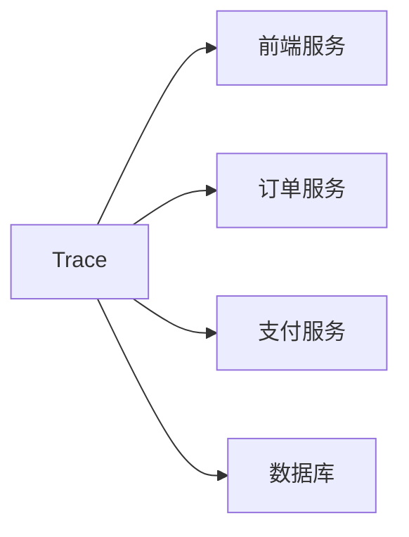
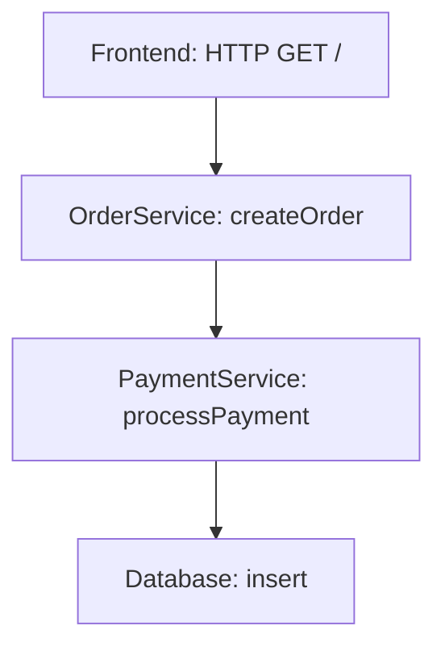

## 什么是链路追踪？

链路追踪（Distributed Tracing）是用于监控和分析分布式系统中请求流转的技术。当用户发起一个请求时，该请求可能跨越多个服务，链路追踪能记录请求的完整路径，帮助开发者：

1. 定位性能瓶颈
2. 分析跨服务调用关系
3. 诊断异常发生的根本原因

:::tip 类比理解
想象快递包裹的物流追踪——每个中转站都会记录包裹的到达/离开时间，最终你能看到完整的运输路径。链路追踪就是分布式系统的"物流追踪系统"。
:::

## 核心概念解析

### 1. Trace（追踪）

一个Trace代表**完整的请求生命周期**。例如用户点击网页按钮触发后端API调用，这个过程中所有相关的服务调用都属于同一个Trace。



### 2. Span（跨度）

Span是Trace的基本组成单元，代表**单个操作**的详细信息。一个Trace包含多个Span，典型信息包括：

- 操作名称
- 开始/结束时间戳
- 标签（Key-Value格式的元数据）
- 日志事件
- 上下文信息（如Trace ID）

```json
// Span的JSON表示示例
{
  "traceId": "abc123",
  "id": "def456",
  "name": "GET /api/orders",
  "timestamp": 1620000000000,
  "duration": 45,
  "tags": {
    "http.method": "GET",
    "http.status_code": "200"
  }
}
```

### 3. 父子关系

Span之间存在层级关系，形成调用树：



## 实际应用案例

### 电商下单场景

用户下单时，系统会经历以下步骤：

1. 前端发起 `POST /orders` 请求（Span A）
2. 订单服务调用支付服务（Span B）
3. 支付服务查询用户余额（Span C）
4. 支付服务调用银行接口（Span D）

在Zipkin UI中看到的Trace结构：

```mermaid
gantt
    title 订单处理Trace
    dateFormat  X
    axisFormat %s
    section 请求流
    前端请求      :a, 0, 3
    订单服务处理  :b, 3, 5
    支付服务处理  :c, 5, 8
    银行接口调用  :d, 8, 12
```



## 代码示例

使用Zipkin的Python客户端记录Span：

```python
from py_zipkin.zipkin import zipkin_span

def handle_request():
    with zipkin_span(
        service_name='webapp',
        span_name='handle_request',
        transport_handler=transport_handler,
        port=8080,
    ) as span:
        # 添加标签
        span.add_annotation('Start processing')
        span.add_tag('http.method', 'GET')
        
        # 模拟业务逻辑
        result = call_order_service()
        
        span.add_annotation('End processing')
        return result
```

## 总结

关键要点：
- Trace是分布式请求的完整记录
- Span代表单个操作，包含时间、元数据等信息
- 父子Span关系形成调用树
- 通过分析Trace可以优化系统性能

## 延伸学习

推荐练习：
1. 在本地启动Zipkin服务器
2. 使用任何语言的Zipkin客户端记录简单Trace
3. 在Zipkin UI中查看收集到的数据

附加资源：
- [Zipkin官方文档](https://zipkin.io/)
- [OpenTracing标准](https://opentracing.io/docs/overview/)