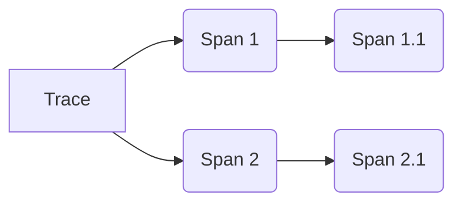
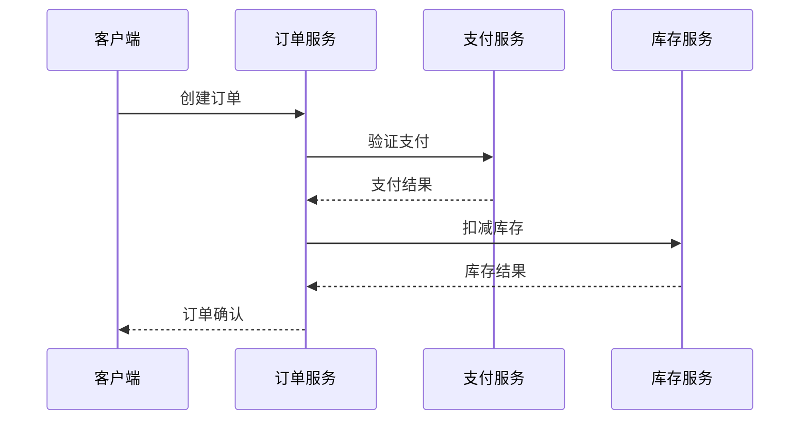

# Trace与Span关系

## 介绍

在分布式系统中，一个用户请求可能需要经过多个微服务协同处理。Zipkin通过**Trace**和**Span**这两个核心概念，帮助我们可视化请求的完整调用链路。简单来说：

- **Trace**：代表一个完整的请求链路，包含从开始到结束的所有操作
- **Span**：代表Trace中的一个独立工作单元，通常对应单个服务中的操作

:::note 类比理解
可以把Trace想象成一本书的完整故事线，而Span就是构成这个故事的各个章节。
:::

## 基本关系



上图展示了：
1. 一个Trace包含多个Span
2. Span之间可以有父子关系（如Span 1.1是Span 1的子Span）
3. Span可以并行存在（如Span 1和Span 2）

## Span的组成

每个Span包含以下关键信息（以JSON格式示例）：

```json
{
  "traceId": "5b8aa5a2d2c872a8324b2159",
  "id": "6b221d5bc9e6496",
  "name": "get_user_data",
  "parentId": "3d7098f8d0351cc",
  "timestamp": 1623984000000,
  "duration": 120,
  "tags": {
    "http.method": "GET",
    "http.path": "/api/users"
  }
}
```

字段说明：
- `traceId`：所属Trace的唯一标识
- `id`：当前Span的唯一标识
- `parentId`：父Span的ID（根Span无此字段）
- `timestamp`/`duration`：时间戳和持续时间(ms)

## 实际案例

假设一个电商网站的订单创建流程：



对应的Trace-Span结构：

1. **Trace** (traceId: abc123)
   - Span 1: 订单服务处理 (spanId: 1)
     - Span 1.1: 调用支付验证 (spanId: 2, parentId: 1)
   - Span 1.2: 调用库存服务 (spanId: 3, parentId: 1)

## 代码示例

使用Zipkin Java客户端创建Trace和Span：

```java
// 初始化Tracer
Tracing tracing = Tracing.newBuilder()
    .localServiceName("order-service")
    .spanReporter(reporter)
    .build();

// 开始一个新Trace
ScopedSpan trace = tracing.tracer().startScopedSpan("create_order");
try {
    // 业务逻辑...
    
    // 创建子Span
    Span childSpan = tracing.tracer().newChild(trace.context())
        .name("validate_payment")
        .start();
    try {
        // 调用支付服务...
    } finally {
        childSpan.finish();
    }
} finally {
    trace.finish();
}
```

## 关键特性

1. **因果关系**：通过parentId建立Span的调用层级
2. **时间信息**：每个Span记录精确的开始/结束时间
3. **上下文传播**：TraceId会跨服务传递，保持链路完整
4. **并行Span**：同一层级可以存在多个并行Span

:::caution 常见误区
- 认为Span必须严格串行（实际上可以并行）
- 混淆TraceId和SpanId（TraceId在整个链路中保持不变）
:::

## 总结

理解Trace和Span的关系是掌握分布式追踪的基础：
- **Trace**是请求的完整故事
- **Span**是故事中的具体事件
- 通过父子关系组织Span可以清晰展现调用拓扑

## 扩展学习

1. 实践练习：使用Zipkin UI查看一个完整Trace的Span组成
2. 深入概念：了解[Baggage](https://zipkin.io/pages/instrumenting.html)在上下文传播中的作用
3. 工具尝试：使用OpenTelemetry自动生成Trace和Span

:::tip 调试技巧
在开发时，可以通过`X-B3-TraceId`请求头在日志中追踪特定请求的全部Span
:::