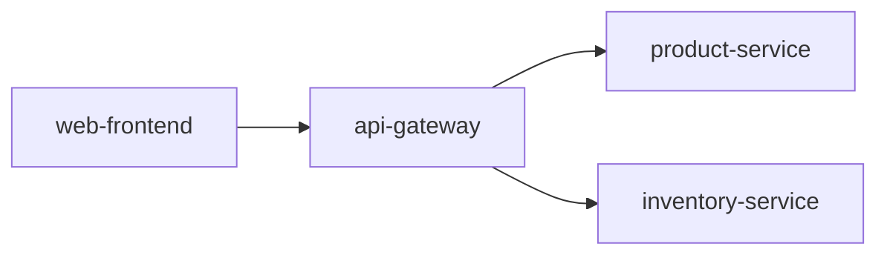

# 链路拓扑结构

## 介绍

链路拓扑结构（Trace Topology）是分布式系统追踪中的重要概念，它通过图形化的方式展示服务之间的调用关系。在 Zipkin 中，链路拓扑结构帮助开发者直观地理解请求在多个服务间的流转路径，从而快速定位性能瓶颈或故障点。

对于初学者来说，可以将链路拓扑结构想象为一张“地图”，标记了请求从发起到最终响应的完整路径。例如，一个用户请求可能先后经过 **前端服务**、**API 网关**、**订单服务** 和 **数据库**，链路拓扑会将这些节点和它们的依赖关系绘制成图。

---

## 核心组成

链路拓扑结构主要由以下元素构成：

1. **节点（Node）**：代表一个独立服务（如 `user-service`）或组件（如 `MySQL`）。
2. **边（Edge）**：表示服务之间的调用关系（如 `gateway → order-service`）。
3. **权重**：边的粗细或颜色可能代表调用频率或延迟高低。

:::tip
在 Zipkin 的 UI 中，链路拓扑通常以 **有向图** 形式展示，箭头方向表示调用方向。
:::

---

## 如何生成链路拓扑？

Zipkin 通过收集分布式追踪数据（Span）自动构建链路拓扑。以下是一个简化的流程：

1. **数据上报**：每个服务通过 `Brave` 或 `OpenTelemetry` 等库上报 Span 数据。
2. **存储与分析**：Zipkin 解析 Span 中的 `serviceName` 和 `parentId`，建立服务间的关联。
3. **可视化**：Zipkin UI 聚合数据并渲染成拓扑图。

---

## 实际案例

假设有一个电商系统，包含以下服务调用链：

1. 用户访问 `web-frontend`。
2. `web-frontend` 调用 `api-gateway`。
3. `api-gateway` 并行调用 `product-service` 和 `inventory-service`。

在 Zipkin 中，链路拓扑会生成如下结构：



:::note
边的默认权重为调用次数。如果 `product-service` 出现高延迟，其对应的边可能会显示为红色。
:::

---

## 代码示例

以下是一个简单的 Spring Boot 服务配置，用于向 Zipkin 上报追踪数据：

```java
// 在 application.properties 中配置 Zipkin 服务器地址
spring.zipkin.base-url=http://localhost:9411
spring.sleuth.sampler.probability=1.0  // 100% 采样率
```

上报后，Zipkin 会自动分析服务依赖关系。例如，如果 `order-service` 调用了 `payment-service`，Zipkin UI 会显示如下链路：

```
Request → order-service → payment-service
```

---

## 应用场景

1. **故障排查**：快速发现某个服务是否因下游依赖失败而超时。
2. **性能优化**：识别高频或高延迟的调用边（如 `auth-service` 是全局瓶颈）。
3. **架构演进**：验证新服务是否按预期接入拓扑。

---

## 总结

链路拓扑结构是理解分布式系统行为的重要工具。通过 Zipkin 的可视化能力，开发者能够：

- 直观掌握服务依赖关系。
- 定位跨服务问题。
- 优化系统架构。

---

## 延伸学习

1. 尝试在本地启动 Zipkin，模拟多服务调用并观察拓扑变化。
2. 阅读 [Zipkin 官方文档](https://zipkin.io/) 中的 `Dependency Diagram` 部分。
3. 使用 `spring-cloud-sleuth` 和 `OpenTelemetry` 深入实践分布式追踪。