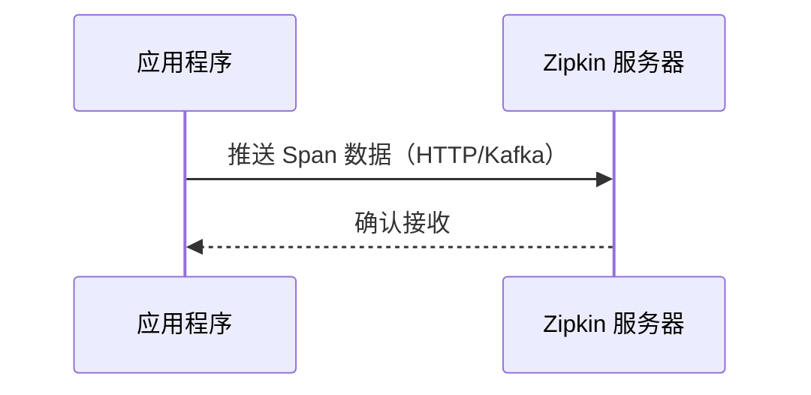
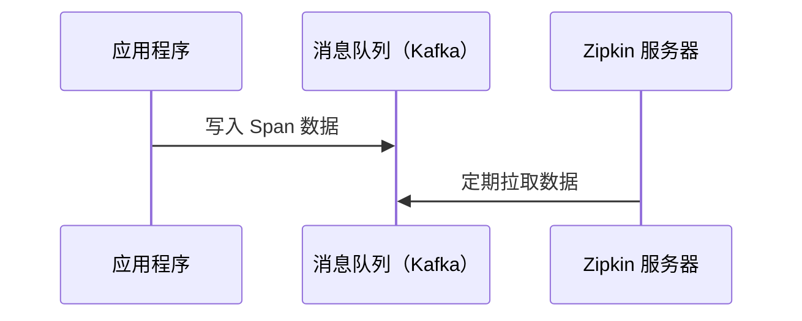

# 追踪数据收集模式

在分布式系统中，追踪数据的收集是链路监控的核心环节。Zipkin 支持两种主要的数据收集模式：**推送（Push）**和**拉取（Pull）**。本章将详细讲解这两种模式的工作原理、优缺点以及实际应用场景。

## 介绍

追踪数据收集模式决定了应用程序如何将生成的链路数据（Spans）发送到 Zipkin 服务器。选择适合的模式对系统性能和可靠性至关重要。

- **推送模式（Push）**：应用程序主动将数据发送到 Zipkin 收集器。
- **拉取模式（Pull）**：Zipkin 收集器从应用程序或中间存储（如消息队列）中主动拉取数据。

## 推送模式（Push）

### 工作原理
应用程序通过 HTTP 或 Kafka 等传输方式，直接将追踪数据推送到 Zipkin 服务器。



### 代码示例
以 Spring Boot 应用为例，配置 HTTP 推送：
```java
// application.properties
spring.zipkin.base-url=http://localhost:9411
spring.zipkin.sender.type=web
```

### 特点
- **优点**：实时性强，数据延迟低。
- **缺点**：可能对应用性能造成压力（网络 I/O 开销）。

:::tip 适用场景
适合中小规模系统或对实时性要求高的场景。
:::

---

## 拉取模式（Pull）

### 工作原理
应用程序先将追踪数据写入中间存储（如 Kafka、RabbitMQ），Zipkin 服务器定期从中间存储拉取数据。



### 代码示例
配置 Kafka 作为中间存储：
```java
// application.properties
spring.zipkin.sender.type=kafka
spring.kafka.bootstrap-servers=localhost:9092
```

### 特点
- **优点**：解耦应用与 Zipkin，避免直接性能影响。
- **缺点**：数据延迟较高，需维护中间存储。

:::caution 注意
拉取模式需要额外的消息队列基础设施支持。
:::

---

## 实际案例对比

| 场景                | 推荐模式 | 理由                                                                 |
|---------------------|----------|----------------------------------------------------------------------|
| 电商订单系统        | Push     | 需要实时监控订单处理链路                                            |
| 离线数据分析        | Pull     | 数据量大，允许延迟，通过 Kafka 批量处理                             |
| 微服务调试环境      | Push     | 开发阶段需快速查看链路，避免复杂中间件依赖                          |

---

## 总结

- **推送模式**适合实时性要求高、基础设施简单的场景。
- **拉取模式**适合大规模、高吞吐量的生产环境。

:::warning 性能建议
在高并发系统中，优先考虑拉取模式 + 异步收集（如通过 Kafka）以减少对业务代码的影响。
:::

## 扩展练习
1. 在本地启动 Zipkin 服务器，分别用 HTTP 和 Kafka 发送测试数据。
2. 对比两种模式下 Zipkin 界面的数据延迟差异。

## 附加资源
- [Zipkin 官方文档：数据收集](https://zipkin.io/pages/instrumenting.html)
- 《分布式链路追踪实战》第 4 章（机械工业出版社）