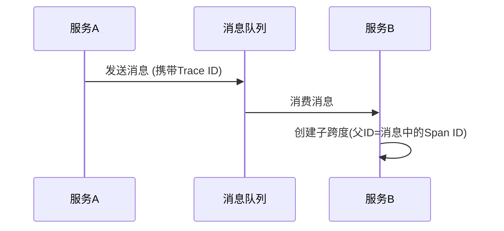

# 异步追踪处理

## 介绍

在分布式系统中，异步调用（如消息队列、事件驱动架构）是常见的通信模式。Zipkin的异步追踪处理机制能够帮助我们追踪这些非阻塞调用的执行路径，即使它们跨越了不同的线程或进程。本节将解释Zipkin如何捕获异步调用的上下文，并通过代码示例和实际场景展示其实现方式。

## 核心原理

当服务A通过异步方式（如Kafka消息）调用服务B时，Zipkin会通过以下步骤保持追踪连续性：

1. **上下文传递**：服务A在发送消息前注入追踪ID（Trace ID）和跨度ID（Span ID）到消息头。
2. **上下文提取**：服务B从消息头提取这些ID，创建新的子跨度并与父跨度关联。



## 代码示例

### 发送方（Spring Boot + Kafka）

```java
@Autowired
private KafkaTemplate<String, String> kafkaTemplate;
@Autowired
private Tracer tracer;

public void sendAsyncMessage() {
    Span span = tracer.nextSpan().name("send-to-kafka").start();
    try (SpanInScope ws = tracer.withSpanInScope(span)) {
        // 将追踪信息注入消息头
        Headers headers = new RecordHeaders();
        Tracing.current().injector(Headers::add).inject(span.context(), headers);
        
        kafkaTemplate.send(new ProducerRecord<>("orders", null, null, "订单数据", headers));
    } finally {
        span.finish();
    }
}
```

### 接收方（消息消费者）

```java
@KafkaListener(topics = "orders")
public void listen(ConsumerRecord<String, String> record) {
    SpanContext context = Tracing.current().extractor(Headers::get).extract(record.headers()).context();
    Span span = Tracing.currentTracer().nextSpan(context).name("process-order").start();
    try (SpanInScope ws = tracer.withSpanInScope(span)) {
        // 处理业务逻辑
        System.out.println("处理消息: " + record.value());
    } finally {
        span.finish();
    }
}
```

## 实际应用场景

**电商订单系统案例**：
1. 用户服务异步发送"创建订单"事件到RabbitMQ
2. 订单服务消费消息并处理
3. 支付服务通过另一个队列接收支付请求
4. Zipkin展示完整的异步调用链：

```
UserService → [RabbitMQ] → OrderService → [RabbitMQ] → PaymentService
```

:::tip 最佳实践
- 为异步操作添加明确的跨度名称（如`send-to-queue`）
- 设置合理的超时时间，避免异步跨度长期挂起
- 使用`SpanInScope`确保上下文在回调函数中不丢失
:::

## 常见问题解决

**问题**：异步跨度在Zipkin中显示为断开<br />
**解决方案**：
1. 检查消息头是否正确注入/提取
2. 确认发送方和接收方使用相同的追踪配置
3. 验证时钟同步（NTP服务）

## 总结

异步追踪处理是分布式追踪的关键能力，通过本课我们学会了：
- 消息头如何传递追踪上下文
- 生产者/消费者模式的代码实现
- 实际系统中的问题排查方法

## 扩展练习

1. 尝试在本地搭建RabbitMQ环境，重现示例中的场景
2. 修改代码使消息处理失败时能记录错误信息到Zipkin
3. 观察Zipkin UI中异步调用的延迟分布

## 附加资源

- [Zipkin Brave文档](https://github.com/openzipkin/brave)
- [Spring Cloud Sleuth异步追踪](https://docs.spring.io/spring-cloud-sleuth/docs/current/reference/html/#asynchronous-communication)