# 追踪数据可视化

## 介绍

在分布式系统中，一个用户请求可能涉及多个服务的协作。Zipkin的**追踪数据可视化**功能将这些复杂的调用关系转化为直观的图表，帮助开发者快速定位延迟问题或错误源头。通过图形化展示，初学者可以轻松理解服务间的依赖关系和耗时分布。

## 核心可视化组件

### 1. 追踪时间线图
Zipkin将每个请求的完整生命周期展示为水平时间轴，其中：
- **Span**：表示单个服务中的操作，显示为彩色条形。
- **层级关系**：子Span嵌套在父Span下方，体现调用深度。

```mermaid
gantt
    title 请求追踪示例 (Trace ID: abc123)
    dateFormat  X
    axisFormat %s
    section 前端服务
    发起请求 :a1, 0, 3s
    section 订单服务
    处理订单 :a2, after a1, 2s
    调用支付 :a3, after a2, 1s
    section 支付服务
    支付处理 :a4, after a3, 3s
```



### 2. 依赖关系图
展示服务之间的调用拓扑，圆圈大小代表流量多少，连线粗细表示调用频率。

## 实际操作示例

### 查看追踪详情
在Zipkin UI中搜索Trace后，你会看到类似这样的结构化数据：

```json
{
  "traceId": "df4534ab",
  "spans": [
    {
      "name": "GET /orders",
      "timestamp": 1620000000000,
      "duration": 120,
      "tags": {"http.status_code": "200"}
    },
    {
      "name": "POST /payment",
      "parentId": "df4534ab",
      "duration": 85
    }
  ]
}
```

### 关键分析维度
1. **耗时分布**：识别哪个Span消耗最长时间
2. **错误标记**：红色高亮的Span表示失败操作
3. **并行调用**：垂直对齐的Span表示并发执行

:::tip 分析技巧
点击Span详情查看附加信息：
- 自定义注解（如`DB Query executed`）
- 二进制标签（如`user.id=12345`）
:::

## 真实案例场景

**电商订单问题排查**：
1. 用户投诉支付超时
2. 在Zipkin中过滤`/checkout`路径的Trace
3. 发现支付服务Span出现5秒延迟
4. 展开Span详情看到数据库查询标签`sql=SELECT * FROM inventory`
5. 最终定位到未优化的SQL查询

## 总结

Zipkin的可视化工具将抽象的追踪数据转化为：
- 直观的时间线图表
- 清晰的依赖拓扑
- 详尽的上下文信息

## 扩展练习
1. 部署本地Zipkin服务器，发送包含5个Span的示例数据
2. 尝试通过UI找出最耗时的服务调用
3. 为Span添加自定义标签（如`environment=dev`）并观察显示变化

## 延伸阅读
- Zipkin官方文档中的[UI功能详解](https://zipkin.io/pages/explore_ui.html)
- 《分布式追踪：原理与实践》第4章