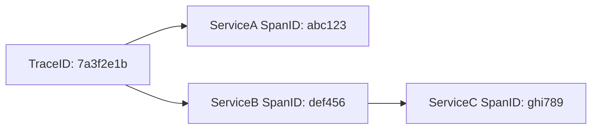
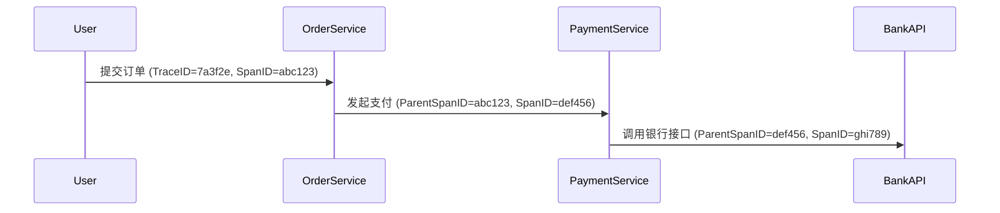

# SpanID与TraceID

## 介绍

在分布式系统中，一个用户请求可能跨越多个服务。为了追踪完整的请求路径，Zipkin引入了 **TraceID** 和 **SpanID** 这两个核心标识符。它们就像快递单号与包裹分拣码，共同构建了请求的完整调用链。

:::note 类比理解
- **TraceID**：整个快递运输流程的唯一订单号（贯穿所有环节）
- **SpanID**：每个中转站的分拣码（标记单个处理节点）
:::

## 核心概念详解

### 1. TraceID（追踪ID）
- **作用**：唯一标识一个完整的请求链路
- **特性**：
  - 全局唯一（通常为16或32位十六进制字符串）
  - 在请求的整个生命周期中保持不变
  - 示例：`7a3f2e1b5d8c4a09`

### 2. SpanID（跨度ID）
- **作用**：标识请求在一个服务中的处理单元
- **特性**：
  - 在当前Trace内唯一
  - 可以嵌套（表示父子Span关系）
  - 示例：`d4e5f6a7b8c9`



## 代码示例

### 生成TraceID/SpanID（Python示例）
```python
import uuid

# 生成TraceID（16字符十六进制）
trace_id = uuid.uuid4().hex[:16]
print(f"TraceID: {trace_id}")  # 输出示例: TraceID: 7a3f2e1b5d8c4a09

# 生成SpanID（8字符十六进制）
span_id = uuid.uuid4().hex[:8]
print(f"SpanID: {span_id}")    # 输出示例: SpanID: d4e5f6a7
```

### HTTP请求传播（Headers示例）
```http
GET /api/data HTTP/1.1
Host: example.com
X-B3-TraceId: 7a3f2e1b5d8c4a09
X-B3-SpanId: d4e5f6a7
X-B3-ParentSpanId: abc123  # 可选，表示父Span
```

## 实际应用场景

**电商订单流程追踪**：
1. 用户提交订单（生成TraceID: `7a3f2e`）
2. 订单服务处理（SpanID: `abc123`）
3. 调用支付服务（SpanID: `def456`，Parent: `abc123`）
4. 支付服务调用银行接口（SpanID: `ghi789`，Parent: `def456`）



## 常见问题

:::caution 注意
- 所有参与分布式调用的服务必须**传播相同的TraceID**
- SpanID通常在服务入口处生成，并作为子Span的ParentSpanID传递
- 如果ParentSpanID为空，则表示这是根Span（Root Span）
:::

## 总结

| 概念     | 作用                          | 生命周期       | 示例               |
|----------|-----------------------------|--------------|--------------------|
| TraceID  | 标识完整请求链路                | 跨服务保持不变  | `7a3f2e1b5d8c4a09` |
| SpanID   | 标识单个服务处理单元             | 仅在当前Span有效 | `d4e5f6a7`         |

## 扩展练习
1. 尝试用任何编程语言实现TraceID/SpanID生成器
2. 在本地搭建Zipkin，观察实际请求中的ID传递
3. 思考：如果某个服务没有正确传播TraceID会发生什么？

:::tip 进阶学习
推荐阅读Zipkin官方文档中的[B3 Propagation](https://github.com/openzipkin/b3-propagation)规范，了解ID在HTTP头中的传递细节。
:::