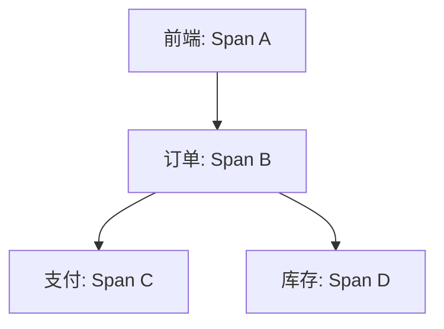

# 父子Span关系

## 介绍

在分布式追踪系统中，**Span** 是表示单个操作（如HTTP请求、数据库查询）的基本单元。**父子Span关系** 则描述了跨服务或跨组件的调用层级，是构建完整调用链（Trace）的关键。当一个Span（子Span）由另一个Span（父Span）触发时，Zipkin会通过上下文传递（如Trace ID、Span ID）建立关联，最终形成树状结构。

:::note 核心要点
- **父Span**：发起操作的Span（如客户端发起HTTP请求）。
- **子Span**：被父Span触发的Span（如服务端处理该请求）。
- **上下文传递**：通过HTTP头、RPC参数等传递Trace ID和Parent Span ID。
:::

## 工作原理

### 上下文传递示例
以下是一个HTTP请求中父子Span的上下文传递流程：

1. **客户端（父Span）** 发起请求时，在HTTP头中注入追踪信息：
   ```http
   X-B3-TraceId: 80f198ee56343ba864fe8b2a57d3eff7
   X-B3-ParentSpanId: 05e3ac9a4f6e3b90
   X-B3-SpanId: e457b5a2e4d86bd1
   ```

2. **服务端（子Span）** 解析头信息，创建关联的子Span，并记录相同的Trace ID和父Span ID。

### 代码示例（Python + OpenTelemetry）
```python
from opentelemetry import trace
from opentelemetry.sdk.trace import TracerProvider

# 初始化Tracer
provider = TracerProvider()
trace.set_tracer_provider(provider)
tracer = trace.get_tracer(__name__)

# 父Span（客户端）
with tracer.start_as_current_span("parent_span") as parent:
    # 模拟传递上下文到子Span（服务端）
    with tracer.start_as_current_span("child_span", context=parent.context):
        print("子Span正在执行...")
```

输出日志（简化）：
```
父Span ID: 05e3ac9a4f6e3b90
子Span ID: e457b5a2e4d86bd1
Trace ID: 80f198ee56343ba864fe8b2a57d3eff7（相同）
```

## 实际案例：电商订单流程

假设一个用户下单请求的调用链：
1. **前端服务**（Span A）调用 **订单服务**（Span B）。
2. **订单服务** 调用 **支付服务**（Span C）和 **库存服务**（Span D）。



在Zipkin中的可视化效果：
- 所有Span共享同一个Trace ID。
- Span B的Parent ID指向Span A。
- Span C和D的Parent ID均指向Span B。

## 总结

父子Span关系是分布式追踪的基石，它通过以下方式帮助开发者：
1. **问题定位**：快速识别跨服务调用的故障点。
2. **性能分析**：统计每个子Span耗时，优化瓶颈。
3. **依赖梳理**：自动生成服务依赖拓扑图。

:::tip 练习
1. 使用OpenTelemetry或Brave库，手动创建一个包含3层父子Span的调用链。
2. 在Zipkin UI中验证Span的层级关系是否正确显示。
:::

## 附加资源
- [Zipkin官方文档：数据模型](https://zipkin.io/pages/data_model.html)
- [OpenTelemetry Span上下文规范](https://github.com/open-telemetry/opentelemetry-specification)