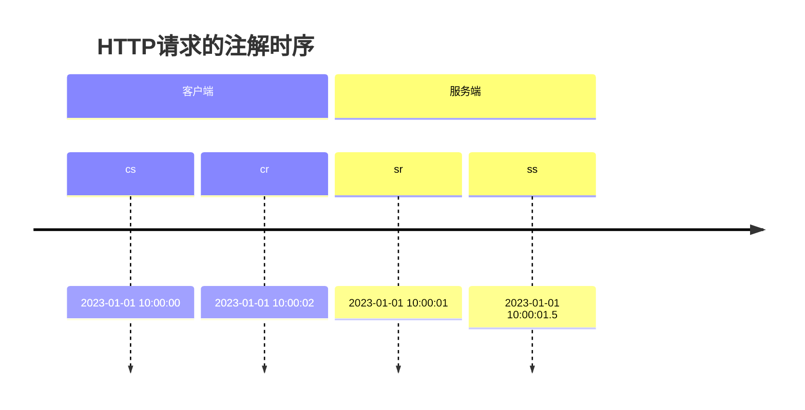

# Zipkin 标签与注解

## 引言

在分布式系统中，追踪请求的完整路径是调试和性能分析的关键。Zipkin通过**标签（Tags）**和**注解（Annotations）**为追踪数据添加上下文信息，帮助开发者更直观地理解系统行为。本章将详细介绍它们的定义、区别及实际应用。

---

## 核心概念

### 1. 标签（Tags）
标签是键值对（Key-Value）形式的元数据，用于记录**跨服务的静态信息**，例如：
- 请求的HTTP方法（`http.method=GET`）
- 数据库查询类型（`db.query=SELECT`）
- 业务逻辑标识（`order.id=123`）

标签的特点：
- 适用于描述**整个Span**的上下文。
- 通常由开发者在代码中显式添加。

#### 代码示例（Java + Brave库）
```java
Span span = tracer.nextSpan().name("query-orders").start();
span.tag("http.method", "GET");
span.tag("order.id", "123");
span.finish();
```

---

### 2. 注解（Annotations）
注解是**时间戳事件**，用于标记Span生命周期中的**关键时间点**，例如：
- `cs`（Client Send）：客户端发起请求。
- `sr`（Server Receive）：服务端接收请求。
- `ss`（Server Send）：服务端发送响应。
- `cr`（Client Receive）：客户端接收响应。

注解的特点：
- 记录**瞬时事件**，不携带额外数据。
- 通常由Zipkin客户端自动生成。

#### 时间轴示意图


---

## 实际应用场景

### 案例：电商订单查询
假设一个订单查询请求经过以下流程：
1. 用户通过HTTP调用订单服务（`/orders/123`）。
2. 订单服务查询数据库。

#### 添加标签与注解
```java
// 1. 创建Span并添加标签
Span span = tracer.nextSpan().name("get-order").start();
span.tag("http.path", "/orders/123");
span.tag("service.name", "order-service");

// 2. 记录注解（Brave库自动处理部分注解）
try (Scope ws = tracer.withSpanInScope(span)) {
    // 模拟数据库调用
    span.annotate("query.db.start");
    Thread.sleep(100); // 模拟耗时
    span.annotate("query.db.end");
} finally {
    span.finish();
}
```

#### 在Zipkin UI中的效果
- **标签**会显示在Span详情页的元数据中。
- **注解**会生成时间轴视图，直观展示各阶段耗时。

---

## 总结

| 特性          | 标签（Tags）               | 注解（Annotations）       |
|---------------|---------------------------|--------------------------|
| **数据类型**  | 键值对                    | 时间戳事件               |
| **用途**      | 描述Span的静态上下文      | 标记Span的关键时间点     |
| **是否可选**  | 是                        | 部分由客户端自动生成     |

:::tip 最佳实践
- 使用标签记录**业务相关**信息（如用户ID、请求参数）。
- 依赖注解分析**性能瓶颈**（如网络延迟、服务处理时间）。
:::

---

## 扩展练习
1. 在本地Zipkin中创建一个Span，尝试添加自定义标签（如 `environment=dev`）。
2. 对比有无注解的Span在Zipkin UI中的展示差异。

## 进一步学习
- [Zipkin官方文档：数据模型](https://zipkin.io/pages/data_model.html)
- Brave库的[标签与注解API](https://github.com/openzipkin/brave)