# 时间戳与持续时间

在分布式系统中，理解请求的流转路径和性能瓶颈至关重要。Zipkin通过记录**时间戳**和**持续时间**来帮助开发者分析请求的生命周期。本章将详细介绍这两个核心概念及其应用。

## 介绍

**时间戳（Timestamp）**表示某个事件发生的具体时间点，而**持续时间（Duration）**则描述两个时间点之间的时间跨度。在Zipkin中，它们用于：
- 标记Span（追踪的基本单元）的开始和结束。
- 计算服务调用的延迟。
- 可视化请求在分布式系统中的流转路径。

:::note
Span是Zipkin中的基本追踪单元，包含名称、时间戳、持续时间以及标签（Tags）和日志（Logs）。
:::

---

## 时间戳的工作原理

Zipkin使用**微秒级精度**的Unix时间戳记录事件时间。例如：
- Span开始时间戳：`1625000000000000`（2021年6月29日 12:53:20 UTC）
- Span结束时间戳：`1625000000500000`（50毫秒后）

### 代码示例
以下是一个Python示例，模拟生成Span的时间戳：
```python
import time

start_time = int(time.time() * 1000000)  # 转换为微秒
# 模拟业务逻辑耗时
time.sleep(0.05)
end_time = int(time.time() * 1000000)

print(f"开始时间戳: {start_time}, 结束时间戳: {end_time}")
```

**输出**：
```
开始时间戳: 1625000000000000, 结束时间戳: 1625000000500000
```

---

## 持续时间的计算

持续时间是**结束时间戳减去开始时间戳**的结果。例如：
- 开始时间戳：`1625000000000000`
- 结束时间戳：`1625000000500000`
- 持续时间：`500000`微秒（即50毫秒）

```mermaid
gantt
    title Span时间线示例
    dateFormat  X
    axisFormat %s
    section 请求处理
    Span执行 :a1, 1625000000000000, 500000
```



:::tip
Zipkin UI会自动将微秒转换为更易读的单位（如毫秒或秒）。
:::

---

## 实际应用场景

### 案例：电商订单处理
假设一个订单请求依次经过以下服务：
1. **API网关**（耗时2毫秒）
2. **订单服务**（耗时30毫秒，含数据库调用）
3. **支付服务**（耗时15毫秒）

Zipkin会记录每个服务的Span时间戳和持续时间，生成如下追踪数据：

```json
{
  "traceId": "abc123",
  "spans": [
    {
      "name": "gateway",
      "timestamp": 1625000000000000,
      "duration": 2000
    },
    {
      "name": "order-service",
      "timestamp": 1625000002000000,
      "duration": 30000
    },
    {
      "name": "payment-service",
      "timestamp": 1625000032000000,
      "duration": 15000
    }
  ]
}
```

通过分析这些数据，可以发现：
- 订单服务是性能瓶颈（耗时占比60%）。
- 总请求耗时：`2 + 30 + 15 = 47毫秒`。

---

## 总结

- **时间戳**标记Span的开始/结束时刻，需使用微秒级Unix时间戳。
- **持续时间**反映Span的执行耗时，通过差值计算得出。
- 两者结合可定位分布式系统中的延迟问题。

### 扩展练习
1. 使用Zipkin的API手动创建一个包含时间戳和持续时间的Span。
2. 在本地部署Zipkin，并追踪一个Spring Boot应用的请求耗时。

### 附加资源
- [Zipkin官方文档：数据模型](https://zipkin.io/pages/data_model.html)
- [OpenTelemetry时间戳规范](https://opentelemetry.io/docs/reference/specification/common/)