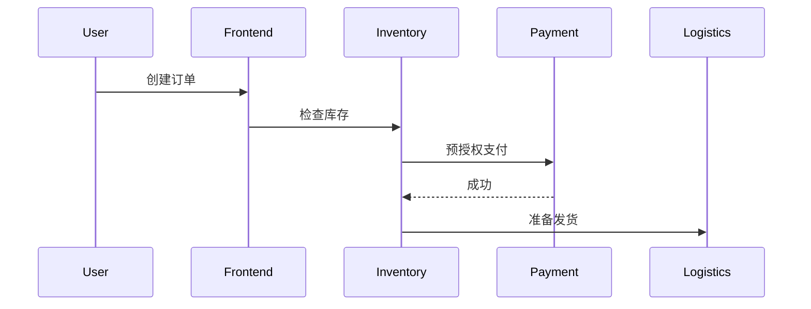

# 分布式上下文传播

## 介绍

在分布式系统中，一个用户请求可能会跨越多个服务。为了追踪完整的请求链路，**上下文信息**（如TraceID、SpanID）需要在服务间传递。Zipkin通过**分布式上下文传播**机制实现这一目标，确保所有相关服务能共享相同的追踪上下文。

:::note 关键术语
- **TraceID**：唯一标识整个请求链路的ID。
- **SpanID**：标识单个服务处理的片段。
- **B3 Propagation**：Zipkin默认的上下文传播协议。
:::

## 工作原理

### 1. 上下文信息的组成
分布式上下文通常包含以下字段：
- `traceId`：全局唯一的追踪ID（16或32位十六进制）。
- `spanId`：当前操作的Span ID。
- `parentId`：父级Span ID（可选）。
- `sampled`：是否采样（布尔值）。

### 2. 传播方式
上下文通常通过HTTP请求头或消息队列属性传递。以下是B3协议的常用头字段：
```
X-B3-TraceId: 80f198ee56343ba864fe8b2a57d3eff7
X-B3-SpanId: e457b5a2e4d86bd1
X-B3-ParentSpanId: 05e3ac9a4f6e3b90
X-B3-Sampled: 1
```

### 3. 代码示例（Java + Spring Cloud Sleuth）
以下示例展示如何在HTTP客户端和服务端自动传播上下文：

```java
// 客户端发送请求（自动注入头信息）
@RestController
class ClientController {
    @Autowired private RestTemplate restTemplate;

    @GetMapping("/start")
    public String start() {
        return restTemplate.getForObject("http://backend-service/next", String.class);
    }
}

// 服务端接收请求（自动解析头信息）
@RestController
class ServerController {
    @GetMapping("/next")
    public String next() {
        return "Hello from backend!";
    }
}
```

## 实际应用场景

### 电商系统中的订单创建
1. 用户发起订单请求 → **前端服务**
2. 前端调用 **库存服务** 检查库存
3. 库存服务调用 **支付服务** 预授权
4. 支付服务返回结果后，库存服务通知 **物流服务**



:::tip 调试技巧
在开发时，可以通过`curl -v`查看请求头中的B3字段，或使用Zipkin UI搜索特定的`traceId`。
:::

## 总结

分布式上下文传播是分布式追踪的基石，它使得：
- 跨服务调用链路可视化
- 故障定位更高效
- 性能分析更准确

## 扩展练习
1. 使用`curl`手动添加B3头调用你的API，观察Zipkin中的轨迹。
2. 尝试在异步消息队列（如Kafka）中实现上下文传播。

## 附加资源
- [B3 Propagation规范](https://github.com/openzipkin/b3-propagation)
- [Spring Cloud Sleuth文档](https://spring.io/projects/spring-cloud-sleuth)