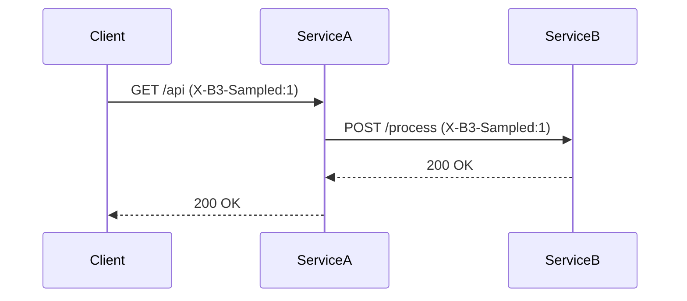

# 采样决策逻辑

## 介绍

在分布式追踪系统中，**采样决策逻辑**（Sampling Decision Logic）是决定是否记录某次请求追踪数据的核心机制。由于全量收集追踪数据可能带来高昂的存储和计算成本，Zipkin通过采样策略在数据完整性和系统性能之间取得平衡。

采样决策通常发生在请求进入系统的第一个组件（如网关或前端服务），并将决策结果通过HTTP头（如 `X-B3-Sampled`）传递给下游服务。

## 为什么需要采样？

:::note 关键点
- **性能优化**：减少追踪数据对网络和存储的压力
- **成本控制**：降低存储和分析大量追踪数据的费用
- **代表性**：通过合理采样仍能反映系统行为特征
:::

## 常见采样策略

### 1. 恒定采样（Constant Sampling）

最简单的策略，对所有请求使用固定采样率：

```java
// 示例：使用 Brave（Zipkin的Java客户端）配置50%采样率
Sampler sampler = Sampler.create(0.5f);
tracingBuilder.sampler(sampler);
```

**输入/输出示例**：
- 采样率=1.0：记录所有请求
- 采样率=0.1：记录约10%的请求

### 2. 速率限制采样（Rate Limiting Sampling）

限制每秒最大追踪数：

```python
# 使用PyZipkin配置每秒最多10个追踪
from py_zipkin.sampling import RateLimiterSampler
sampler = RateLimiterSampler(10)  # 10 traces/second
```

### 3. 动态采样（Dynamic Sampling）

根据请求属性动态决策，例如：
- 只采样错误请求
- 对重要用户（如VIP）全量采样

```java
// 自定义采样器示例
Sampler dynamicSampler = request -> {
    if (request.path().contains("/api/vip/")) {
        return true;  // VIP接口全采样
    }
    return Math.random() < 0.2;  // 其他接口20%采样
};
```

## 采样决策的传播

采样决策需要在服务间传递，通常通过以下HTTP头：
- `X-B3-Sampled`: "1"（采样）或 "0"（不采样）
- `X-B3-TraceId`: 追踪ID
- `X-B3-SpanId`: 当前Span ID



## 实际应用案例

**电商平台场景**：
1. 首页访问：10%采样率（高频但低价值）
2. 支付流程：100%采样（关键路径）
3. 错误请求：100%采样（便于排查问题）

```yaml
# 假设的配置示例
sampling_rules:
  - path_pattern: "/checkout/**"
    sample_rate: 1.0
  - path_pattern: "/product/**"
    sample_rate: 0.1
  - status_codes: [500, 503]
    sample_rate: 1.0
```

## 总结

| 策略类型 | 优点 | 缺点 |
|----------|------|------|
| 恒定采样 | 实现简单 | 不够灵活 |
| 速率限制 | 保护系统 | 可能丢失重要数据 |
| 动态采样 | 智能高效 | 实现复杂 |

:::tip 最佳实践
- 生产环境推荐组合使用多种策略
- 关键业务路径设置更高采样率
- 监控采样数据量避免存储过载
:::

## 延伸学习

1. 尝试在本地Zipkin中配置不同采样率观察数据变化
2. 使用Spring Cloud Sleuth实验采样策略
3. 阅读OpenTelemetry采样规范对比差异

通过合理配置采样策略，您可以在系统可观测性和性能开销之间找到最佳平衡点。