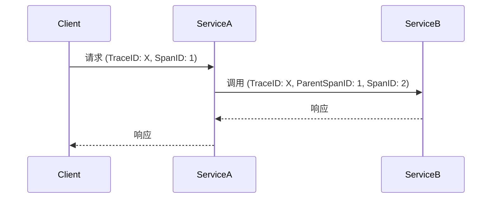

# 追踪上下文管理

## 介绍

在分布式系统中，一个用户请求可能涉及多个服务的协同处理。**追踪上下文管理**是 Zipkin 的核心机制，用于在服务间传递唯一标识符（如 `Trace ID` 和 `Span ID`），从而将分散的调用记录关联为完整的调用链。理解这一概念是掌握分布式追踪的基础。

:::note 关键术语
- **Trace**：代表一个完整的请求链路，包含多个 Span。
- **Span**：单个服务处理的逻辑单元，包含开始时间、结束时间和元数据。
- **Context**：存储 Trace ID 和 Span ID 的载体，用于跨服务传递。
:::

---

## 上下文是如何工作的？

追踪上下文通常通过 HTTP 头或 RPC 框架的隐式参数传递。以下是典型流程：

1. **入口服务**生成 `Trace ID` 和第一个 `Span ID`。
2. **下游服务**从上游接收上下文，并创建新的子 `Span ID`。
3. **上下文传递**确保所有 Span 最终关联到同一个 Trace。



---

## 代码示例

以下是一个使用 Spring Cloud Sleuth（Zipkin 的 Java 客户端）的示例，展示上下文如何自动传递：

```java
// Service A 的控制器
@RestController
public class ServiceAController {
    @Autowired
    private RestTemplate restTemplate;

    @GetMapping("/start")
    public String startRequest() {
        // 访问 Service B（上下文通过 HTTP 头自动传递）
        return restTemplate.getForObject("http://service-b/process", String.class);
    }
}

// Service B 的控制器
@RestController
public class ServiceBController {
    @GetMapping("/process")
    public String process() {
        // 当前 Span 信息会自动从上下文中获取
        return "Processed by Service B";
    }
}
```

**输出到 Zipkin 的数据**：
- Trace ID: `3df45b2c1a7a5b2d`
- Service A Span ID: `1a7a5b2d`
- Service B Span ID: `5e8f1d3c`（父 Span ID 为 `1a7a5b2d`）

---

## 实际应用场景

### 场景：电商订单处理
1. 用户提交订单（生成 Trace ID）。
2. 订单服务调用库存服务（传递上下文）。
3. 库存服务调用支付服务（继续传递上下文）。
4. 所有 Span 在 Zipkin 中显示为一条完整链路，便于排查延迟问题。

:::tip 调试技巧
在日志中输出 `Trace ID`，便于快速在 Zipkin 中定位问题：
```java
@Slf4j
@RestController
public class OrderController {
    @GetMapping("/order")
    public String createOrder() {
        log.info("Order created with trace ID: {}", Span.current().context().traceId());
        return "Order placed";
    }
}
```
:::

---

## 总结

- 追踪上下文是分布式追踪的**基石**，通过 `Trace ID` 和 `Span ID` 关联请求。
- 上下文通常通过 **HTTP 头**（如 `X-B3-TraceId`）或框架内置机制传递。
- 现代工具（如 Spring Cloud Sleuth）会自动处理上下文传递，减少手动编码。

---

## 扩展练习
1. 手动实现一个上下文传递：尝试在不依赖框架的情况下，通过 HTTP 头传递 `Trace ID`。
2. 在 Zipkin UI 中查找一个完整的 Trace，观察其 Span 父子关系。

## 进一步学习
- [Zipkin 官方文档 - 数据模型](https://zipkin.io/pages/data_model.html)
- [OpenTelemetry 上下文规范](https://opentelemetry.io/docs/concepts/context/)