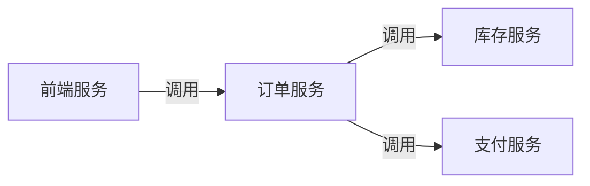
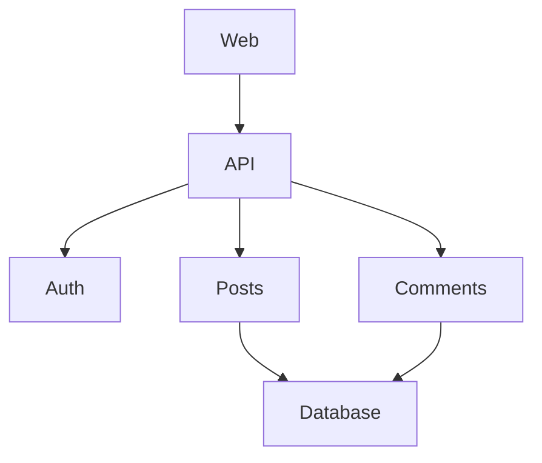

# 服务依赖图

## 介绍

在微服务架构中，一个用户请求可能会经过多个服务的处理。例如，一个电商网站的订单请求可能涉及用户服务、库存服务、支付服务等多个模块。**服务依赖图（Service Dependency Graph）** 是Zipkin提供的可视化工具，用于展示这些服务之间的调用关系和依赖拓扑。通过它，开发者可以快速发现性能瓶颈、异常调用链或冗余依赖。

## 核心原理

Zipkin通过收集分布式追踪数据（Span），自动构建服务之间的调用关系。每个Span包含以下关键信息：
- `serviceName`：当前服务的名称
- `parentId`：父级Span的ID（用于建立依赖关系）
- `kind`：Span类型（如CLIENT、SERVER）



:::note
依赖图中的箭头方向表示**调用方向**。例如 "A → B" 表示服务A调用了服务B。
:::

## 如何生成依赖图

### 1. 数据收集
确保所有服务已集成Zipkin客户端并上报追踪数据。以下是Spring Boot应用的配置示例：

```java
// application.properties
spring.zipkin.base-url=http://localhost:9411
spring.sleuth.sampler.probability=1.0  // 100%采样
```

### 2. 查看依赖图
访问Zipkin UI的`/dependency`页面，系统会自动生成两种视图：
- **静态图**：显示所有历史依赖关系
- **动态图**：实时反映当前流量模式

## 实际案例

假设我们有一个博客平台，其服务架构如下：



在Zipkin中可能会发现：
1. `Auth`服务响应缓慢（红色高亮节点）
2. `Comments`服务存在冗余的`Database`调用（密集箭头）

:::tip 优化建议
通过依赖图发现`Comments`服务频繁访问数据库后，可以引入缓存层（如Redis）优化性能。
:::

## 高级功能

### 过滤与时间范围
- 按时间范围分析（如"过去1小时"）
- 按服务名称过滤（如只显示与`payment-service`相关的依赖）

### 指标解读
- **线条粗细**：调用频率
- **颜色深浅**：错误率或延迟程度

## 总结

服务依赖图能帮助开发者：
✓ 直观理解系统架构  
✓ 快速定位性能问题  
✓ 识别不必要的服务耦合  

## 延伸练习
1. 在本地启动Zipkin服务器，模拟3个相互调用的服务并观察依赖图
2. 尝试在Spring Boot中手动创建一个包含错误信息的Span，观察依赖图如何反映异常

## 附加资源
- [Zipkin官方文档 - 依赖分析](https://zipkin.io/pages/data_model.html)
- [分布式追踪模式详解](https://microservices.io/patterns/observability/distributed-tracing.html)