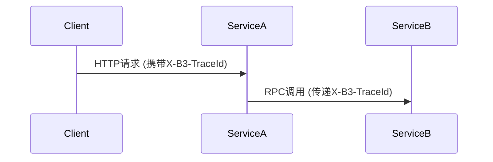

# 分布式上下文传播

## 介绍

分布式上下文传播（Distributed Context Propagation）是分布式追踪系统中的核心概念，它允许在跨服务调用时传递关键的追踪信息（如Trace ID、Span ID等）。在Zipkin中，这些上下文信息通过HTTP头或RPC框架的扩展字段传播，确保整个调用链的完整性。

:::note 为什么需要上下文传播？
在微服务架构中，一个请求可能经过多个服务。如果没有上下文传播，每个服务会生成独立的追踪片段，无法关联成完整的调用链。
:::

## 核心概念

### 1. 追踪上下文（Trace Context）
Zipkin的上下文通常包含以下字段：
- `traceId`：唯一标识整个调用链
- `spanId`：标识当前操作的Span
- `parentId`：父Span的ID（用于构建层级关系）
- `sampled`：是否采样标志

### 2. 传播方式
常见的传播协议：
- **B3 Propagation**：Zipkin的标准格式
- **W3C Trace Context**：较新的行业标准



## 代码示例

### 手动传播（Java示例）
```java
// 客户端发送请求
@GetMapping("/start")
public String startRequest() {
    // 创建新Trace
    Span span = tracer.nextSpan().name("client-call").start();
    try (Scope ws = tracer.withSpanInScope(span)) {
        // 通过RestTemplate传播上下文
        HttpHeaders headers = new HttpHeaders();
        injector.inject(span.context(), headers);
        return restTemplate.exchange("http://serviceA/api", 
            HttpMethod.GET, 
            new HttpEntity<>(headers), 
            String.class).getBody();
    } finally {
        span.finish();
    }
}
```

### 自动传播（Spring Cloud Sleuth）
如果你使用Spring Cloud Sleuth，传播会自动完成：
```java
@GetMapping("/auto")
public String autoPropagate() {
    // 无需手动处理，框架会自动注入headers
    return restTemplate.getForObject("http://serviceA/api", String.class);
}
```

## 实际应用场景

### 案例：电商订单流程
1. 用户下单请求到达`订单服务`
2. `订单服务`调用`库存服务`检查库存
3. `库存服务`调用`支付服务`预授权
4. 所有服务的日志/追踪信息共享同一个`traceId`


## 常见问题解决

:::caution 上下文丢失的典型原因
1. 使用了异步处理但未正确传递上下文
2. 自定义线程池未包装ContextExecutor
3. 非标准HTTP客户端未注入headers
:::

解决方案示例（Java异步场景）：
```java
// 错误方式：直接提交到线程池会导致上下文丢失
executor.submit(() -> { /* 操作 */ });

// 正确方式：使用ContextExecutor包装
ExecutorService tracedExecutor = ContextExecutorService.wrap(executor);
tracedExecutor.submit(() -> { /* 操作 */ });
```

## 总结

关键要点：
- 分布式上下文传播是构建完整调用链的基础
- B3是最常用的传播格式，但W3C标准正在普及
- 框架集成（如Sleuth）可以简化实现
- 异步场景需要特别注意上下文传递

## 扩展练习

1. 尝试手动实现一个Python服务的B3传播
2. 使用Zipkin UI查看跨3个服务的完整追踪链
3. 模拟上下文丢失场景并修复

## 附加资源
- [Zipkin B3传播规范](https://github.com/openzipkin/b3-propagation)
- [W3C Trace Context标准](https://www.w3.org/TR/trace-context/)