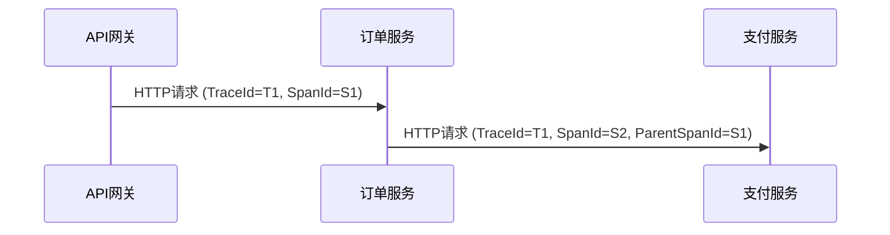

# B3传播格式

## 介绍

B3传播格式是Zipkin分布式追踪系统中用于传递追踪信息的标准协议。它定义了HTTP请求头或消息协议（如gRPC）中如何编码和传递追踪上下文（Trace Context），确保跨服务的调用链能够正确关联。B3格式最初由Zipkin团队提出，现已成为业界广泛采用的传播标准之一。

B3的名称来源于**BigBrotherBird**（灵感来自《1984》中的监控隐喻），其核心是通过一组特定的HTTP头字段传递以下信息：
- **Trace ID**：全局唯一的追踪标识符。
- **Span ID**：当前操作的唯一标识符。
- **Parent Span ID**（可选）：父级操作的标识符。
- **采样标志**（Sampled）：决定是否记录追踪数据。

## B3头字段

B3格式支持两种变体：
1. **单头模式（Single Header）**：所有信息合并为一个头字段 `b3`。
2. **多头模式（Multiple Headers）**：拆分为多个独立头字段。

### 1. 单头模式
格式为：  
`b3: {TraceId}-{SpanId}-{SamplingDecision}-{ParentSpanId}`  
示例：  
```plaintext
b3: 80f198ee56343ba864fe8b2a57d3eff7-e457b5a2e4d86bd1-1-05e3ac9a4f6e3b90
```
- `TraceId`: 80f198ee56343ba864fe8b2a57d3eff7  
- `SpanId`: e457b5a2e4d86bd1  
- `SamplingDecision`: 1（表示采样）  
- `ParentSpanId`: 05e3ac9a4f6e3b90（可选）

### 2. 多头模式
独立头字段如下：
```plaintext
X-B3-TraceId: 80f198ee56343ba864fe8b2a57d3eff7
X-B3-SpanId: e457b5a2e4d86bd1
X-B3-ParentSpanId: 05e3ac9a4f6e3b90
X-B3-Sampled: 1
```

:::note
单头模式更适合消息大小受限的场景（如gRPC），而多头模式更易读且支持更多扩展字段。
:::

## 代码示例

以下是一个Python Flask应用的示例，展示如何从HTTP请求中提取B3上下文并向下游服务传递：

```python
from flask import Flask, request
import requests

app = Flask(__name__)

@app.route('/api')
def handle_request():
    # 提取B3头
    trace_id = request.headers.get('X-B3-TraceId')
    span_id = request.headers.get('X-B3-SpanId')
    sampled = request.headers.get('X-B3-Sampled')

    # 向下游服务传递相同的B3上下文
    headers = {
        'X-B3-TraceId': trace_id,
        'X-B3-SpanId': 'new_span_id',  # 生成新的Span ID
        'X-B3-ParentSpanId': span_id,  # 当前Span作为父级
        'X-B3-Sampled': sampled
    }
    response = requests.get('http://downstream-service/api', headers=headers)
    return response.json()
```

## 实际应用场景

### 场景：微服务调用链追踪
假设有一个订单处理流程，涉及以下服务：  
1. **API网关** → 2. **订单服务** → 3. **支付服务**  

B3格式确保每个服务在调用下游时传递相同的 `TraceId`，同时生成新的 `SpanId` 并记录父子关系。最终在Zipkin中看到的追踪数据如下：



## 总结

- **B3格式**是Zipkin中传递追踪上下文的标准协议。  
- 支持**单头**和**多头**两种模式，适应不同场景需求。  
- 核心字段包括 `TraceId`、`SpanId`、`ParentSpanId` 和 `Sampled`。  
- 实际开发中，通常由追踪库（如OpenTelemetry）自动处理B3传播。

## 扩展练习
1. 尝试在本地启动两个微服务，手动设置B3头并观察Zipkin中的调用链。  
2. 比较单头模式和多头模式的性能差异（如使用curl测试请求大小）。  

## 附加资源
- [Zipkin官方文档：B3传播](https://zipkin.io/pages/instrumenting.html)  
- [OpenTelemetry上下文传播规范](https://opentelemetry.io/docs/concepts/context-propagation/)