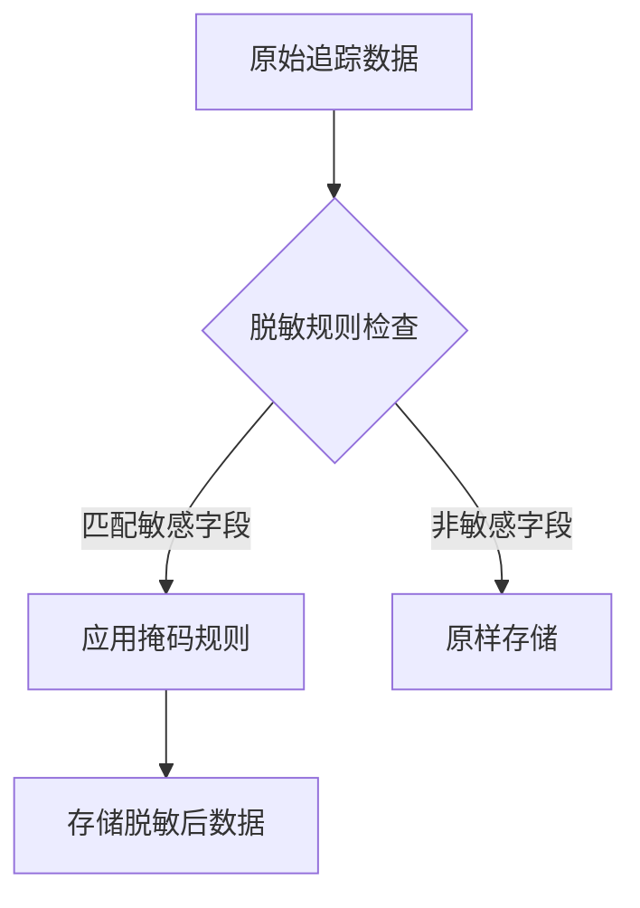

# 追踪数据脱敏

## 介绍

在分布式系统的链路追踪中，Zipkin会收集请求的元数据（如HTTP头、URL参数等），这些数据可能包含敏感信息（如密码、API密钥）。**追踪数据脱敏**是指通过规则配置或编程方式，在数据存储或展示前对敏感字段进行掩码或删除，确保隐私和安全。

:::note 为什么需要脱敏？
- 避免泄露用户凭证（如`Authorization`头）
- 符合GDPR等数据保护法规
- 防止内部人员滥用日志数据
:::

## 核心机制

Zipkin提供两种脱敏方式：

### 1. 内置字段过滤
通过配置`zipkin-server`的启动参数，自动屏蔽常见敏感字段：
```bash
java -jar zipkin-server.jar --zipkin.collector.scribe.enabled=false \
  --zipkin.collector.http.enabled=true \
  --zipkin.collector.http.sensitive-headers=password,token
```

### 2. 自定义脱敏器（以Java为例）
通过实现`SpanConsumer`接口，在数据存储前修改内容：
```java
public class MaskingSpanConsumer implements SpanConsumer {
  private final SpanConsumer delegate;

  public void accept(List<Span> spans) {
    spans.forEach(span -> {
      if (span.tags().containsKey("ssn")) {
        span.tag("ssn", "***-**-****");
      }
    });
    delegate.accept(spans);
  }
}
```

## 实际案例

### 场景：电商支付系统
追踪数据中需要脱敏的字段：
- 信用卡号（`card_number`）
- 用户ID（`user_id`）
- 支付令牌（`payment_token`）



### 示例输入/输出
**原始Span标签**:
```json
{
  "traceId": "abc123",
  "tags": {
    "card_number": "4111-1111-1111-1111",
    "amount": "100.00"
  }
}
```

**脱敏后**:
```json
{
  "traceId": "abc123",
  "tags": {
    "card_number": "4111-****-****-****",
    "amount": "100.00"
  }
}
```

## 进阶技巧

### 正则表达式脱敏
使用模式匹配处理动态字段：
```java
span.tags().replaceAll(
  (k, v) -> k.matches(".*(secret|key).*") ? "MASKED" : v
);
```

### 环境区分
开发环境保留完整数据，生产环境启用脱敏：
```yaml
# application-prod.yml
zipkin:
  masking:
    enabled: true
    patterns: ["credit_card", "ssn"]
```

## 总结

| 关键点                 | 实现方式                          |
|------------------------|----------------------------------|
| 静态字段脱敏           | 服务启动参数配置                 |
| 动态字段脱敏           | 自定义`SpanConsumer`实现        |
| 复杂模式匹配           | 正则表达式                       |

:::warning 注意事项
1. 脱敏后数据不可逆，调试时可能需要白名单机制
2. 确保脱敏规则不影响关键业务字段的分析
3. 在测试环境验证所有规则
:::

## 扩展资源

1. [Zipkin官方数据收集文档](https://zipkin.io/pages/data-instrumentation.html)
2. [Spring Cloud Sleuth字段过滤配置](https://docs.spring.io/spring-cloud-sleuth/docs/current/reference/html/howto.html#how-to-set-keys-for-span-tags-baggage)
3. 练习：为你的Zipkin实例配置脱敏规则，捕获包含`email`字段的请求并验证效果