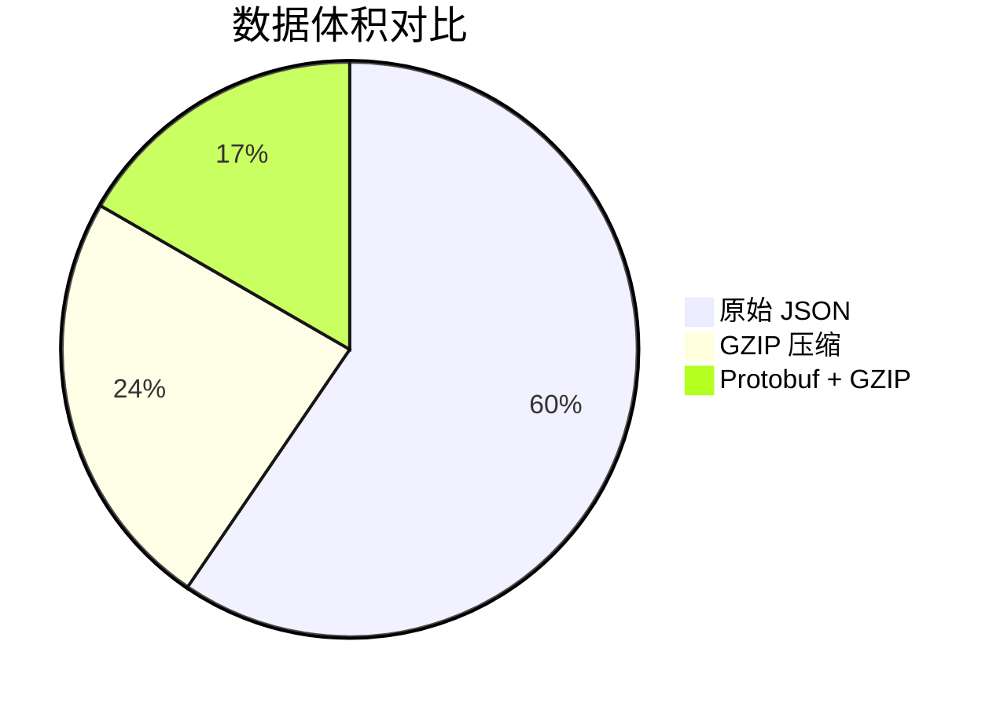

# 追踪数据压缩

## 介绍

在分布式系统中，Zipkin 用于收集和分析请求的追踪数据。随着系统规模的扩大，追踪数据量可能急剧增长，导致存储和传输成本上升。**追踪数据压缩**是一种优化技术，通过减少数据体积来降低资源消耗，同时保持数据的完整性和可用性。本文将介绍 Zipkin 中的压缩机制、实现方法以及实际应用场景。

## 为什么需要压缩追踪数据？

1. **减少存储开销**：未压缩的追踪数据会占用大量磁盘空间。
2. **降低网络带宽**：压缩后数据传输更快，尤其在跨数据中心场景中。
3. **提升处理效率**：压缩后的数据解析和存储速度更快。

Zipkin 支持多种压缩方式，例如 GZIP 或 Protocol Buffers（Protobuf）。

---

## 压缩技术实现

### 1. GZIP 压缩
GZIP 是一种通用的压缩算法，适用于文本类数据（如 JSON 格式的追踪数据）。以下是一个示例，展示如何在 Zipkin 中启用 GZIP 压缩：

#### 示例：启用 GZIP 的 HTTP 请求
```java
// 使用 Spring Boot 的 RestTemplate 发送压缩数据
RestTemplate restTemplate = new RestTemplate();
HttpHeaders headers = new HttpHeaders();
headers.set("Content-Encoding", "gzip");
headers.setContentType(MediaType.APPLICATION_JSON);

// 压缩 JSON 数据
String jsonData = "..."; // 你的追踪数据
byte[] compressedData = compressGZIP(jsonData);

HttpEntity<byte[]> request = new HttpEntity<>(compressedData, headers);
restTemplate.postForObject(zipkinUrl, request, String.class);

// GZIP 压缩工具方法
private static byte[] compressGZIP(String data) throws IOException {
    ByteArrayOutputStream bos = new ByteArrayOutputStream();
    GZIPOutputStream gzip = new GZIPOutputStream(bos);
    gzip.write(data.getBytes());
    gzip.close();
    return bos.toByteArray();
}
```

#### 输入与输出对比
- **原始数据**：`{"traceId":"a1b2c3","spans":[{"name":"serviceA"}]}`（约 50 字节）
- **压缩后**：GZIP 二进制数据（约 30 字节，节省 40%）。

---

### 2. Protocol Buffers（Protobuf）
Protobuf 是二进制编码格式，比 JSON 更高效。Zipkin 支持 Protobuf 格式的追踪数据上传。

#### 示例：Protobuf 编码
```protobuf
// Zipkin 的 Protobuf 定义（简化版）
message Span {
    string trace_id = 1;
    string name = 2;
}
```

```java
// 使用 Protobuf 发送数据
Span span = Span.newBuilder()
    .setTraceId("a1b2c3")
    .setName("serviceA")
    .build();
byte[] protobufData = span.toByteArray();

// 发送到 Zipkin
HttpEntity<byte[]> request = new HttpEntity<>(protobufData, headers);
restTemplate.postForObject(zipkinUrl, request, String.class);
```

:::tip
Protobuf 的压缩率通常比 GZIP 更高，且解析速度更快，适合高吞吐系统。
:::

---

## 实际应用场景

### 案例：电商系统的追踪优化
假设一个电商平台每日生成 1TB 的追踪数据：
1. **问题**：原始 JSON 数据占用大量存储。
2. **解决方案**：启用 GZIP 压缩后，数据体积减少 60%，年节省存储成本约 $10,000。
3. **进阶优化**：改用 Protobuf + GZIP，进一步减少 30% 体积。



---

## 总结

- **压缩技术**：GZIP 和 Protobuf 是 Zipkin 中常用的压缩方案。
- **选择依据**：
  - GZIP 适合兼容性优先的场景。
  - Protobuf 适合性能敏感型系统。
- **注意事项**：压缩会增加少量 CPU 开销，需权衡压缩率与计算资源。

---

## 扩展练习
1. 在本地 Zipkin 中配置 GZIP 压缩，对比上传速度的变化。
2. 尝试用 Protobuf 编码一段追踪数据，计算与 JSON 的体积差异。

## 附加资源
- [Zipkin 官方文档](https://zipkin.io/)
- [Protocol Buffers 指南](https://developers.google.com/protocol-buffers)