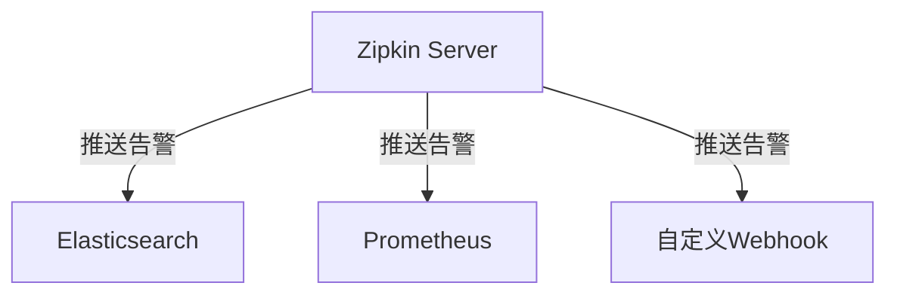

# 追踪告警设置

## 介绍

在分布式系统中，追踪告警是确保服务可靠性的关键功能。Zipkin通过分析追踪数据，允许您设置基于延迟阈值或错误率的告警规则。当系统行为超出预期范围时，这些告警会及时通知运维团队。

:::tip 为什么需要追踪告警？
- 主动发现问题而非被动响应
- 量化服务级别目标(SLO)
- 减少平均修复时间(MTTR)
:::

## 基础配置

### 1. 告警规则定义

Zipkin的告警规则通常通过配置文件或API设置。以下是一个YAML格式的示例配置：

```yaml
alert_rules:
  - name: "CheckoutServiceHighLatency"
    service: "checkout-service"
    type: "latency"
    threshold: "500ms"  # 超过500毫秒触发告警
    window: "5m"       # 5分钟滑动窗口
    severity: "warning"
  
  - name: "PaymentServiceErrors"
    service: "payment-service"
    type: "error_rate"
    threshold: "0.05"  # 错误率超过5%
    window: "10m"
    severity: "critical"
```

### 2. 告警存储后端

Zipkin支持多种告警存储后端：



## 实战案例

### 案例：电商网站延迟告警

假设您的电商网站有以下关键路径：
1. 用户浏览商品 (100ms预期)
2. 添加到购物车 (200ms预期)
3. 结算流程 (500ms预期)

当结算服务延迟超过阈值时：

```java
// 示例：在Java应用中标记慢请求
@PostMapping("/checkout")
public ResponseEntity checkout() {
    Span span = tracer.nextSpan().name("checkout").start();
    try (var ws = tracer.withSpanInScope(span)) {
        // 业务逻辑
        if (span.getDuration() > 500) {
            span.tag("alert", "high_latency");
        }
        return ResponseEntity.ok().build();
    } finally {
        span.finish();
    }
}
```

告警触发后的处理流程：

1. Zipkin检测到持续超限的`checkout-service`调用
2. 通过Webhook通知运维系统
3. 自动创建JIRA工单
4. 触发扩容流程

## 高级配置

### 动态阈值调整

使用百分位数而非固定值：

```yaml
alert_rules:
  - name: "DynamicCartLatency"
    service: "cart-service"
    type: "latency_percentile"
    percentile: "95"   # P95延迟
    threshold: "300ms"
    window: "15m"
```

### 关联告警

配置服务依赖关系的级联告警：

```mermaid
graph LR
    A[前端服务] --> B[用户服务]
    B --> C[数据库]
    
    rule: 当数据库延迟告警时，抑制用户服务的独立告警
```

## 测试与验证

使用Zipkin的API模拟告警触发：

```bash
# 生成测试追踪数据
curl -X POST http://zipkin:9411/api/v2/spans -H "Content-Type: application/json" -d '
[{
  "traceId": "1a2b3c4d",
  "name": "slow-operation",
  "duration": 600000,  # 600ms
  "localEndpoint": { "serviceName": "checkout-service" }
}]'
```

然后在Zipkin UI的"Alerts"面板查看触发的告警。

## 总结

关键要点：
- 告警应关注业务关键路径
- 结合历史数据设置合理阈值
- 实现告警分级（Warning/Critical）
- 定期审查误报/漏报情况

## 延伸学习

推荐练习：
1. 为您的服务配置一个基于P99延迟的告警
2. 实现告警自动升级机制（如30分钟未解决提升严重等级）
3. 将Zipkin告警与Slack/Teams集成

附加资源：
- Zipkin官方文档的"Alerting"章节
- 《分布式系统观测》第7章：有效告警策略