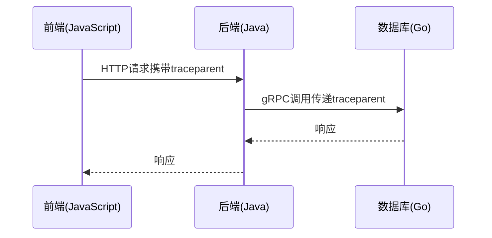

# W3C追踪上下文

## 介绍

W3C追踪上下文（Trace Context）是一种开放标准，定义了如何在分布式系统中传递追踪信息。它通过HTTP头部（如 `traceparent` 和 `tracestate`）实现跨服务的请求关联，是Zipkin等分布式追踪系统的核心支持标准之一。

:::note 关键概念
- **traceparent**: 包含追踪ID和父Span ID的必需头部
- **tracestate**: 提供厂商特定的扩展信息的可选头部
:::

## 标准格式

### traceparent 头部
格式如下：
```
traceparent: 00-0af7651916cd43dd8448eb211c80319c-b7ad6b7169203331-01
```
各部分的含义：
1. `00`: 版本号
2. `0af7651916cd43dd8448eb211c80319c`: 追踪ID（Trace ID）
3. `b7ad6b7169203331`: 父Span ID
4. `01`: 采样标志（01表示采样，00表示不采样）

### tracestate 头部
示例：
```
tracestate: zipkin=span1,elastic=span2
```
允许不同追踪系统添加自己的上下文信息。

## 在Zipkin中的实现

Zipkin从2.23.0版本开始原生支持W3C Trace Context。以下是通过HTTP传播上下文的示例：

```java
// 服务A发送请求
@GetMapping("/serviceA")
public String serviceA() {
    // 自动注入traceparent到请求头
    RestTemplate template = new RestTemplate();
    return template.getForObject("http://serviceB/api", String.class);
}

// 服务B接收请求
@GetMapping("/serviceB")
public String serviceB(@RequestHeader("traceparent") String traceparent) {
    System.out.println("Received traceparent: " + traceparent);
    return "Processed by ServiceB";
}
```

## 实际应用场景

### 跨语言服务追踪


:::tip 实际案例
电商系统中的订单流程：
1. 用户通过浏览器（前端）提交订单
2. 订单服务（Java）处理请求
3. 订单服务调用支付服务（Python）
4. 支付服务记录到数据库（Go）

所有服务通过W3C Trace Context保持追踪连续性
:::

## 手动创建上下文

当需要手动创建或修改上下文时：

```python
from opentelemetry.trace.propagation.tracecontext import TraceContextTextMapPropagator

carrier = {}
propagator = TraceContextTextMapPropagator()
span = tracer.start_span("manual-span")

# 注入上下文
propagator.inject(carrier, context=span.context)
print("traceparent:", carrier["traceparent"])

# 提取上下文
context = propagator.extract(carrier)
```

## 总结

W3C追踪上下文为分布式系统提供了：
- 标准化的追踪信息传递方式
- 跨语言/平台的支持能力
- 与现有系统的兼容性（通过tracestate）

## 扩展学习

1. 官方标准文档：[W3C Trace Context](https://www.w3.org/TR/trace-context/)
2. 尝试在Zipkin中：
   - 观察不同服务间的traceparent传递
   - 实验修改tracestate字段
3. 比较W3C标准与B3（Zipkin传统格式）的差异

:::caution 常见问题
Q: 为什么我的traceparent没有被传递？
A: 检查：
1. 服务是否正确处理HTTP头部
2. 中间件（如API网关）是否保留了追踪头部
3. 采样标志是否为01（启用采样）
:::