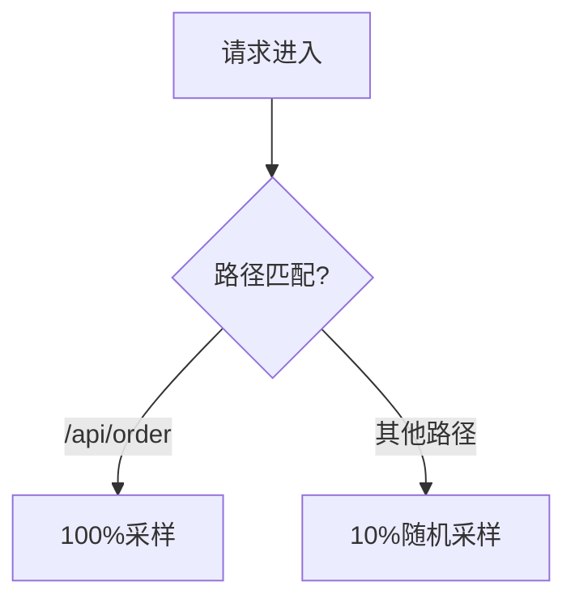

# 自定义采样器实现

## 介绍

在分布式系统中，Zipkin作为链路追踪工具，通过**采样（Sampling）**决定哪些请求的追踪数据需要被记录。默认采样策略（如固定比率采样）可能无法满足特定场景需求。**自定义采样器**允许开发者根据业务逻辑（如请求路径、用户ID等）动态控制采样行为，平衡系统开销与数据完整性。

:::note 为什么需要自定义采样器？
- **降低存储成本**：高频接口可能只需抽样记录。
- **关键路径全采集**：如支付流程需100%追踪。
- **动态调节**：根据系统负载自动调整采样率。
:::

---

## 基础概念

### 采样器类型
Zipkin支持以下常见采样器：
1. **概率采样器**（ProbabilitySampler）：按固定比例（如10%）采样。
2. **速率限制采样器**（RateLimitingSampler）：控制每秒最大采样数。
3. **自定义采样器**：通过实现接口实现业务逻辑。

### 关键接口
自定义采样器需实现 `zipkin2.Sampler` 接口：
```java
public interface Sampler {
  boolean isSampled(long traceId);
}
```

---

## 实现步骤

### 1. 创建自定义采样器类
以下示例实现一个基于**请求路径**的采样器：

```java
import zipkin2.Sampler;

public class PathBasedSampler implements Sampler {
  private final Set<String> highPriorityPaths;

  public PathBasedSampler(Set<String> highPriorityPaths) {
    this.highPriorityPaths = highPriorityPaths;
  }

  @Override
  public boolean isSampled(long traceId) {
    // 从当前线程获取请求路径（实际需结合上下文传递）
    String path = RequestContext.getCurrentPath();
    return highPriorityPaths.contains(path); // 关键路径全采样
  }
}
```

### 2. 集成到Zipkin
在Spring Boot中注册采样器Bean：
```java
@Bean
public Sampler customSampler() {
  Set<String> criticalPaths = Set.of("/api/payment", "/api/checkout");
  return new PathBasedSampler(criticalPaths);
}
```

---

## 实际案例

### 电商平台采样策略


**场景需求**：
- 订单相关接口全采样（业务核心）。
- 商品浏览接口低采样（QPS高，容忍部分数据丢失）。

**实现代码**：
```java
public class EcommerceSampler implements Sampler {
  private final Sampler defaultSampler = Sampler.create(0.1); // 默认10%

  @Override
  public boolean isSampled(long traceId) {
    String path = getRequestPath();
    return path.startsWith("/api/order") || defaultSampler.isSampled(traceId);
  }
}
```

---

## 高级技巧

### 动态配置采样率
结合配置中心（如Nacos）实现运行时调整：
```java
public class DynamicSampler implements Sampler {
  private volatile double rate;

  // 监听配置变更
  public void updateRate(double newRate) {
    this.rate = newRate;
  }

  @Override
  public boolean isSampled(long traceId) {
    return Math.abs(traceId % 100) < rate * 100;
  }
}
```

### 性能优化建议
- 在 `isSampled()` 方法中避免阻塞操作。
- 使用 `ThreadLocal` 缓存请求上下文。

:::warning 注意
采样决策应在请求开始时完成，且**同一个Trace ID的所有Span必须保持一致**的采样结果！
:::

---

## 总结

| 关键点                 | 说明                                                                 |
|------------------------|----------------------------------------------------------------------|
| **接口实现**           | 实现 `Sampler` 接口并注入Zipkin配置                                  |
| **上下文传递**         | 需确保请求路径等参数能跨线程传递（如MDC或RequestInterceptor）        |
| **一致性保证**         | 同一Trace ID的采样结果必须相同                                       |
| **动态策略优势**       | 结合配置中心实现无需重启调整采样率                                   |

---

## 延伸练习
1. 尝试实现一个基于**用户ID尾号**的采样器（如尾号0-3的用户全采样）。
2. 集成Spring Cloud Sleuth，观察自定义采样器如何生效。

**进一步学习**：
- [Zipkin官方采样文档](https://zipkin.io/pages/instrumenting.html)
- Brave库的 `SamplerFunction` 高级用法