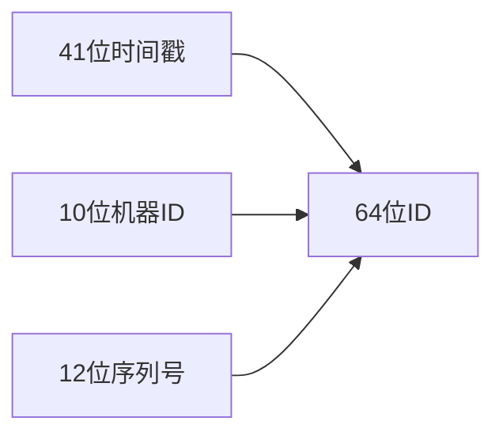

# 追踪ID生成策略

## 介绍

在分布式追踪系统中，**Trace ID**（追踪ID）是贯穿整个调用链的唯一标识符。它如同病历号将所有检查项目关联起来，帮助开发者理解跨服务请求的完整生命周期。Zipkin作为流行的分布式追踪系统，其ID生成策略直接影响追踪数据的准确性和系统性能。

:::note 基本概念
- **Trace ID**：128位或64位全局唯一标识符
- **Span ID**：单个工作单元的64位标识符
- **Parent ID**：指向父Span的标识符（可选）
:::

## ID生成原理

### 1. 核心要求
追踪ID必须满足：
- **全局唯一性**：不同服务、不同机器生成的ID不能冲突
- **时间有序性**（可选）：便于按时间排序分析
- **高效生成**：不能成为系统性能瓶颈

### 2. 常见策略

#### 2.1 随机数生成
最简单的实现方式：

```java
// Java示例：使用SecureRandom生成128位Trace ID
import java.security.SecureRandom;

public class TraceIdGenerator {
    private static final SecureRandom random = new SecureRandom();
    
    public static String generate() {
        byte[] bytes = new byte[16]; // 128位
        random.nextBytes(bytes);
        return bytesToHex(bytes);
    }
    
    private static String bytesToHex(byte[] bytes) {
        StringBuilder sb = new StringBuilder();
        for (byte b : bytes) {
            sb.append(String.format("%02x", b));
        }
        return sb.toString();
    }
}
```

**输入/输出示例**：
```
输入：无参数
输出：3e7d5f1b4a6c8d2e9f0b1a2c3d4e5f6
```

#### 2.2 时间戳+随机数
结合时间信息提高可读性：

```python
# Python示例：时间戳+随机数组合
import time
import random

def generate_trace_id():
    timestamp = int(time.time() * 1000)  # 毫秒时间戳
    random_part = random.getrandbits(64)  # 64位随机数
    return f"{timestamp:x}{random_part:016x}"

# 输出示例：'183c8d7f2a4b0000ef12d4a5b6c7e8f9'
```

#### 2.3 雪花算法（Snowflake）
Twitter开发的分布式ID算法：



Java实现片段：
```java
public class SnowflakeIdGenerator {
    private long workerId;
    private long sequence = 0L;
    private long lastTimestamp = -1L;

    public synchronized long nextId() {
        long timestamp = timeGen();
        if (timestamp < lastTimestamp) {
            throw new RuntimeException("时钟回拨！");
        }
        
        if (lastTimestamp == timestamp) {
            sequence = (sequence + 1) & 4095; // 12位序列号
            if (sequence == 0) {
                timestamp = tilNextMillis(lastTimestamp);
            }
        } else {
            sequence = 0L;
        }
        
        lastTimestamp = timestamp;
        return ((timestamp - 1288834974657L) << 22) 
               | (workerId << 12) 
               | sequence;
    }
}
```

## 实际应用场景

### 案例1：电商订单追踪
```
用户下单 -> 支付服务 -> 库存服务 -> 物流服务
```
所有服务使用相同的Trace ID（如 `5a3f9e2b1c4d6f8e`），在Zipkin中呈现完整调用链。

### 案例2：微服务调试
当API网关收到请求：
1. 检查HTTP头部是否存在 `X-B3-TraceId`
2. 不存在则生成新Trace ID
3. 将ID传递给下游所有服务

```go
// Go语言中间件示例
func TracingMiddleware(next http.Handler) http.Handler {
    return http.HandlerFunc(func(w http.ResponseWriter, r *http.Request) {
        traceID := r.Header.Get("X-B3-TraceId")
        if traceID == "" {
            traceID = generateTraceID() // 生成128位ID
        }
        ctx := context.WithValue(r.Context(), "traceID", traceID)
        next.ServeHTTP(w, r.WithContext(ctx))
    })
}
```

## 最佳实践

1. **ID长度选择**：
   - 128位：更适合大规模分布式系统
   - 64位：节省存储空间但可能发生冲突

2. **传播方式**：
   ```http
   GET /api/orders HTTP/1.1
   X-B3-TraceId: 80f198ee56343ba864fe8b2a57d3eff7
   X-B3-SpanId: 05e3ac9a4f6e3b90
   ```

3. **采样率控制**：
   ```java
   // 配置50%采样率
   @Bean
   public Sampler defaultSampler() {
       return Sampler.create(0.5f);
   }
   ```

## 总结

Trace ID生成策略是分布式追踪系统的基石。选择时需要考虑：
- 系统规模（冲突概率）
- 性能要求
- 是否需要时间信息
- 跨语言兼容性

:::tip 扩展练习
1. 实现一个能同时生成64位和128位ID的生成器
2. 比较UUID v4与自定义算法的性能差异
3. 设计一个带时区信息的Trace ID格式
:::

## 附加资源

- [Zipkin B3协议规范](https://github.com/openzipkin/b3-propagation)
- [Twitter Snowflake算法详解](https://blog.twitter.com/engineering/en_us/a/2010/announcing-snowflake)
- [RFC 7518 - JSON Web Algorithms](https://tools.ietf.org/html/rfc7518)