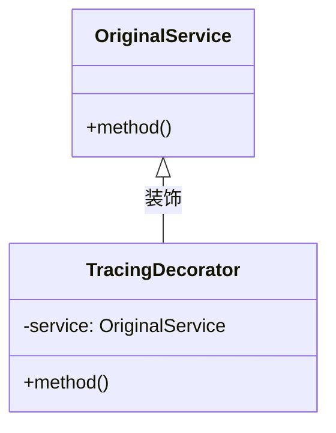

# 追踪装饰器开发

## 介绍

追踪装饰器（Tracing Decorators）是Zipkin中用于**增强分布式追踪粒度**的高级功能。它允许开发者在现有代码逻辑上"装饰"额外的追踪信息（如标签、注解或自定义元数据），而无需修改核心业务逻辑。这种技术特别适用于以下场景：

1. 为特定方法添加业务相关的追踪标签
2. 自动记录耗时操作的性能指标
3. 跨服务传递自定义上下文信息

## 核心概念

### 装饰器模式基础

装饰器通过包装（wrap）原始对象/方法，在其执行前后插入追踪逻辑。典型的装饰器结构如下：



### Zipkin 中的关键组件

1. **Tracer** - 负责创建和管理Span
2. **SpanCustomizer** - 用于修改Span属性
3. **ScopedSpan** - 有明确生命周期的Span

## 开发实战

### 基础装饰器示例

以下是一个Java方法调用的简单装饰器实现：

```java
public class TracedServiceDecorator implements OriginalService {
    private final OriginalService delegate;
    private final Tracer tracer;

    public String criticalOperation(String input) {
        // 创建新Span
        ScopedSpan span = tracer.startScopedSpan("critical_operation");
        try {
            span.tag("input", input);  // 记录输入参数
            
            // 调用原始方法
            String result = delegate.criticalOperation(input);
            
            span.tag("result_length", String.valueOf(result.length()));
            return result;
        } catch (Exception e) {
            span.error(e);  // 记录异常
            throw e;
        } finally {
            span.finish();  // 必须关闭Span
        }
    }
}
```

:::note 关键点
- `startScopedSpan()` 会自动将Span与当前线程上下文绑定
- 所有标签操作必须在 `finish()` 前完成
- 必须处理异常情况以保证Span能正确关闭
:::

### 跨进程装饰器

对于RPC调用，需要传播追踪上下文：

```java
public class HttpClientDecorator {
    private final Tracer tracer;

    public HttpResponse doGetWithTracing(String url) {
        // 从当前上下文获取Trace信息
        TraceContext context = tracer.currentSpan().context();
        
        // 注入HTTP头部
        Request.Builder builder = Request.newBuilder(url)
            .header("X-B3-TraceId", context.traceIdString())
            .header("X-B3-SpanId", context.spanIdString());
        
        // 执行请求并记录结果
        ScopedSpan span = tracer.startScopedSpan("http_request");
        try {
            HttpResponse response = client.execute(builder.build());
            span.tag("http.status", String.valueOf(response.status()));
            return response;
        } finally {
            span.finish();
        }
    }
}
```

## 实际应用案例

### 案例：电商订单处理

在订单创建流程中装饰关键步骤：

1. **支付服务调用** - 记录支付金额和支付方式
2. **库存服务调用** - 记录SKU和扣减数量
3. **物流服务调用** - 记录配送地址和物流商

```java
// 伪代码示例
public class OrderServiceDecorator {
    public Order createOrder(OrderRequest request) {
        ScopedSpan span = tracer.startScopedSpan("create_order");
        span.tag("order.amount", request.getAmount());
        span.tag("user.id", request.getUserId());
        
        try {
            Order order = delegate.createOrder(request);
            span.tag("order.id", order.getId());
            return order;
        } finally {
            span.finish();
        }
    }
}
```

通过这种装饰器，我们可以在Zipkin UI中看到完整的订单创建轨迹，并能够通过自定义标签进行筛选和分析。

## 最佳实践

1. **标签命名规范**：
   - 使用小写字母和下划线（如 `user_type`）
   - 避免敏感信息（如密码、身份证号）

2. **性能考量**：
   ```java
   // 不好的实践：在循环中创建大量Span
   for (Item item : items) {
       tracer.startScopedSpan("process_item");  // 可能产生性能问题
   }
   
   // 改进方案：批量处理
   ScopedSpan span = tracer.startScopedSpan("process_batch");
   span.tag("item_count", String.valueOf(items.size()));
   ```

3. **上下文清理**：
   ```java
   try (ScopedSpan span = tracer.startScopedSpan("operation")) {
       // 自动关闭资源
   }
   ```

## 总结

追踪装饰器为Zipkin提供了强大的扩展能力，通过本文我们学习了：

- 装饰器的基本实现模式
- 同步/异步场景下的Span管理
- 跨进程的上下文传播
- 实际业务中的最佳实践

## 扩展练习

1. 尝试为你的数据库访问层添加装饰器，记录SQL执行时间
2. 实现一个装饰器，自动重试失败操作并记录重试次数
3. 探索如何在装饰器中使用Zipkin的注解功能（如 `@NewSpan`）

## 附加资源

- [Zipkin官方自定义追踪文档](https://zipkin.io/pages/instrumenting.html)
- [Brave（Zipkin的Java客户端）高级用法](https://github.com/openzipkin/brave)
- [分布式追踪模式与反模式](https://microservices.io/patterns/observability/distributed-tracing.html)