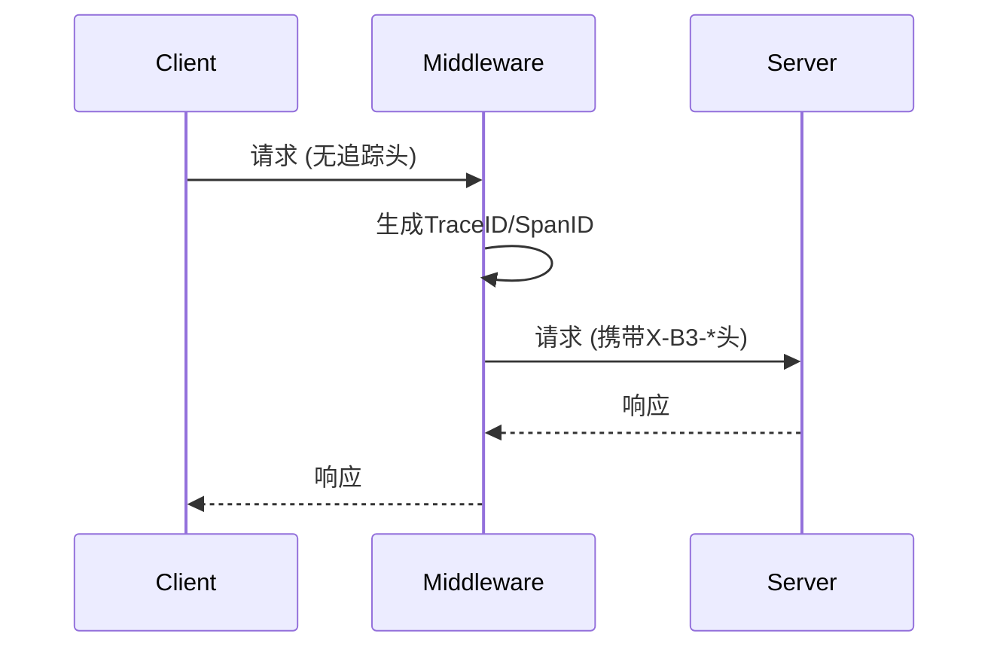

## 介绍

追踪中间件是Zipkin架构中的关键组件，它负责在服务间传递追踪上下文（如Trace ID、Span ID），并自动记录跨服务调用的时序数据。通过开发自定义中间件，您可以：

1. 统一处理不同框架的追踪逻辑
2. 添加业务特定的追踪标签
3. 实现与现有系统的深度集成

## 基础概念

### 追踪上下文传播
Zipkin使用以下标准HTTP头传递上下文：
- `X-B3-TraceId`：128位唯一追踪ID
- `X-B3-SpanId`：当前工作单元ID
- `X-B3-ParentSpanId`：父工作单元ID



## 开发实战

### 示例：Python Flask中间件

```python
from flask import Flask, request
import requests
import uuid

app = Flask(__name__)

@app.before_request
def start_trace():
    # 从请求头获取或生成追踪上下文
    trace_id = request.headers.get('X-B3-TraceId', str(uuid.uuid4()))
    span_id = request.headers.get('X-B3-SpanId', str(uuid.uuid4().hex[:16]))
    
    # 存储到请求上下文中
    request.environ['zipkin.trace_id'] = trace_id
    request.environ['zipkin.span_id'] = span_id
    
    # 记录开始时间
    request.environ['zipkin.start_time'] = time.time()

@app.after_request
def end_trace(response):
    # 计算耗时
    duration = (time.time() - request.environ['zipkin.start_time']) * 1000
    
    # 发送数据到Zipkin
    zipkin_data = {
        "traceId": request.environ['zipkin.trace_id'],
        "id": request.environ['zipkin.span_id'],
        "name": request.path,
        "timestamp": int(request.environ['zipkin.start_time'] * 1000000),
        "duration": int(duration * 1000),
        "tags": {
            "http.method": request.method,
            "http.status_code": response.status_code
        }
    }
    requests.post("http://zipkin:9411/api/v2/spans", json=[zipkin_data])
    
    return response
```

:::note HTTP头处理
对于下游服务调用，需要手动传递追踪头：
```python
headers = {
    'X-B3-TraceId': request.environ['zipkin.trace_id'],
    'X-B3-SpanId': str(uuid.uuid4().hex[:16]),
    'X-B3-ParentSpanId': request.environ['zipkin.span_id']
}
requests.get("http://downstream/api", headers=headers)
```
:::

## 高级功能

### 自定义标签
在中间件中添加业务相关标签：
```python
zipkin_data["tags"].update({
    "user.id": current_user.id,
    "request.size": len(request.get_data()),
    "service.version": "1.2.0"
})
```

### 采样控制
实现动态采样策略：
```python
def should_sample(request):
    # 示例：对重要路径100%采样，其他10%
    if request.path.startswith('/api/vip/'):
        return True
    return random.random() < 0.1
```

## 实际案例

### 电商系统追踪
1. **订单创建流程**：
   - 前端 → 订单服务 → 库存服务 → 支付服务
2. **关键标签**：
   ```python
   tags = {
       "order.id": order_id,
       "payment.amount": amount,
       "inventory.items": json.dumps(items)
   }
   ```

### 错误诊断
通过错误标签快速定位问题：
```python
try:
    process_request()
except Exception as e:
    zipkin_data["tags"]["error"] = str(e)
    raise
```

## 总结

关键要点：
- 中间件负责上下文传播和数据收集
- 必须正确处理HTTP追踪头
- 自定义标签增强可观测性
- 采样策略影响系统性能

## 延伸学习

推荐练习：
1. 为您的Web框架开发Zipkin中间件
2. 添加自定义业务标签
3. 实现基于QPS的动态采样

官方资源：
- [Brave (Java) 中间件实现](https://github.com/openzipkin/brave)
- [Zipkin数据模型文档](https://zipkin.io/pages/data_model.html)