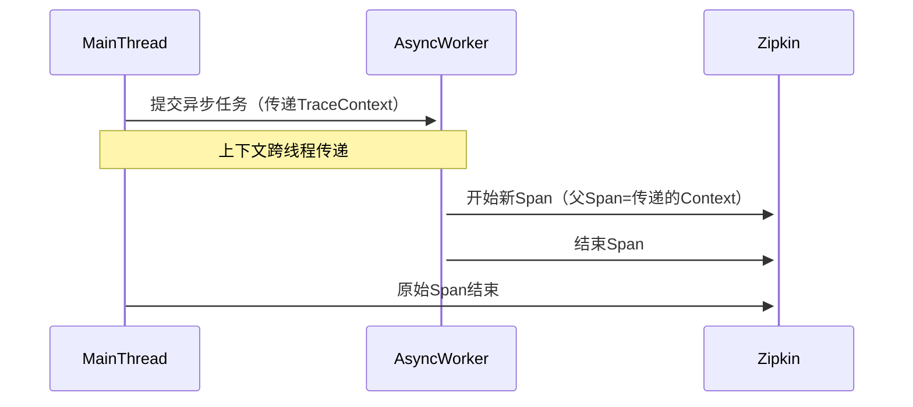
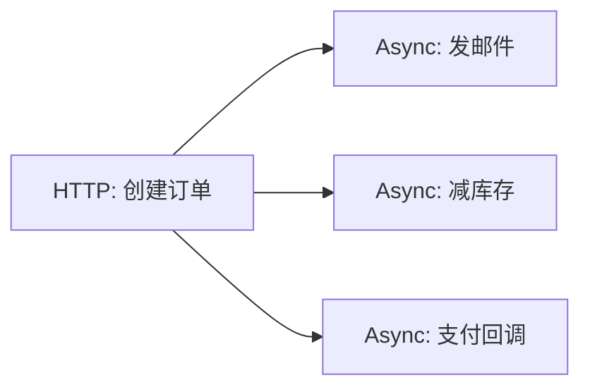

# 异步追踪处理

## 介绍

在分布式系统中，异步操作（如消息队列、定时任务或事件驱动架构）是常见的模式。然而，传统的同步追踪机制无法直接捕获异步调用的完整生命周期。Zipkin的**异步追踪处理**功能允许开发者追踪跨线程或跨服务的异步操作，确保分布式调用的可视化完整性。

异步追踪的核心挑战是**上下文传递**——如何在异步边界（如线程切换或消息发布/订阅）中保持追踪上下文（Trace ID、Span ID等）的连续性。Zipkin通过以下机制实现：
1. **手动上下文传播**：在异步操作前后显式传递追踪上下文。
2. **工具库支持**：如Brave（Java）提供`Tracer.nextSpan()`等API。

## 基础概念

### 关键术语
- **Span**：代表一个独立的工作单元（如方法调用或异步任务）。
- **Trace**：由多个Span组成的调用链。
- **Async Span**：标记为异步的Span，其生命周期可能跨越线程或进程。

### 工作原理


## 代码示例

### Java（使用Brave）
以下示例展示如何在异步线程中传递追踪上下文：

```java
// 1. 获取当前追踪上下文
Span currentSpan = tracer.currentSpan();
TraceContext context = currentSpan.context();

// 2. 提交异步任务
executor.submit(() -> {
    // 3. 在新线程中恢复上下文
    try (Scope scope = tracer.withSpanInScope(currentSpan)) {
        Span asyncSpan = tracer.newChild(context).name("async-operation").start();
        try {
            // 执行异步操作...
        } finally {
            asyncSpan.finish();
        }
    }
});
```

### 输入/输出
- **输入**：同步线程中的HTTP请求（Trace ID: `abc123`）
- **输出**：Zipkin中显示包含两个Span的Trace：
  - `parent-span`（同步）
  - `async-operation`（异步，子Span）

:::note
异步Span的持续时间通常会超过其父Span，这是正常现象！
:::

## 实际应用场景

### 案例：订单处理系统
1. **同步阶段**：用户提交订单（HTTP请求）
2. **异步阶段**：
   - 发送订单确认邮件
   - 更新库存服务
   - 支付结果回调



通过异步追踪，可以清晰看到：
- 各异步任务是否完成
- 每个任务的耗时和状态
- 整体流程的瓶颈分析

## 常见问题

### 1. 上下文丢失
**现象**：异步Span与父Trace无关联。<br />
**解决**：确保在任务提交时传递`TraceContext`，使用工具库的`propagation`功能。

### 2. Span时间重叠
**现象**：父Span结束后异步Span仍在进行。<br />
**解释**：这是异步追踪的正常表现，Zipkin会自动处理这种关系。

## 总结

- 异步追踪需要**显式传递上下文**，工具库可简化此过程。
- 适用于消息队列、线程池、定时任务等场景。
- 在Zipkin UI中，异步Span会通过**父子关系**可视化。

## 扩展练习

1. 尝试在Spring Boot中集成RabbitMQ，并追踪消息生产/消费的全过程。
2. 使用`Tracing.current().newTrace()`创建一个独立的异步Trace，观察其与主Trace的区别。

## 附加资源

- [Brave异步追踪文档](https://github.com/openzipkin/brave/tree/master/brave#asynchronous-instrumentation)
- [Zipkin数据模型](https://zipkin.io/pages/data_model.html)