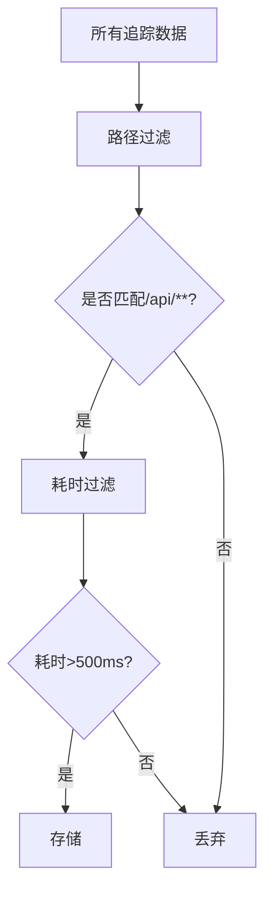

# Zipkin 高级功能：追踪数据过滤

## 介绍

在分布式系统中，Zipkin会收集大量追踪数据。但并非所有数据都值得长期存储或分析。**追踪数据过滤**允许你按规则筛选数据，例如：

- 排除健康检查等低价值请求
- 仅保留错误率高的服务追踪
- 根据HTTP路径或标签过滤数据

过滤能显著降低存储成本，并帮助开发者聚焦关键问题。

## 基础过滤机制

Zipkin提供两种主要过滤方式：

1. **采集时过滤**：在数据上报到Zipkin前丢弃匹配项
2. **存储后过滤**：通过查询接口筛选已存储数据

### 1. 采集时过滤（推荐）

通过`zipkin-collector`配置过滤规则。修改`zipkin-server`的启动参数：

```bash
java -jar zipkin-server.jar \
  --zipkin.collector.sample-rate=0.5 \
  --zipkin.collector.whitelist-paths=/api/important
```

参数说明：
- `sample-rate`：采样率（0.5表示50%的请求会被记录）
- `whitelist-paths`：只收集匹配路径的请求

:::tip
采集时过滤最节省资源，但过滤后的数据无法恢复。建议先在高采样率下测试规则。
:::

### 2. 存储后过滤

通过Zipkin API查询时添加过滤条件：

```bash
# 只查询包含error标签的追踪
curl "http://localhost:9411/api/v2/traces?annotationQuery=error"
```

常用过滤参数：
- `serviceName`：服务名
- `annotationQuery`：标签键值对
- `minDuration`/`maxDuration`：耗时范围

## 实际配置示例

### 案例1：过滤健康检查请求

在Spring Cloud Sleuth中配置：

```java
@Bean
public Sampler sampler() {
    return new Sampler() {
        @Override
        public boolean isSampled(long traceId) {
            // 排除/actuator/health的请求
            return !Optional.ofNullable(RequestContextHolder.getRequestAttributes())
              .map(attrs -> ((ServletRequestAttributes) attrs).getRequest())
              .map(req -> req.getRequestURI().contains("/actuator/health"))
              .orElse(false);
        }
    };
}
```

### 案例2：按错误状态过滤

使用Zipkin的`StorageComponent`自定义存储逻辑：

```java
@Bean
public StorageComponent storage() {
    return new FilteredStorageComponent(originalStorage) {
        @Override
        public boolean shouldStore(Span span) {
            // 只存储包含错误或耗时超过1秒的span
            return "error".equals(span.tags().get("error")) 
              || span.duration() > 1000;
        }
    };
}
```

## 高级过滤模式

### 组合过滤条件



### 基于标签的动态过滤

在微服务中添加业务标签：

```python
# Python Flask示例
from flask import Flask
import requests

app = Flask(__name__)

@app.route("/order")
def order():
    # 添加业务标签
    with tracer.start_span('place_order') as span:
        span.set_tag("business.tier", "premium")
        span.set_tag("payment.method", "credit_card")
```

然后在Zipkin中查询：
```bash
# 只查询高级用户的订单
/api/v2/traces?annotationQuery=business.tier=premium
```

## 总结

关键要点：
- 优先使用**采集时过滤**减少不必要的数据传输
- 结合**采样率**和**路径过滤**实现基础过滤
- 通过**自定义标签**实现业务级过滤
- 存储后过滤适合临时分析场景

## 延伸学习

练习建议：
1. 在本地Zipkin中配置只收集`/api/v1`路径的请求
2. 为你的服务添加自定义业务标签
3. 尝试组合多个过滤条件查询

附加资源：
- [Zipkin官方过滤文档](https://zipkin.io/zipkin-api/#/default/get_traces)
- [Spring Cloud Sleuth采样配置](https://docs.spring.io/spring-cloud-sleuth/docs/current/reference/html/howto.html#howto-set-a-sampler)