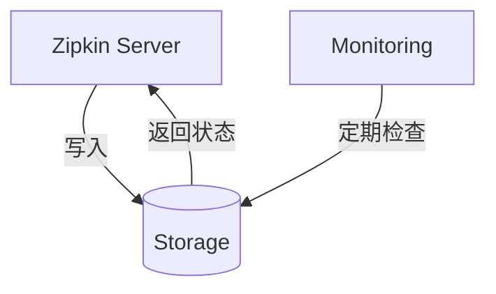

## 介绍

Zipkin健康监控是保障分布式追踪系统可靠性的关键环节。通过监控Zipkin服务的关键指标（如请求延迟、错误率、存储状态等），开发者可以及时发现潜在问题，确保追踪数据不丢失。本章将介绍健康监控的核心指标、常用工具及告警配置方法。

---

## 核心监控指标

### 1. 服务可用性
- **HTTP端点健康检查**：通过`/health`端点验证Zipkin服务是否存活
```bash
curl http://localhost:9411/health
# 预期输出：{"status":"UP"}
```

### 2. 存储健康状态
监控存储后端（如Elasticsearch、MySQL）的连接状态和数据写入情况：


### 3. 关键性能指标
| 指标名称              | 说明           | 正常阈值     |
|-------------------|--------------|----------|
| `spans_received`  | 每分钟接收的Span数量 | 依业务规模而定  |
| `storage_success` | 成功存储的Span比例  | `>99%`   |
| `query_latency`   | 查询响应时间(毫秒)   | `<500ms` |

---

## 监控工具配置

### Prometheus监控示例
1. 添加Prometheus客户端依赖（以Java为例）：
```xml
<dependency>
    <groupId>io.micrometer</groupId>
    <artifactId>micrometer-registry-prometheus</artifactId>
</dependency>
```

2. 暴露指标端点：
```java
@SpringBootApplication
public class ZipkinServer {
    public static void main(String[] args) {
        SpringApplication.run(ZipkinServer.class, args);
    }
}
```

3. 配置Prometheus抓取目标：
```yaml
scrape_configs:
  - job_name: 'zipkin'
    metrics_path: '/actuator/prometheus'
    static_configs:
      - targets: ['localhost:9411']
```

:::tip
使用Grafana可视化指标数据时，可导入现成的Zipkin仪表板模板（ID: 10001）
:::

---

## 告警规则配置

### Alertmanager规则示例
```yaml
groups:
- name: zipkin-alerts
  rules:
  - alert: HighErrorRate
    expr: rate(http_server_requests_errors_total{job="zipkin"}[5m]) > 0.1
    for: 10m
    labels:
      severity: critical
    annotations:
      summary: "High error rate on Zipkin ({{ $value }})"
```

:::warning 常见问题
存储空间不足会导致Span丢失，建议设置磁盘使用率告警：
```yaml
  - alert: StorageFull
    expr: disk_used_percent{path="/data"} > 85
```
:::

---

## 实战案例：电商系统监控

**场景**：某电商平台发现订单追踪数据缺失

1. **问题排查**：
   - 检查`/health`端点返回存储状态异常
   - 发现Elasticsearch集群磁盘使用率达95%

2. **解决方案**：
   ```bash
   # 临时清理旧索引
   curl -XDELETE 'http://es-host:9200/zipkin-*-2023-01-*'
   
   # 长期方案：配置索引生命周期管理
   PUT _ilm/policy/zipkin-retention
   {
     "policy": {
       "phases": {
         "hot": {"actions": {"rollover": {"max_size": "50GB"}}},
         "delete": {"min_age": "30d", "actions": {"delete": {}}}
       }
     }
   }
   ```

---

## 总结与练习

### 关键要点
- 定期检查`/health`和`/metrics`端点
- 监控存储后端连接状态和资源使用情况
- 设置合理的性能阈值告警

### 动手练习
1. 使用Docker部署Zipkin+Prometheus：
   ```bash
   docker run -d -p 9411:9411 openzipkin/zipkin
   docker run -d -p 9090:9090 -v prometheus.yml:/etc/prometheus/prometheus.yml prom/prometheus
   ```

2. 尝试编写一个检测Span接收量突降的告警规则

### 扩展阅读
- [Zipkin官方监控指南](https://zipkin.io/pages/health.html)
- [Micrometer监控指标文档](https://micrometer.io/docs)