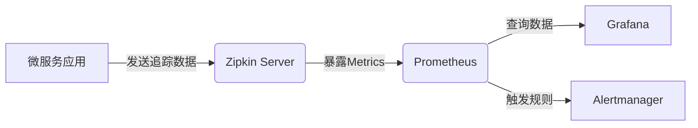

# Prometheus集成

## 介绍

在微服务架构中，Zipkin作为分布式追踪系统可以帮助开发者理解请求在服务间的流转路径。而**Prometheus**作为云原生监控领域的标杆工具，能够为Zipkin提供强大的指标收集、存储和告警能力。本章将指导初学者如何将两者集成，构建完整的可观测性体系。

:::tip 核心价值
- **指标可视化**：通过Prometheus的Grafana看板展示Zipkin的追踪指标
- **告警自动化**：基于追踪数据设置服务健康度告警规则
- **性能分析**：结合RED方法(Requests, Errors, Duration)监控微服务
:::

## 基础架构



## 配置步骤

### 1. 启用Zipkin的Prometheus指标

Zipkin服务默认在`/actuator/prometheus`端点暴露Prometheus格式的指标。确保你的Zipkin服务包含以下依赖：

```xml
<!-- Maven示例 -->
<dependency>
    <groupId>io.zipkin.zipkin2</groupId>
    <artifactId>zipkin-server</artifactId>
    <version>${zipkin.version}</version>
</dependency>
<dependency>
    <groupId>io.micrometer</groupId>
    <artifactId>micrometer-registry-prometheus</artifactId>
</dependency>
```

启动Zipkin时添加配置参数：
```properties
# application.properties
management.metrics.export.prometheus.enabled=true
management.endpoints.web.exposure.include=prometheus,health,metrics
```

### 2. Prometheus抓取配置

在`prometheus.yml`中添加抓取目标：

```yaml
scrape_configs:
  - job_name: 'zipkin'
    metrics_path: '/actuator/prometheus'
    static_configs:
      - targets: ['zipkin-host:9411']
```

验证指标是否正常采集：
```bash
curl http://localhost:9411/actuator/prometheus | grep "zipkin_collector"
```

### 3. 关键监控指标

| 指标名称                          | 类型    | 说明                          |
|-----------------------------------|---------|-------------------------------|
| zipkin_collector_spans_total      | Counter | 接收到的总span数量            |
| zipkin_collector_bytes_total      | Counter | 接收到的总字节数              |
| zipkin_collector_spans_dropped    | Counter | 因错误丢弃的span数量          |
| zipkin_storage_requests_seconds   | Summary | 存储操作耗时统计              |

## 实战案例

### 场景：检测异常服务延迟

1. **创建Grafana看板**：
   - 添加`zipkin_collector_spans_total`图表
   - 设置`rate(zipkin_collector_spans_total[5m])`查询

2. **设置告警规则**：
```yaml
# alert.rules.yml
groups:
- name: zipkin.rules
  rules:
  - alert: HighErrorRate
    expr: rate(zipkin_collector_spans_dropped[5m]) > 0.1
    for: 10m
    labels:
      severity: warning
    annotations:
      summary: "High span drop rate in Zipkin (instance {{ $labels.instance }})"
```

### 示例：追踪成功率监控

```promql
100 * (
  1 - sum(rate(zipkin_collector_spans_dropped[5m]))
  / sum(rate(zipkin_collector_spans_total[5m]))
)
```

## 常见问题

:::caution 指标缺失排查
1. 确认`/actuator/prometheus`端点可访问
2. 检查Prometheus的`/targets`页面
3. 验证时间戳是否同步（NTP服务）
:::

## 总结

通过Prometheus集成，Zipkin的监控能力得到显著增强：
- 实时可视化追踪指标
- 基于历史数据的趋势分析
- 结合Alertmanager实现智能告警

## 扩展学习

1. **官方文档**：
   - [Zipkin Metrics](https://zipkin.io/pages/metrics.html)
   - [Prometheus Configuration](https://prometheus.io/docs/prometheus/latest/configuration/configuration/)

2. **实践建议**：
   - 为不同服务添加`service_name`标签
   - 设置合理的抓取间隔（建议15-30s）
   - 结合Kubernetes服务发现实现动态监控

3. **进阶方向**：
   - 实现基于追踪数据的SLO告警
   - 开发自定义的Zipkin Exporter
   - 集成OpenTelemetry Collector