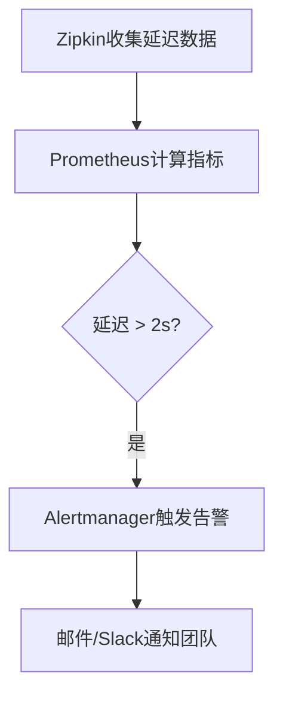

# 告警通知渠道

## 介绍

在分布式系统中，Zipkin作为链路追踪工具，能够帮助开发者监控请求的流转过程。当系统出现异常（如延迟激增或错误率超标）时，**告警通知渠道**是确保团队及时响应的重要手段。本节将介绍如何配置Zipkin的告警通知渠道，涵盖邮件、Slack、Webhook等常见方式。

:::note
Zipkin本身不直接提供告警功能，但可通过集成Prometheus Alertmanager或第三方工具（如Grafana）实现。
:::

---

## 常见通知渠道配置

### 1. 邮件通知
通过Alertmanager配置邮件告警，示例配置如下：

```yaml
# alertmanager.yml 示例
global:
  smtp_from: 'alert@example.com'
  smtp_smarthost: 'smtp.example.com:587'
  smtp_auth_username: 'user'
  smtp_auth_password: 'password'

route:
  receiver: 'email-team'

receivers:
- name: 'email-team'
  email_configs:
  - to: 'team@example.com'
    send_resolved: true  # 发送问题解决通知
```

**触发条件示例**（Prometheus规则）：
```yaml
groups:
- name: zipkin-alerts
  rules:
  - alert: HighRequestLatency
    expr: histogram_quantile(0.9, rate(zipkin_latency_bucket[5m])) > 1000
    for: 10m
    labels:
      severity: 'critical'
    annotations:
      summary: "高延迟请求 detected"
      description: "{{ $value }}ms 延迟超过阈值"
```

---

### 2. Slack通知
在Slack中创建Incoming Webhook，并在Alertmanager中配置：

```yaml
receivers:
- name: 'slack-team'
  slack_configs:
  - api_url: 'https://hooks.slack.com/services/XXXX/YYYY'
    channel: '#alerts'
    text: '{{ .CommonAnnotations.description }}'
```

---

### 3. Webhook集成
自定义Webhook可将告警转发至内部系统（如企业微信、钉钉）：

```yaml
receivers:
- name: 'webhook-team'
  webhook_configs:
  - url: 'http://internal-api.example.com/alerts'
    send_resolved: true
```

---

## 实际案例：电商系统延迟告警

### 场景描述
某电商平台的订单服务出现P99延迟超过2秒，通过Zipkin追踪发现是支付服务调用缓慢。配置的告警流程如下：



**告警内容示例**（Slack通知）：
```
[CRITICAL] 高延迟请求 detected in 支付服务
P99延迟: 2300ms (阈值: 2000ms)
Trace ID: 3ba9b5432a1cdff1
立即查看: http://zipkin.example.com/trace/3ba9b5432a1cdff1
```

---

## 总结与练习

### 关键点总结
1. Zipkin需配合监控工具（如Prometheus）实现告警。
2. 主流通知渠道包括邮件、Slack、Webhook等。
3. 告警规则需定义明确的阈值和持续时间。

### 练习建议
1. 在本地部署Prometheus+Alertmanager，配置邮件告警规则。
2. 使用Zipkin的`/api/v2/trace/{traceId}`接口，尝试在告警信息中嵌入追踪链接。

### 附加资源
- [Alertmanager官方文档](https://prometheus.io/docs/alerting/latest/alertmanager/)
- [Zipkin指标导出示例](https://github.com/openzipkin/zipkin/tree/master/zipkin-server#prometheus-metrics)