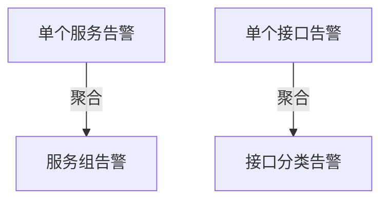

# 告警降噪策略

## 介绍

在分布式系统的监控中，告警是发现问题的关键手段。然而，过多的无效告警（即"告警噪音"）会导致"告警疲劳"，使运维人员忽略真正重要的告警。Zipkin作为分布式追踪系统，可以通过合理的降噪策略提高告警质量。

告警降噪的核心目标是：
1. 减少误报（False Positives）
2. 突出关键问题（True Positives）
3. 避免告警风暴（Alert Storm）

## 基础降噪策略

### 1. 阈值调整

通过设置合理的阈值避免过于敏感的告警触发：

```yaml
# Zipkin 告警规则示例（假设使用Prometheus Alertmanager）
alert: HighLatency
expr: histogram_quantile(0.99, sum(rate(zipkin_latency_bucket[5m])) by (service)) > 1000
for: 5m
labels:
  severity: critical
annotations:
  summary: "High latency detected in {{ $labels.service }}"
```

:::tip 阈值设置建议
- 初始阶段设置较宽松的阈值（如P99 > 2s）
- 根据历史数据逐步调整到最佳值
:::

### 2. 告警聚合

将相似告警合并，避免重复通知：



### 3. 静默规则

配置静默规则处理已知问题：

```bash
# 使用Alertmanager静默规则示例
amtool silence add --comment="计划维护" service=payment-service
```

## 高级降噪技术

### 1. 基于上下文的过滤

结合追踪上下文判断告警是否有效：

```java
// 示例：在Span中添加业务上下文
tracer.nextSpan().name("checkout")
    .tag("user_type", "vip")  // 添加用户类型上下文
    .tag("payment_method", "credit_card");
```

### 2. 异常检测算法

使用统计学方法识别真正异常：

```python
# 伪代码：使用Z-score检测异常值
def is_anomaly(latency_values):
    mean = np.mean(latency_values)
    std = np.std(latency_values)
    latest = latency_values[-1]
    return abs(latest - mean) > 3 * std
```

### 3. 告警依赖关系

建立服务依赖关系避免级联告警：


:::note 依赖告警规则
当底层服务（如库存服务）故障时，只触发根因告警
:::

## 实际案例

**电商网站场景**：

1. **问题**：大促期间支付服务出现1000+条高延迟告警
2. **分析**：
   - 80%告警来自同一批用户（使用特定支付方式）
   - 实际系统容量仍有余量
3. **解决方案**：
   - 添加支付方式标签到Span
   - 配置基于支付方式的告警分组
   - 对非关键支付方式降低告警级别

## 总结

有效的告警降噪策略需要：

1. 合理的阈值设置
2. 多维度告警聚合
3. 上下文感知能力
4. 智能异常检测
5. 服务依赖关系管理

## 延伸学习

- 练习：分析你项目中的历史告警，识别可以降噪的模式
- 进阶阅读：
  - [Zipkin官方文档 - 告警配置](https://zipkin.io/)
  - 《SRE实战》中的告警管理章节
  - Prometheus Alertmanager最佳实践

:::warning 不要过度降噪
降噪的目标是提高告警质量，而不是完全消除告警。确保关键问题仍能被及时发现！
:::