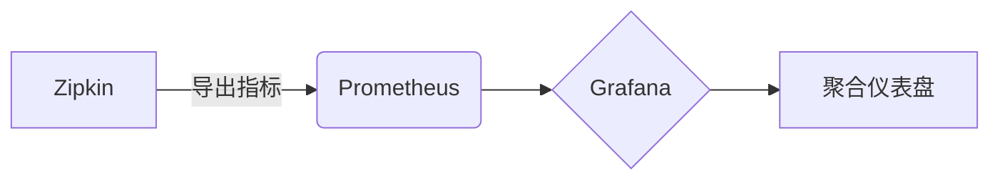

# 监控数据聚合

## 介绍

在分布式系统中，Zipkin通过收集各个服务的追踪数据（traces）来帮助开发者分析性能问题。随着系统规模扩大，原始数据量可能变得非常庞大，直接处理这些数据会导致存储和计算资源浪费。**监控数据聚合**通过对原始数据进行分组、统计和摘要，生成更高层次的监控指标（如平均延迟、错误率等），从而提升监控效率。

## 为什么需要数据聚合？

1. **降低存储压力**：原始追踪数据可能包含大量冗余信息，聚合后仅保留关键指标。
2. **提高查询性能**：聚合后的数据更易于快速分析和可视化。
3. **简化告警规则**：基于聚合指标（如95%分位延迟）设置告警比直接分析原始数据更高效。

## 聚合原理

Zipkin的数据聚合通常发生在两个阶段：

1. **客户端聚合**：在数据上报前，客户端（如Spring Boot应用）对部分指标进行预聚合。
2. **服务端聚合**：Zipkin服务器或外部系统（如Prometheus）对接收到的数据进行二次聚合。

### 常见聚合维度
| 维度         | 示例                          |
|--------------|-----------------------------|
| 时间窗口     | 每分钟/每小时的请求量         |
| 服务名称     | 按服务统计错误率              |
| HTTP路径     | 聚合相同API的延迟             |
| 状态码       | 统计5xx错误占比               |

## 实现方式

### 1. 使用Zipkin原生聚合
Zipkin默认支持按服务名和Span名的基本聚合。例如，以下查询会返回服务`backend-service`的延迟分布：

```bash
# 查询示例（Zipkin API）
curl "http://localhost:9411/api/v2/traces?serviceName=backend-service&limit=10"
```

输出结果（摘要）：
```json
{
  "traceId": "abcd1234",
  "spans": [
    {
      "name": "GET /api/users",
      "duration": 45,
      "tags": {"http.status_code": "200"}
    }
  ]
}
```

### 2. 集成Prometheus
通过`zipkin-storage-prometheus`将数据导出到Prometheus进行高级聚合：



配置示例（`application.properties`）：
```properties
# 启用Prometheus存储扩展
zipkin.storage.type=prometheus
zipkin.prometheus.metrics.enabled=true
```

### 3. 自定义聚合脚本
使用Python处理Zipkin的JSON数据：

```python
import json
from collections import defaultdict

# 模拟聚合：计算每个服务的平均延迟
def aggregate_latency(traces):
    service_stats = defaultdict(list)
    for trace in traces:
        for span in trace["spans"]:
            service = span["localEndpoint"]["serviceName"]
            service_stats[service].append(span["duration"])
    
    return {service: sum(durations)/len(durations) 
            for service, durations in service_stats.items()}

# 示例输入（简化版Zipkin数据）
sample_traces = [
    {"spans": [{"localEndpoint": {"serviceName": "auth"}, "duration": 20}]},
    {"spans": [{"localEndpoint": {"serviceName": "auth"}, "duration": 30}]}
]
print(aggregate_latency(sample_traces))  # 输出: {'auth': 25.0}
```

## 实际案例

### 电商系统监控
假设一个电商平台包含以下服务：
- `user-service`：用户管理
- `product-service`：商品信息
- `order-service`：订单处理

通过聚合：
1. 发现`order-service`的`POST /checkout`接口在促销期间平均延迟从50ms升至200ms。
2. 针对该接口设置告警规则：当95%分位延迟 > 500ms时触发告警。

:::tip 实际配置
在Prometheus中配置的告警规则示例：
```yaml
alert: HighCheckoutLatency
expr: histogram_quantile(0.95, sum(rate(zipkin_latency_bucket{service="order-service", span="POST /checkout"}[5m])) by (le)) > 500
for: 10m
```
:::

## 总结

- **核心价值**：数据聚合将原始追踪数据转化为可操作的监控指标。
- **常用工具**：Zipkin原生聚合、Prometheus、自定义脚本。
- **典型场景**：性能分析、容量规划、异常检测。

## 扩展练习

1. 使用Zipkin UI的依赖图功能，观察服务间调用的聚合视图。
2. 尝试用PromQL编写一个查询，计算所有服务每分钟的错误请求率（5xx状态码占比）。

## 附加资源

- [Zipkin官方文档：数据存储](https://zipkin.io/zipkin/#storage-component)
- [Prometheus直方图使用指南](https://prometheus.io/docs/practices/histograms/)