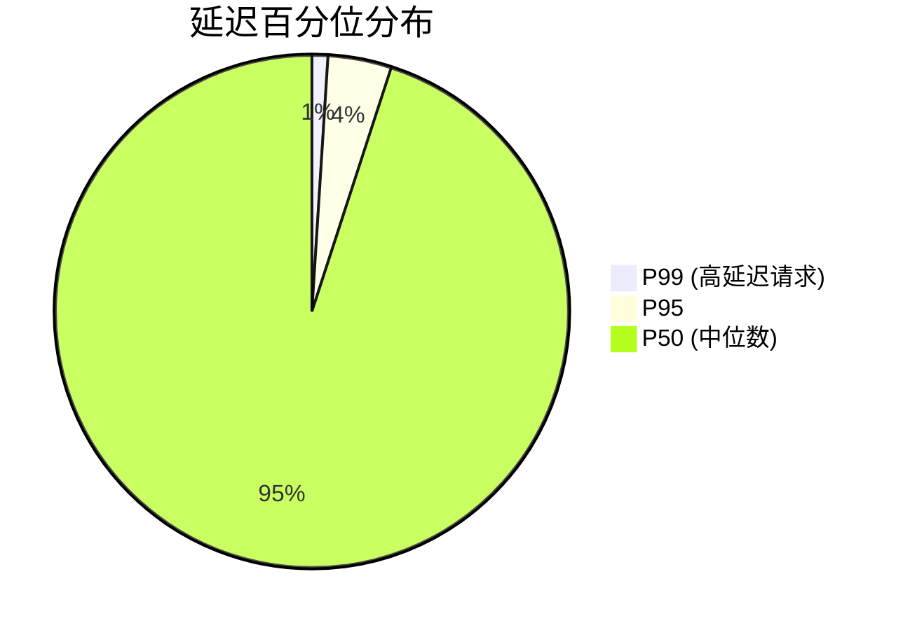

# 关键指标定义

在分布式系统中，监控和告警是确保系统可靠性的关键环节。Zipkin作为分布式追踪系统，提供了丰富的指标来帮助开发者理解系统的性能和行为。本章将介绍Zipkin中的**关键指标定义**，帮助你识别和监控系统的核心性能指标。

## 介绍

关键指标（Key Metrics）是衡量系统健康状况的量化数据。在Zipkin中，这些指标通常与**延迟（Latency）**、**错误率（Error Rate）**和**吞吐量（Throughput）**相关。通过监控这些指标，你可以快速发现潜在问题并采取相应措施。

:::tip
关键指标是告警规则的基础。定义清晰的指标能帮助你更早发现问题。
:::

---

## 核心指标分类

Zipkin的监控指标主要分为以下几类：

### 1. 延迟（Latency）
延迟是指请求从发起到完成所花费的时间。在Zipkin中，延迟通常以**百分位数（P99、P95、P50）**的形式呈现。

- **P99**：99%的请求完成时间小于此值。
- **P50（中位数）**：50%的请求完成时间小于此值。



### 2. 错误率（Error Rate）
错误率是指请求失败的比例。Zipkin通过追踪HTTP状态码（如`4xx`、`5xx`）或自定义错误标记来统计错误率。

```
错误率 = (错误请求数 / 总请求数) * 100%
```

### 3. 吞吐量（Throughput）
吞吐量是指系统在单位时间内处理的请求数量，通常以**请求/秒（RPS）**为单位。

---

## 实际案例

假设你有一个用户服务（User Service），通过Zipkin监控其关键指标：

### 场景：用户登录接口
- **延迟**：P99为500ms，P50为100ms。
- **错误率**：因密码错误返回`401`的比例为5%。
- **吞吐量**：高峰期RPS为1000。

:::note
如果P99延迟突然从500ms上升到1000ms，可能表明数据库查询变慢或网络拥塞。
:::

---

## 代码示例

以下是通过Prometheus查询Zipkin指标的示例（假设Zipkin数据已导出到Prometheus）：

```promql
# 查询P99延迟
histogram_quantile(0.99, sum(rate(zipkin_latency_bucket[5m])) by (service)

# 查询错误率
sum(rate(zipkin_http_requests_total{status_code=~"4..|5.."}[5m])) / sum(rate(zipkin_http_requests_total[5m]))
```

**输出示例：**
```
zipkin_latency_p99{service="user-service"} 500ms
zipkin_error_rate{service="user-service"} 0.05
```

---

## 总结

- **延迟**、**错误率**和**吞吐量**是Zipkin监控的三大核心指标。
- 通过百分位数（如P99）分析延迟，能更精准地定位性能瓶颈。
- 结合Prometheus等工具，可以自动化监控和告警。

---

## 附加资源

1. [Zipkin官方文档：Metrics](https://zipkin.io/pages/metrics.html)
2. [PromQL查询指南](https://prometheus.io/docs/prometheus/latest/querying/basics/)
3. 练习：尝试为你的服务设置P99延迟告警（阈值自定）。