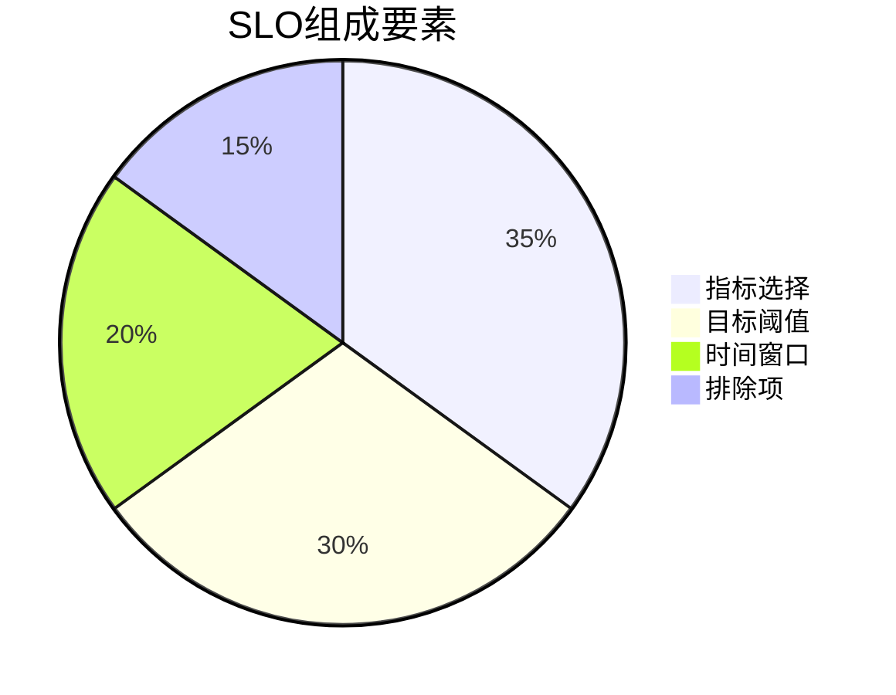
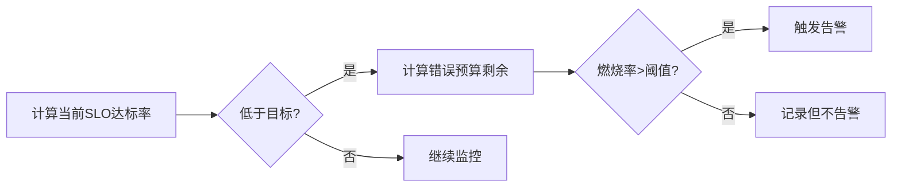

# 服务水平目标(SLO)监控

## 介绍

服务水平目标（Service Level Objective, SLO）是衡量系统可靠性的关键指标，通常以百分比形式表示（如"99.9%的请求应在200ms内完成"）。在Zipkin的分布式追踪上下文中，SLO监控帮助开发者量化系统的实际表现是否符合预期，并为告警提供数据依据。

:::tip 为什么需要SLO?
- 将模糊的"系统要快"转化为可衡量的目标
- 为团队提供明确的可靠性标准
- 避免过度告警（基于错误率而非单个故障）
:::

## 核心概念

### 1. SLO基本组成



- **指标选择**：常见于分布式系统的指标包括：
  - 延迟（Latency）：`p99 < 300ms`
  - 错误率（Error Rate）：`< 0.1% 5xx错误`
  - 吞吐量（Throughput）

- **目标阈值**：通常表示为"X%的请求满足条件Y"
- **时间窗口**：如"30天内达到99.9%可用性"

### 2. Zipkin中的SLO实现

Zipkin通过追踪数据计算SLO指标。例如，要监控API延迟：

```java
// 在Spring Boot应用中添加自定义标签
@GetMapping("/api")
public ResponseEntity<String> getData() {
    Span span = tracer.currentSpan();
    span.tag("slo.type", "latency");
    span.tag("slo.threshold_ms", "200");
    // ...业务逻辑
}
```

对应的Zipkin查询：
```sql
SELECT COUNT(*) FROM spans WHERE 
  timestamp > now() - 1h AND
  tags["slo.type"] = "latency" AND
  duration < tags["slo.threshold_ms"] * 1000
```

## 实际案例：电商订单服务

假设我们需要保证订单服务的SLO：
- **目标**：99%的订单创建请求在1秒内完成
- **监控周期**：滚动7天窗口

### 实现步骤

1. **标记关键Span**：
```python
# Flask应用示例
@app.route("/create_order", methods=["POST"])
def create_order():
    with tracer.start_span("create_order") as span:
        span.set_tag("slo_category", "order_processing")
        span.set_tag("slo_max_latency", "1s")
        # 处理订单逻辑
```

2. **Zipkin数据聚合**：
```bash
# 使用Zipkin API查询符合SLO的请求比例
curl -X GET "http://zipkin:9411/api/v2/traces?serviceName=order-service&annotationQuery=slo_category=order_processing"
```

3. **计算结果**：
```
总请求数：10,000
<1s完成的请求：9,920
SLO达标率：99.2% （达标）
```

## 告警策略设计

:::caution 避免告警疲劳
建议采用"燃烧率"（Burn Rate）模型而非即时告警：
- 燃烧率 = 错误预算消耗速度
- 例如：当1小时消耗了1天的错误预算时触发告警
:::



## 总结

关键要点：
1. SLO需要明确定义可测量的指标
2. Zipkin的分布式追踪数据是计算SLO的理想来源
3. 应该基于错误预算而非即时指标触发告警

## 扩展练习

1. 在您的Zipkin实例中：
   - 为关键服务添加`slo_category`标签
   - 编写查询计算过去24小时的SLO达标率
2. 设计一个燃烧率告警规则（假设允许每月27分钟宕机）

## 附加资源

- [Google SRE手册：SLO章节](https://sre.google/workbook/slo-document/)
- [Zipkin标签规范](https://zipkin.io/pages/instrumenting.html)