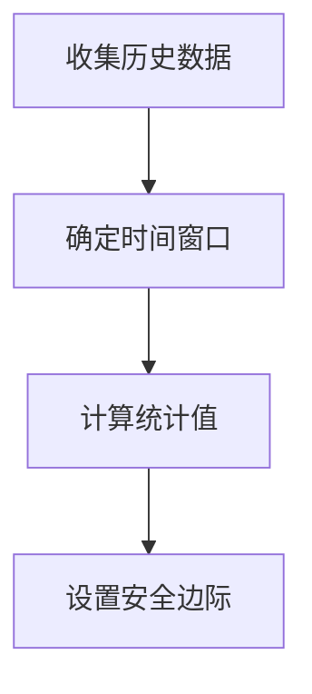

# 性能基线设置

## 介绍

性能基线（Performance Baseline）是系统在正常负载下的性能指标参考值。在Zipkin中设置性能基线，可以帮助你快速识别服务延迟、错误率等关键指标的异常波动。本指南将介绍如何通过Zipkin的监控数据建立基线，并应用于告警策略。

:::note 为什么需要性能基线？
- 区分正常波动与真实异常
- 减少误报率
- 建立历史性能参考
:::

## 核心概念

### 1. 基线指标类型
在Zipkin中常用的基线指标包括：
- **延迟基线**：`p50/p95/p99` 延迟阈值
- **错误率基线**：HTTP状态码错误比例
- **吞吐量基线**：每秒请求量(RPS)范围

### 2. 基线计算方式


## 实际操作

### 步骤1：收集历史数据
通过Zipkin API获取7天的追踪数据示例：
```bash
curl -X GET "http://your-zipkin-server/api/v2/traces?serviceName=web-service&lookback=604800000" 
```

典型响应片段（JSON）：
```json
{
  "traceId": "df4534...",
  "duration": 125,
  "localEndpoint": { "serviceName": "web-service" },
  "tags": { "http.status_code": "200" }
}
```

### 步骤2：计算基准值
使用Python计算p95延迟基线：
```python
import numpy as np

# 示例数据（单位：毫秒）
durations = [120, 135, 110, 95, 150, 200, 80, 115, 130, 125]

p95 = np.percentile(durations, 95)
print(f"基线p95延迟: {p95}ms")  # 输出: 基线p95延迟: 185.0ms
```

### 步骤3：设置告警规则
在监控系统中配置告警（以Prometheus为例）：
```yaml
alert: HighLatency
expr: |
  histogram_quantile(0.95, sum(rate(zipkin_latency_bucket{service="web-service"}[5m])) by (le))
  > 185 # 基线值
for: 10m
```

## 实际案例

### 电商网站场景
**背景**：`/checkout` 接口在黑色星期五期间需要特别监控

**基线设置过程**：
1. 收集过去3个月正常时段的延迟数据
2. 计算得到：
   - 平时p95：220ms
   - 大促期间预期p95：350ms（设置动态基线）
3. 配置分级告警：
   - Warning级：>220ms
   - Critical级：>350ms持续15分钟

## 最佳实践

:::tip 基线维护建议
- **动态调整**：每季度重新计算基线
- **环境区分**：为dev/staging/prod设置不同基线
- **标记异常事件**：在基线计算时排除已知故障时段数据
:::

## 总结

性能基线设置是Zipkin监控体系的关键环节，通过本指南你学会了：
1. 选择核心监控指标
2. 基于历史数据计算统计基线
3. 将基线应用于告警配置
4. 实际场景中的动态调整策略

## 扩展学习

- 推荐工具：Zipkin + Prometheus + Alertmanager组合方案
- 进阶概念：季节性基线（处理每日/每周流量波动）
- 实践练习：为你的测试服务建立完整的基线监控方案