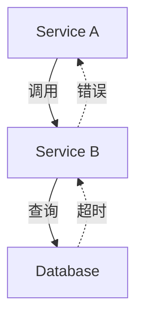

## 介绍

在分布式系统中，异常检测是监控与告警的核心环节。Zipkin作为分布式追踪系统，通过收集服务间的调用链路数据，为异常检测提供了丰富上下文。本章将介绍如何利用Zipkin的追踪数据设计异常检测策略，帮助开发者快速定位问题。

:::note 关键概念
异常检测策略通常包括：**阈值检测**、**统计模型**和**机器学习方法**。Zipkin的链路数据（如延迟、错误码）是这些策略的基础输入。
:::

---

## 基础策略

### 1. 阈值检测
最简单的异常检测方法是为关键指标（如延迟、错误率）设置静态阈值。当数据超过阈值时触发告警。

**示例：检测高延迟请求**
```python
# 伪代码：检查Span延迟是否超过1秒
def detect_high_latency(spans):
    for span in spans:
        if span.duration > 1000:  # 单位：毫秒
            alert(f"高延迟Span: {span.id}, 延迟: {span.duration}ms")
```

**输入/输出示例：**
- 输入：Span数据 `{id: "abc", duration: 1200}`
- 输出：告警消息 `"高延迟Span: abc, 延迟: 1200ms"`

:::caution 局限性
静态阈值无法适应流量波动（如促销期间正常延迟升高）。
:::

---

### 2. 动态基线（滑动窗口统计）
通过计算历史数据的移动平均值和标准差，动态调整异常阈值。


**实现示例（Python + Pandas）：**
```python
import pandas as pd

def dynamic_threshold(spans, window_hours=24):
    df = pd.DataFrame([s.duration for s in spans], columns=["duration"])
    mean = df.rolling(window=f"{window_hours}H").mean()
    std = df.rolling(window=f"{window_hours}H").std()
    df["is_anomaly"] = df["duration"] > (mean + 3 * std)
    return df
```

---

## 高级策略

### 3. 依赖关系异常检测
利用Zipkin的拓扑图，检测异常的服务依赖。例如：
- 下游服务错误率上升导致上游服务异常
- 数据库延迟激增影响多个微服务



**检测逻辑：**
1. 通过Zipkin API获取服务依赖图
2. 分析错误传播路径（如`Service A -> Service B -> Database`）
3. 标记错误根源节点（本例中为`Database`）

---

## 实际案例

### 电商平台秒杀场景
**问题现象：** 订单服务错误率突然升高。<br />
**Zipkin分析步骤：**
1. 发现错误集中在`创建订单`Span
2. 追踪依赖显示该Span调用了库存服务，且库存服务返回`504`超时
3. 根本原因：库存服务数据库连接池耗尽

**解决方案：**
- 为库存服务添加数据库连接监控
- 设置错误传播链告警规则

---

## 总结与练习

### 关键点总结
| 策略类型       | 适用场景                  | Zipkin数据需求          |
|----------------|---------------------------|-------------------------|
| 静态阈值       | 简单明确的指标            | 单个Span的延迟/错误码   |
| 动态基线       | 流量波动环境              | 历史Span时间序列        |
| 依赖关系分析   | 复杂链路中的根因定位      | 完整Trace拓扑           |

### 练习建议
1. 使用Zipkin UI筛选出错误率最高的服务
2. 为`/checkout`接口编写动态阈值检测脚本
3. 模拟一个级联故障，观察Zipkin的依赖图变化

### 扩展阅读
- [Zipkin官方文档：数据模型](https://zipkin.io/pages/data_model.html)
- 《分布式系统观测》第5章：异常检测模式