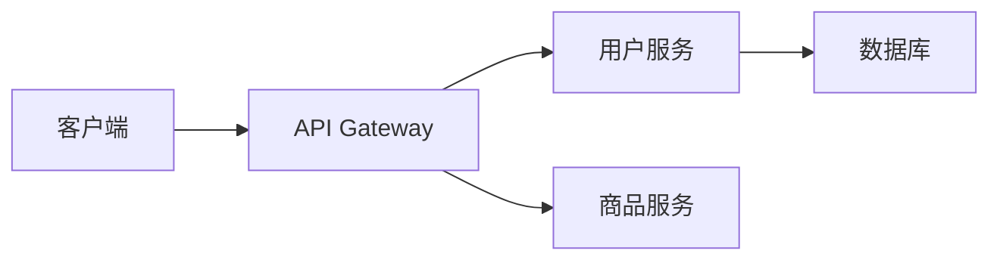

# 延迟阈值告警

## 介绍

在分布式系统中，服务的延迟是衡量系统健康状态的关键指标之一。Zipkin作为分布式追踪系统，可以帮助开发者监控请求在微服务链路中的延迟情况。**延迟阈值告警**功能允许你为特定服务或端点设置延迟上限，当实际延迟超过阈值时触发告警，便于快速定位性能瓶颈。

:::tip 为什么需要延迟阈值告警？
- 避免因未察觉的延迟累积导致系统雪崩
- 快速发现因代码变更、依赖服务故障或资源不足引发的性能退化
- 为SLA（服务等级协议）提供保障机制
:::

## 核心概念

### 1. 延迟阈值配置
Zipkin通过`zipkin-dependencies`和外部告警系统（如Prometheus AlertManager）协同工作。你需要定义：
- **服务/端点**：监控目标（如`user-service`的`/api/profile`端点）
- **阈值时间**：可接受的最高延迟（如`500ms`）
- **统计方式**：P50/P95/P99等百分位数或平均值

### 2. 告警触发逻辑
当满足以下条件时触发告警：
```
实际延迟 > 阈值延迟 且 持续时长 > 静默窗口
```

## 配置示例

### 步骤1：收集延迟指标
首先确保Zipkin已收集到延迟数据。以下是示例Span的JSON表示：

```json
{
  "traceId": "5b1a5c8e45b75ee3",
  "id": "5b1a5c8e45b75ee3",
  "name": "get /api/profile",
  "timestamp": 1623986140000,
  "duration": 650000,
  "localEndpoint": {
    "serviceName": "user-service"
  }
}
```

### 步骤2：配置Prometheus告警规则
假设使用Prometheus监控Zipkin数据，告警规则示例：

```yaml
groups:
- name: zipkin-latency-alerts
  rules:
  - alert: HighLatencyOnUserService
    expr: histogram_quantile(0.95, sum(rate(zipkin_latency_bucket{service="user-service"}[5m])) by (le) > 0.5
    for: 10m
    labels:
      severity: critical
    annotations:
      summary: "High latency on user-service ({{ $value }}s)"
      description: "95th percentile latency for user-service exceeds 500ms"
```

### 步骤3：验证告警
当`user-service`的P95延迟持续10分钟超过500ms时，AlertManager会发送通知。

## 实际案例

### 电商系统场景


**问题现象**：
- 用户个人资料页加载缓慢
- 告警显示`user-service`的`/api/profile`延迟达1.2s（阈值：800ms）

**排查过程**：
1. 通过Zipkin追踪发现耗时集中在数据库查询
2. 检查发现缺少用户表的`user_id`索引
3. 添加索引后延迟降至300ms

:::warning 告警策略建议
- 生产环境建议设置P99阈值
- 开发环境可使用P50阈值早期发现问题
- 对不同重要性服务设置分级阈值
:::

## 总结

延迟阈值告警是分布式系统监控的重要环节，通过Zipkin实现的要点包括：
1. 合理设置服务/端点的延迟基线
2. 选择适当的百分位数（P95/P99）
3. 配置足够的静默窗口避免误报
4. 告警信息应包含TraceID便于直接跳转分析

## 延伸学习

- 练习：为你的Zipkin实例配置一个测试服务的延迟告警
- 进阶：结合Zipkin的依赖分析（Dependencies）定位跨服务延迟问题
- 推荐工具：
  - `zipkin-dependencies`生成服务依赖图
  - Prometheus + Grafana实现可视化告警面板