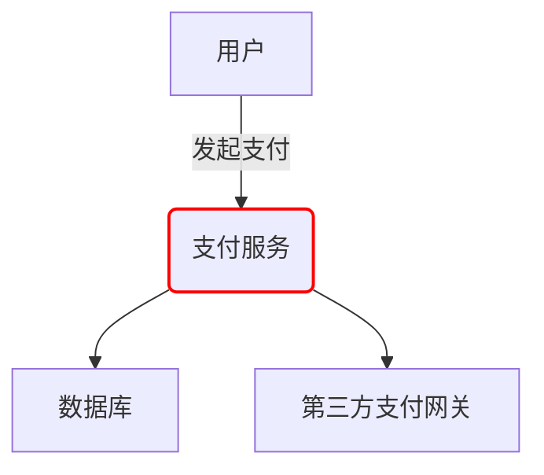

# 错误率告警

## 介绍

在分布式系统中，错误率（Error Rate）是衡量服务健康状态的关键指标之一。它表示一段时间内失败请求占总请求的比例。Zipkin作为分布式追踪系统，可以帮助你监控错误率并在超过阈值时触发告警，从而快速发现和解决问题。

错误率告警的核心目标是：
- 及时发现服务异常
- 减少人工监控成本
- 预防小问题演变成大故障

## 基础概念

### 什么是错误率？

错误率计算公式为：
```
错误率 = (错误请求数 / 总请求数) × 100%
```

在Zipkin中，一个"错误请求"通常指：
- HTTP状态码 ≥ 400的响应
- 抛出未捕获异常的请求
- 超时请求

### Zipkin 如何计算错误率？

Zipkin通过分析追踪数据中的span标签来计算错误率。关键标签包括：
- `http.status_code`：HTTP响应状态码
- `error`：标记为true表示请求失败

## 配置错误率告警

### 步骤1：收集错误率指标

首先需要从Zipkin数据中提取错误率指标。以下是一个使用Prometheus从Zipkin收集指标的示例配置：

```yaml
# prometheus.yml 配置示例
scrape_configs:
  - job_name: 'zipkin'
    metrics_path: '/metrics'
    static_configs:
      - targets: ['zipkin:9411']
```

### 步骤2：定义告警规则

在Prometheus中定义错误率告警规则：

```yaml
# alert.rules.yml 示例
groups:
- name: zipkin-error-rates
  rules:
  - alert: HighErrorRate
    expr: sum(rate(zipkin_http_requests_total{status_code=~"5.."}[5m])) by (service) / sum(rate(zipkin_http_requests_total[5m])) by (service) > 0.05
    for: 10m
    labels:
      severity: 'critical'
    annotations:
      summary: "High error rate on {{ $labels.service }}"
      description: "{{ $labels.service }} has error rate of {{ $value }}"
```

### 步骤3：配置告警通知

配置Alertmanager将告警发送到适当渠道（如Slack、邮件等）：

```yaml
# alertmanager.yml 示例
route:
  receiver: 'slack-notifications'
  group_by: ['alertname', 'service']
  
receivers:
- name: 'slack-notifications'
  slack_configs:
  - api_url: 'https://hooks.slack.com/services/...'
    channel: '#alerts'
```

## 实际案例

### 案例：电商网站支付服务

假设你的电商网站支付服务突然出现高错误率：



通过Zipkin追踪发现：
1. 错误率从1%突增至15%
2. 主要错误来自数据库连接超时
3. 错误集中在特定时间段

告警触发后，团队可以：
1. 立即扩容数据库连接池
2. 回滚最近部署的有问题代码
3. 通知用户支付延迟

## 最佳实践

:::tip 告警设置建议
- **阈值设置**：从5%开始，根据业务调整
- **持续时间**：至少持续5-10分钟才触发
- **分级告警**：设置多级阈值（警告/严重/紧急）
:::

:::caution 避免告警疲劳
- 只对关键服务设置错误率告警
- 合并相关告警
- 设置合理的静默期
:::

## 总结

错误率告警是微服务监控的重要组成部分。通过Zipkin结合Prometheus等工具，你可以：

1. 实时监控服务健康状态
2. 快速发现和定位问题
3. 提高系统可靠性

## 延伸学习

- 练习：为你的服务设置一个错误率告警，测试触发条件
- 进阶：实现基于错误率的自动扩缩容
- 推荐阅读：Zipkin官方文档中的"Alerting and Monitoring"部分