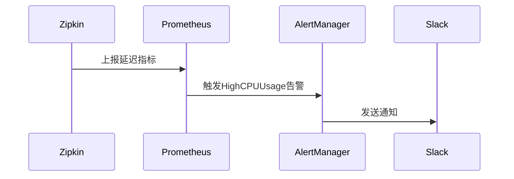

# 系统负载告警

## 介绍

在分布式系统中，服务间的调用链可能因高负载导致延迟或故障。Zipkin作为分布式追踪工具，不仅能分析请求链路，还能通过监控系统负载触发告警，帮助开发者及时发现问题。本节将介绍如何利用Zipkin和相关工具实现系统负载告警。

## 核心概念

系统负载告警通常基于以下指标：
1. **CPU使用率**：超过阈值（如80%）时触发告警。
2. **内存占用**：JVM堆内存或系统内存不足时告警。
3. **请求延迟**：Zipkin追踪的Span延迟异常。
4. **错误率**：服务调用失败比例升高。

:::note
Zipkin本身不直接提供告警功能，需结合Prometheus、Grafana或自定义脚本实现。
:::

## 实现步骤

### 1. 集成指标收集
使用Micrometer或Prometheus客户端暴露系统指标：

```java
// Spring Boot示例：暴露Prometheus指标
@Bean
MeterRegistryCustomizer<PrometheusMeterRegistry> configureMetrics() {
    return registry -> registry.config().commonTags("application", "zipkin-service");
}
```

### 2. 配置告警规则
在Prometheus中定义规则（示例`prometheus.rules.yml`）：

```yaml
groups:
- name: system.rules
  rules:
  - alert: HighCPUUsage
    expr: process_cpu_usage{job="zipkin-service"} > 0.8
    for: 5m
    labels:
      severity: warning
    annotations:
      summary: "High CPU usage on {{ $labels.instance }}"
```

### 3. 可视化与通知
Grafana面板示例查询Zipkin相关延迟：
```
histogram_quantile(0.95, sum(rate(zipkin_latency_bucket[5m])) by (le))
```

## 实际案例

**场景**：电商平台在促销期间订单服务延迟激增。

1. **现象**：Zipkin追踪显示`/create-order`接口P99延迟从200ms升至1500ms。
2. **根因**：Prometheus告警显示订单服务的CPU使用率达92%。
3. **解决**：通过自动扩展Pod副本数降低负载，并在Grafana中标记事件。



## 总结

系统负载告警是保障分布式系统健康的关键环节。通过结合Zipkin的链路数据和Prometheus的监控能力，可以快速定位性能瓶颈。建议初学者：
1. 在本地使用Docker Compose搭建Zipkin+Prometheus+Grafana环境。
2. 模拟高负载场景（如JMeter压测）观察告警触发。

## 延伸阅读
- [Zipkin与Prometheus集成指南](https://zipkin.io/pages/integrations.html)
- 《Prometheus监控实战》第4章
