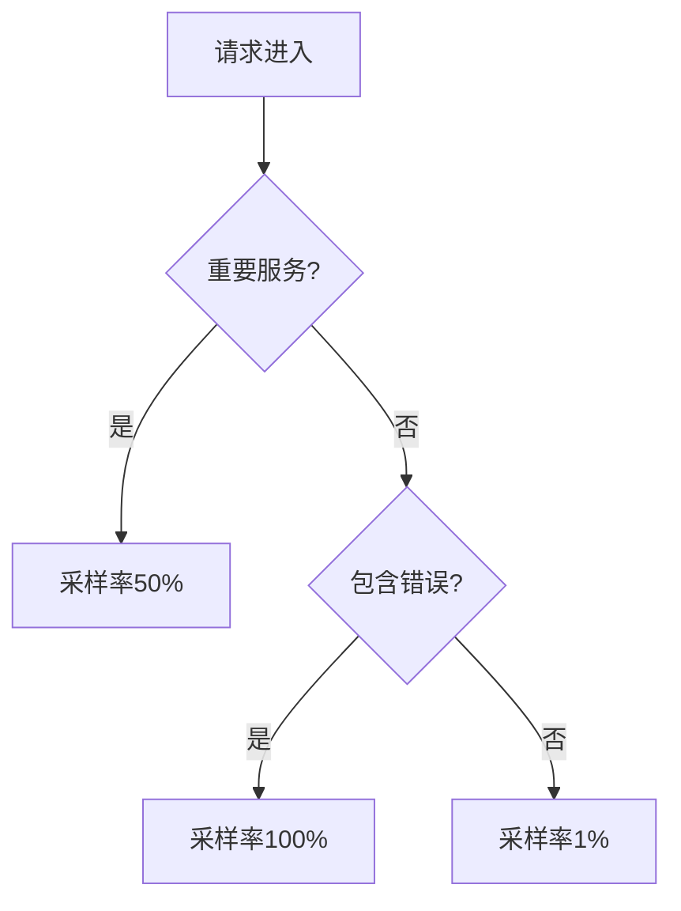

# 采样策略最佳实践

## 介绍

在分布式系统中，Zipkin作为链路追踪工具会收集大量请求数据。采样策略（Sampling Strategy）决定了哪些请求需要被记录，哪些可以忽略。合理的采样能**降低存储压力**，同时保留**关键诊断信息**。对于初学者，理解采样策略是优化Zipkin性能的第一步。

:::tip 为什么需要采样？
- 每秒百万级请求的全量追踪会消耗大量资源
- 大部分请求是重复或成功的，错误请求占比通常很低
- 采样能在可接受的精度损失下显著提升系统性能
:::

## 采样策略类型

### 1. 恒定采样（Constant Sampling）
最简单的策略，固定比例采样所有请求：

```java
// Spring Cloud Sleuth 配置示例
spring.sleuth.sampler.probability=0.1 // 10%的请求会被采样
```

**适用场景**：
- 低流量系统
- 开发/测试环境

### 2. 速率限制采样（Rate Limiting Sampling）
控制每秒最大采样数：

```python
# Brave (Python) 配置示例
sampler = RateLimitingSampler(100) # 每秒最多100条追踪
```

**适用场景**：
- 流量波动较大的生产环境
- 需要严格控制资源消耗的场景

### 3. 动态采样（Dynamic Sampling）
根据请求属性智能决策，例如：
- 只采样错误请求
- 对重要服务提高采样率



## 实际案例

### 电商平台场景
某电商系统在双十一期间采用分层采样：
1. 支付服务：100%采样（业务核心）
2. 商品服务：10%采样（可容忍丢失）
3. 推荐服务：1%采样（非关键路径）

```java
// 动态采样配置示例
@Bean
public Sampler customSampler() {
    return request -> {
        if (request.path().contains("/payment")) {
            return true; // 全量采样
        }
        return Math.random() < 0.1; // 其他服务10%
    };
}
```

## 配置建议

:::warning 注意事项
1. 生产环境避免100%采样
2. 错误请求建议单独标记并提高采样率
3. 不同环境使用不同策略（开发环境可提高采样率）
:::

推荐配置组合：
1. **基础采样率**：5-10%（控制常规流量）
2. **错误补偿**：错误请求额外采样
3. **关键路径**：核心服务单独配置

## 总结与练习

### 关键要点
- 恒定采样适合简单场景
- 动态采样能更好平衡资源与数据价值
- 采样策略需要随业务需求调整

### 动手练习
1. 在本地Zipkin中尝试配置10%的恒定采样
2. 使用Spring Sleuth实现一个动态采样器，对 `/api/orders` 路径提高采样率
3. 观察不同采样率下Zipkin服务器的CPU和内存消耗变化

### 扩展阅读
- [Zipkin官方采样文档](https://zipkin.io/pages/samplers)
- 《分布式追踪：原理与实践》第4章
