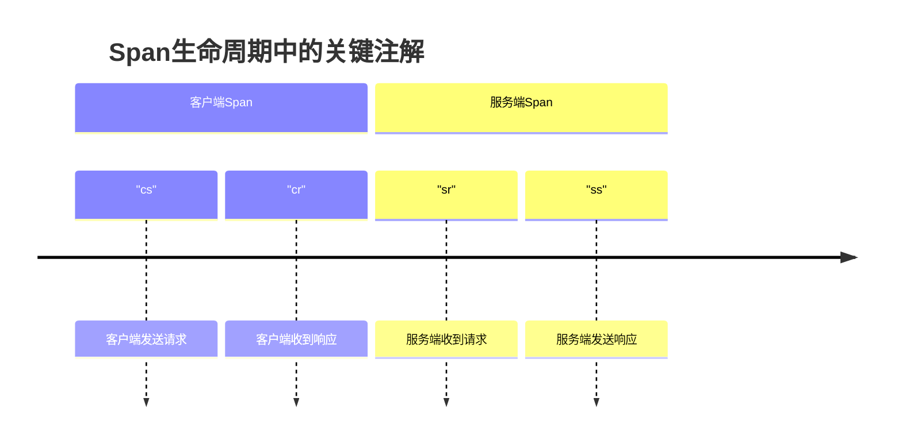
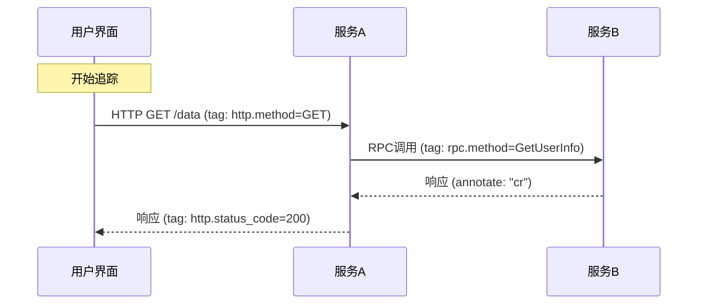

# 标签与注解使用规范

## 介绍

在Zipkin分布式追踪系统中，**标签(Tags)**和**注解(Annotations)**是两种关键的元数据形式，它们为追踪数据提供了额外的上下文信息。正确使用这些元素可以帮助你：

- 更高效地诊断问题
- 实现更精确的查询过滤
- 为监控系统提供有价值的指标
- 提高跨团队协作效率

:::tip 关键区别
- **标签**是键值对，记录在整个Span生命周期中都相关的信息（如HTTP状态码）
- **注解**是时间戳事件，记录Span生命周期中特定时间点发生的事件（如"客户端发送请求"）
:::

## 标签使用规范

### 基础标签规范

每个Span都应该包含以下基本标签：

```java
// Java示例
span.tag("http.method", "GET");
span.tag("http.path", "/api/users");
span.tag("http.status_code", "200");
```

### 命名约定

1. 使用**小写字母**和**点号分隔**的命名空间（如 `db.statement`）
2. 保持一致性 - 在整个系统中使用相同的键名表示相同含义
3. 避免使用特殊字符或空格

:::note 推荐标签
| 标签键 | 描述 | 示例值 |
|--------|------|--------|
| `http.method` | HTTP请求方法 | "GET", "POST" |
| `http.status_code` | HTTP响应状态码 | "200", "404" |
| `db.system` | 数据库类型 | "mysql", "postgresql" |
| `error` | 标记错误发生 | "true" |
:::

### 自定义标签

添加业务相关标签时，建议使用业务域作为前缀：

```python
# Python示例
with tracer.start_span("process_order") as span:
    span.tag("shop.order_id", order_id)
    span.tag("shop.customer_tier", "premium")
```

## 注解使用规范

### 核心注解类型

Zipkin中常见的注解包括：



### 添加自定义注解

```go
// Go示例
span.Annotate(time.Now(), "cache.hit")
span.Annotate(time.Now(), "validation.completed")
```

:::caution 注意事项
- 注解应该记录**有意义的事件时间点**
- 避免过度添加注解导致数据膨胀
- 注解值应该是简短的描述性字符串
:::

## 实际应用案例

### 电商系统追踪示例

```java
// 订单处理流程示例
Span orderSpan = tracer.newTrace().name("process_order").start();
try {
    orderSpan.tag("shop.order_id", "12345");
    orderSpan.tag("shop.order_value", "150.00");
    
    orderSpan.annotate("inventory.check_start");
    // 检查库存逻辑...
    orderSpan.annotate("inventory.check_complete");
    
    orderSpan.tag("payment.method", "credit_card");
    orderSpan.annotate("payment.process_start");
    // 支付处理逻辑...
    orderSpan.annotate("payment.process_complete");
    
} catch (Exception e) {
    orderSpan.tag("error", "true");
    orderSpan.tag("error.message", e.getMessage());
} finally {
    orderSpan.finish();
}
```

### 微服务通信场景



## 最佳实践总结

1. **一致性优先**：在整个系统中保持标签和注解的命名一致
2. **适度原则**：只添加对调试和监控真正有价值的信息
3. **安全考虑**：避免记录敏感信息如密码、令牌等
4. **性能意识**：过多的标签/注解会影响系统性能
5. **文档化**：为团队维护标签/注解使用文档

## 延伸学习

- 练习：为你的服务添加有意义的业务标签
- 思考：哪些业务事件值得添加为注解？
- 进一步阅读：Zipkin官方文档关于[数据模型](https://zipkin.io/pages/data_model.html)的部分

通过规范使用标签和注解，你可以极大提升分布式系统的可观测性，使团队能够更高效地诊断问题和理解系统行为。