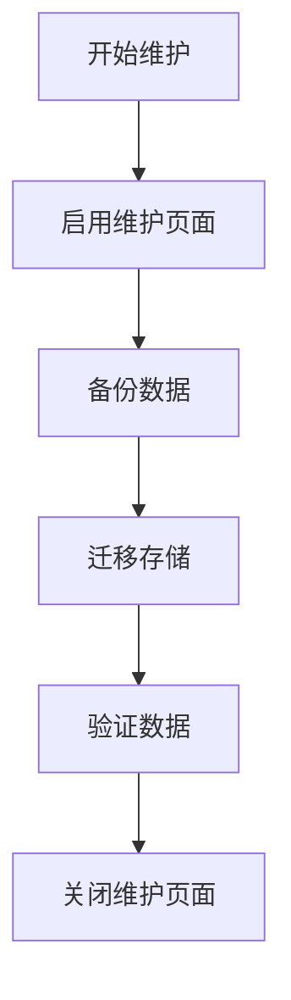

# 维护窗口管理

## 介绍

在分布式追踪系统（如Zipkin）中，**维护窗口**是指预先规划的、用于执行系统维护（如升级、备份或配置更改）的时间段。合理设置维护窗口可以最小化对用户的影响，同时确保系统的稳定性和数据完整性。本章将介绍Zipkin维护窗口的最佳实践，包括如何规划、实施和验证维护操作。

---

## 为什么需要维护窗口？

1. **减少服务中断**：在低流量时段执行维护，降低对用户的影响。
2. **团队协作**：明确维护时间，便于开发、运维和监控团队协调。
3. **数据安全**：确保维护期间的数据一致性（例如避免追踪数据丢失）。

---

## 维护窗口的关键步骤

### 1. 规划维护窗口
- **选择低流量时段**：通过分析Zipkin的流量模式（如使用Prometheus或Grafana监控）确定最佳时间。
- **通知相关方**：提前告知团队和用户维护计划。

:::tip
示例：使用以下PromQL查询分析Zipkin的请求量趋势：
```promql
sum(rate(zipkin_spans_received_total[1h])) by (service)
```
:::

### 2. 配置维护模式
Zipkin本身不提供内置的“维护模式”，但可以通过以下方式实现：
- **前端代理**：通过Nginx或Apache返回维护页面。
- **服务降级**：临时关闭非关键功能（如依赖检查）。

示例Nginx配置：
```nginx
location /zipkin/ {
    if ($maintenance = "on") {
        return 503 /maintenance.html;
    }
    proxy_pass http://zipkin-service;
}
```

### 3. 执行维护操作
维护期间可能需要：
- 停止数据收集（如暂停Kafka消费者）。
- 备份数据库（例如Elasticsearch快照）：
```bash
curl -X PUT "localhost:9200/_snapshot/zipkin_backup/snapshot_1?wait_for_completion=true"
```

### 4. 验证和恢复
- **健康检查**：确保Zipkin组件重启后正常运行：
```bash
curl -X GET "http://localhost:9411/health"
```
- **数据完整性**：验证追踪数据是否完整（如检查最新Span的时间戳）。

---

## 实际案例

### 场景：Zipkin存储迁移
1. **规划**：选择周末凌晨2点（流量最低时段）。
2. **操作**：
   - 启用Nginx维护页面。
   - 创建Elasticsearch快照。
   - 将数据迁移到新集群。
3. **验证**：
   - 比较新旧集群的Span计数。
   - 检查追踪链是否完整。



---

## 总结

| 最佳实践                | 说明                          |
|-------------------------|-----------------------------|
| 提前规划窗口            | 基于流量分析和团队可用性      |
| 自动化维护操作          | 使用脚本减少人为错误          |
| 监控恢复过程            | 确保系统功能完全恢复          |

---

## 附加资源
1. [Zipkin官方文档](https://zipkin.io/)
2. [Elasticsearch快照管理指南](https://www.elastic.co/guide/en/elasticsearch/reference/current/snapshots-take-snapshot.html)

:::caution
练习：尝试为你的Zipkin实例设置一个模拟维护窗口，记录从规划到验证的全过程。
:::