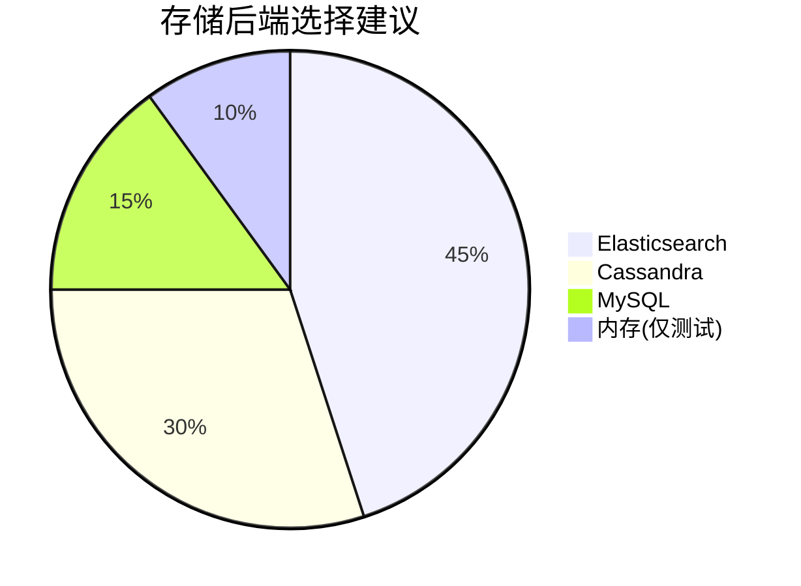

# 生产环境检查清单

## 介绍

在生产环境中部署Zipkin时，需要确保其稳定性、安全性和可扩展性。本检查清单将指导你完成关键配置步骤和最佳实践，帮助避免常见陷阱。无论你是首次部署还是优化现有环境，这些建议都能为你的分布式追踪系统提供坚实基础。

:::tip 为什么需要检查清单？
- 防止配置遗漏导致的服务中断
- 标准化生产环境部署流程
- 提前识别潜在性能瓶颈
:::

## 基础设施准备

### 1. 存储后端选择
根据你的流量规模选择合适的存储后端：



关键考虑因素：
- **Elasticsearch**：适合高吞吐量场景，需要额外维护集群
- **Cassandra**：适合超大规模部署，具有线性扩展能力
- **MySQL**：适合中小规模，维护简单但性能有限

### 2. 资源分配
最低推荐配置：
```yaml
# docker-compose示例（单节点）
zipkin:
  environment:
    - JAVA_OPTS=-Xms1g -Xmx1g -XX:+HeapDumpOnOutOfMemoryError
  resources:
    limits:
      cpus: '2'
      memory: 2G
```

## 关键配置检查

### 1. 采样率配置
合理设置采样率平衡开销与数据价值：

```java
// Spring Boot示例（10%采样率）
@Bean
public Sampler defaultSampler() {
    return Sampler.create(0.1);
}
```

:::warning 注意
生产环境不建议使用100%采样率，通常1-10%足够问题诊断
:::

### 2. 服务命名规范
确保服务名称符合约定：
- 使用小写字母和连字符（`user-service`而非`UserService`）
- 避免环境信息混入（用标签区分`env=prod`）

### 3. 网络配置
必要防火墙规则：
| 方向 | 端口 | 协议 | 用途           |
|------|------|------|----------------|
| 入站 | 9411 | TCP  | Zipkin UI/API   |
| 出站 | 9411 | TCP  | 发送Span数据    |

## 监控与告警

### 1. 健康检查端点
配置并监控关键端点：
- `/health` - 服务健康状态
- `/metrics` - Prometheus格式指标

### 2. 关键指标告警
建议设置的告警阈值：

| 指标                     | 阈值              | 说明                     |
|--------------------------|-------------------|--------------------------|
| `zipkin_collector_spans` | 同比下降>30%      | 可能数据丢失             |
| `http_server_requests`   | P99 > 2s          | API性能下降              |
| `jvm_memory_used`        | >80% 堆内存       | 需要扩容                 |

## 安全实践

### 1. 基本认证配置
```properties
# 在application.properties中
spring.security.user.name=admin
spring.security.user.password=${ZIPKIN_ADMIN_PASSWORD}
```

### 2. 敏感数据处理
禁止收集敏感信息的Span标签：
```java
// 在追踪配置中过滤敏感头信息
@Bean
public Tracing tracing() {
    return Tracing.newBuilder()
        .redactTag("Authorization", "Cookie")
        .build();
}
```

## 性能优化

### 1. 批量发送配置
```yaml
# 在客户端配置（如Spring Sleuth）
spring.zipkin.sender.type: web
spring.zipkin.batch-size: 100
spring.zipkin.timeout: 5000
```

### 2. 索引优化
对于ES存储的索引模板建议：
```json
{
  "template": "zipkin-*",
  "settings": {
    "number_of_shards": 3,
    "refresh_interval": "30s"
  }
}
```

## 真实案例：电商平台部署

**问题场景**：
黑色星期五期间，Zipkin集群因突增流量导致收集器崩溃

**解决方案**：
1. 动态调整采样率从10%→5%
2. 预先扩展ES集群节点从3→5
3. 配置自动缩放组基于CPU使用率扩容

**结果**：
- 峰值QPS从15k→25k平稳处理
- 资源成本仅增加40%

## 总结与练习

### 关键要点
✓ 根据规模选择适当存储后端<br />
✓ 配置合理的采样率避免过载<br />
✓ 建立完善的监控和告警机制<br />
✓ 实施基本安全防护措施<br />
✓ 预先进行性能压力测试

### 实践练习
1. 使用Docker Compose部署一个具有ES后端的Zipkin实例
2. 配置Spring Boot应用以5%采样率发送追踪数据
3. 模拟高负载场景（如使用JMeter）并观察系统行为

### 扩展阅读
- [Zipkin官方部署指南](https://zipkin.io/pages/deploy.html)
- [分布式追踪性能调优白皮书](https://example.com/tracing-performance)
- [生产环境可观测性模式](https://example.com/observability-patterns)