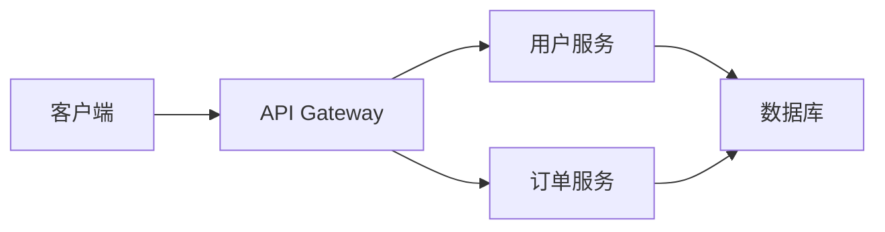

# 常见陷阱与解决方案

## 介绍

Zipkin 是一个开源的分布式追踪系统，用于帮助开发者分析和监控微服务架构中的延迟问题。尽管 Zipkin 功能强大，但在实际使用中可能会遇到一些常见陷阱。本文将介绍这些陷阱及其解决方案，帮助初学者更高效地使用 Zipkin。

## 1. 采样率设置不当

### 问题描述
采样率决定了哪些请求会被追踪。如果采样率设置过高（如 100%），可能会导致大量数据涌入 Zipkin，增加存储和网络负担；如果采样率过低（如 1%），可能会遗漏关键请求的追踪信息。

### 解决方案
根据实际需求动态调整采样率。例如，在生产环境中可以使用较低的采样率（如 10%），而在调试阶段可以临时提高采样率（如 100%）。

#### 代码示例
```java
// 在 Spring Boot 中配置采样率
@Bean
public Sampler defaultSampler() {
    return Sampler.create(0.1); // 10% 采样率
}
```

:::tip
对于高流量服务，建议使用动态采样策略，例如基于请求路径或错误率调整采样率。
:::

---

## 2. 跨服务追踪丢失

### 问题描述
在微服务架构中，如果未正确传递追踪上下文（如 `traceId` 和 `spanId`），可能导致跨服务调用链路断裂，无法完整追踪请求路径。

### 解决方案
确保在所有服务间正确传递追踪上下文。例如，在使用 HTTP 调用时，需要在请求头中添加 `B3` 相关的追踪字段。

#### 代码示例
```java
// 使用 Feign 客户端传递追踪头
@FeignClient(name = "user-service")
public interface UserServiceClient {
    @GetMapping("/users/{id}")
    User getUser(@RequestHeader("X-B3-TraceId") String traceId,
                 @RequestHeader("X-B3-SpanId") String spanId,
                 @PathVariable Long id);
}
```

:::caution
如果使用异步通信（如消息队列），需要手动将追踪上下文注入消息中。
:::

---

## 3. 存储性能瓶颈

### 问题描述
默认情况下，Zipkin 使用内存存储（In-Memory Storage），仅适合开发和测试环境。在生产环境中，如果不配置持久化存储（如 Elasticsearch 或 MySQL），可能导致数据丢失或性能问题。

### 解决方案
在生产环境中配置持久化存储。以下是使用 Elasticsearch 作为存储后端的示例：

#### 配置示例
```yaml
# application.yml
zipkin:
  storage:
    type: elasticsearch
    elasticsearch:
      hosts: http://localhost:9200
      index: zipkin
```

:::note
对于高负载环境，建议使用 Elasticsearch 集群并优化索引策略。
:::

---

## 4. 忽略关键标签（Tags）

### 问题描述
Zipkin 通过标签（Tags）记录请求的附加信息（如 HTTP 状态码、错误信息）。如果未记录关键标签，可能会丢失重要的调试信息。

### 解决方案
为关键操作添加标签。例如，记录 HTTP 状态码和错误信息：

#### 代码示例
```java
tracer.currentSpan().tag("http.status_code", "200");
tracer.currentSpan().tag("error", "Database connection failed");
```

---

## 5. 未正确处理高延迟问题

### 问题描述
Zipkin 可以帮助识别高延迟请求，但如果未正确分析追踪数据，可能无法定位根本原因。

### 解决方案
结合 Zipkin 的依赖关系图和时序图分析延迟问题。例如，以下 Mermaid 图表展示了一个典型的服务调用链路：



通过分析每个 Span 的耗时，可以定位延迟瓶颈（如数据库查询慢）。

---

## 实际案例

### 场景描述
某电商平台的订单查询接口偶尔出现高延迟。通过 Zipkin 分析发现，订单服务调用用户服务时未正确传递追踪上下文，导致链路断裂。

### 解决方案
修复追踪上下文传递问题后，完整链路显示用户服务的数据库查询是瓶颈。通过优化数据库索引，延迟问题得到解决。

---

## 总结

Zipkin 是一个强大的工具，但在使用中需要注意以下陷阱：
1. 合理设置采样率。
2. 确保跨服务追踪上下文的传递。
3. 配置适合生产环境的存储后端。
4. 记录关键标签以辅助调试。
5. 结合可视化工具分析延迟问题。

## 附加资源
- [Zipkin 官方文档](https://zipkin.io/)
- [Spring Cloud Sleuth 文档](https://spring.io/projects/spring-cloud-sleuth)
- 《分布式追踪：实践与案例分析》

## 练习
1. 在你的项目中配置 Zipkin 并设置 20% 的采样率。
2. 模拟一个跨服务调用链路断裂的场景，并修复它。
3. 尝试为某个关键接口添加自定义标签（如 `region=us-east`）。