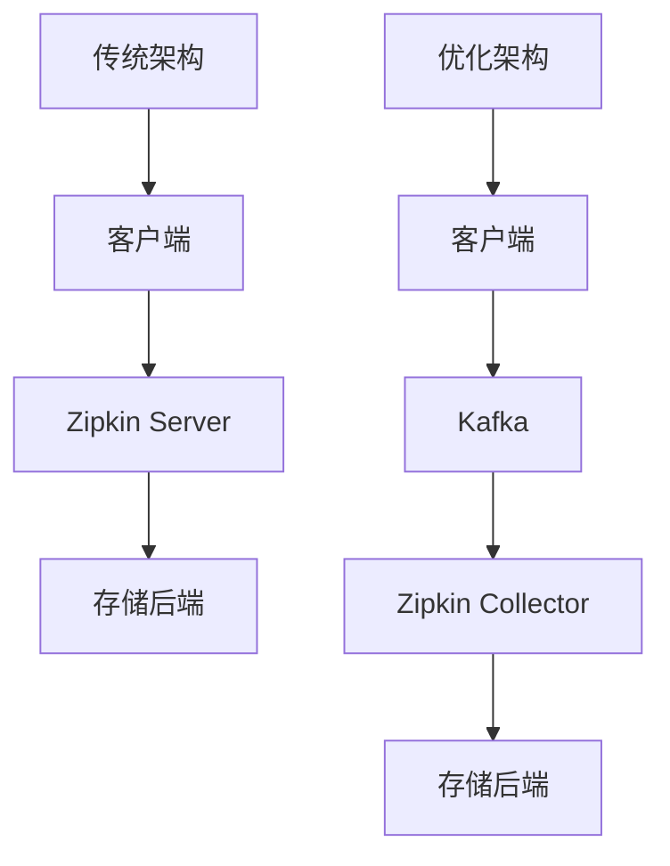

# 性能优化建议

## 介绍

在分布式系统中，Zipkin作为链路追踪工具会收集大量跨度(Span)数据。未经优化的部署可能导致：

- 存储成本指数增长
- 查询性能下降
- 网络带宽占用过高

本章将介绍Zipkin的核心优化策略，帮助你在保证可观测性的同时控制资源消耗。

## 采样策略优化

### 基础采样配置

通过调整采样率平衡数据完整性和系统负载：

```properties
# 在Spring Cloud Sleuth中的配置示例
spring.sleuth.sampler.probability=0.1 # 10%的请求会被采样
```

:::tip 采样率建议
- 生产环境：0.1-0.01 (10%-1%)
- 开发环境：1.0 (100%)
- 故障排查期间可临时调高
:::

### 自适应采样

使用`RateLimitingSampler`实现动态采样：

```java
import zipkin2.sampler.RateLimitingSampler;

// 每秒最多100个trace
Sampler sampler = RateLimitingSampler.create(100);
```

## 存储优化

### 存储后端选择

| 存储类型       | 适用场景                  | 性能特点               |
|----------------|-------------------------|-----------------------|
| Elasticsearch  | 大规模生产环境           | 查询快，但需要调优     |
| MySQL          | 中小规模环境             | 简单但性能有限         |
| 内存存储       | 测试/演示环境            | 不持久化，重启丢失数据 |

### Elasticsearch调优建议

```yaml
# zipkin-server的ES配置优化
zipkin:
  storage:
    type: elasticsearch
    elasticsearch:
      hosts: http://es-host:9200
      index: zipkin
      index-shards: 5       # 根据数据量调整
      index-replicas: 1     # 生产环境建议≥2
      timeout: 10000        # 超时时间(ms)
```

## 架构优化

### 部署模式对比



关键改进点：
1. 引入消息队列缓冲写入压力
2. 分离收集器(Collector)和查询接口(UI)
3. 使用sidecar模式减少客户端负担

## 实战案例

### 电商平台优化实践

**问题现象**：
- 黑色星期五期间Zipkin集群CPU使用率达90%
- 查询延迟超过5秒

**解决方案**：
1. 部署Kafka中间层，峰值流量从10k EPS降到2k EPS
2. 调整ES索引生命周期：
   ```json
   PUT _ilm/policy/zipkin_policy
   {
     "policy": {
       "phases": {
         "hot": {
           "actions": {
             "rollover": {
               "max_size": "50GB" 
             }
           }
         },
         "delete": {
           "min_age": "7d",
           "actions": {
             "delete": {} 
           }
         }
       }
     }
   }
   ```
3. 实施错误请求优先采样策略

**效果**：
- 存储成本降低`60%`
- P99查询延迟`<1`秒
- 关键业务链路保持`100%`采样

## 总结与练习

### 关键要点
- 采样是性能优化的第一道防线
- 存储后端选择和配置显著影响查询性能
- 架构解耦能有效提升系统伸缩性

### 动手练习
1. 在你的测试环境配置10%的固定采样率
2. 使用Docker Compose部署Zipkin+ES集群，调整`index-shards`参数观察性能变化
3. 尝试用Kafka作为中间层重新部署收集链路

### 扩展阅读
- [Zipkin官方性能调优指南](https://zipkin.io/pages/performance.html)
- [Elasticsearch索引优化白皮书]
- [分布式追踪采样策略研究论文]