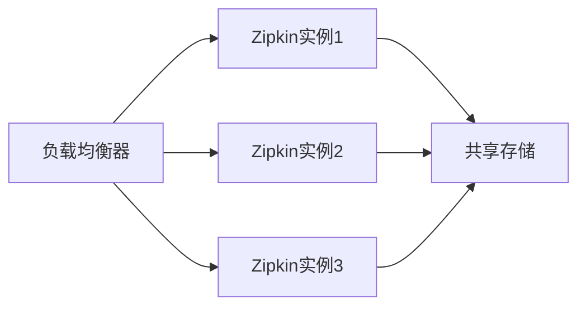

# 高流量环境配置

## 介绍

在高流量环境中，Zipkin作为分布式追踪系统可能会面临性能瓶颈和数据存储压力。本章将介绍如何通过合理的配置和优化，确保Zipkin在高并发场景下稳定运行，同时保持高效的追踪能力。

## 核心优化策略

### 1. 存储后端选择

高流量环境下，存储后端的选择至关重要。推荐以下两种方案：

- **Elasticsearch**：适合大规模数据存储和查询
- **Cassandra**：适合高写入吞吐量场景

```yaml
# 示例：Zipkin使用Elasticsearch的配置
storage:
  type: elasticsearch
  elasticsearch:
    hosts: http://elasticsearch:9200
    index: zipkin
    index-shards: 5
    index-replicas: 1
```

### 2. 采样率调整

在高流量下，100%采样会带来巨大开销。建议使用动态采样：

```java
// 在Spring Cloud Sleuth中配置采样率
@Bean
public Sampler defaultSampler() {
    return Sampler.create(0.1); // 10%采样率
}
```

:::tip
对于关键业务路径，可以单独配置更高的采样率
:::

### 3. 服务端配置优化

```properties
# Zipkin 服务器JVM参数建议
JAVA_OPTS="-Xms4g -Xmx4g -XX:+UseG1GC -XX:MaxGCPauseMillis=200"
```

## 架构设计最佳实践

### 1. 水平扩展



### 2. 消息队列缓冲

在高流量峰值时，使用消息队列作为缓冲：

```yaml
# 使用Kafka作为收集器输入
kafka:
  bootstrap-servers: localhost:9092
  topic: zipkin
  group-id: zipkin
```

## 监控与告警

配置关键指标监控：
- 收集器吞吐量
- 存储延迟
- 查询响应时间
- JVM指标

## 实际案例

某电商平台在双11期间配置：
- 3节点Zipkin集群
- Elasticsearch 10节点集群
- 动态采样率：平日10%，大促时5%
- Kafka缓冲层
- 每日清理7天前数据

实现效果：
- 峰值QPS `50,000+`
- 平均查询延迟`<500ms`
- 系统稳定性`99.99%`

## 总结

高流量环境下配置Zipkin需要关注：
1. 选择合适的存储后端
2. 合理设置采样率
3. 优化服务器资源配置
4. 设计可扩展的架构
5. 实施全面的监控

## 附加资源

- [Zipkin性能调优指南](https://zipkin.io/pages/performance.html)
- [Elasticsearch for Zipkin配置参考](https://github.com/openzipkin/zipkin/tree/master/zipkin-server#elasticsearch-storage)

## 练习

1. 在本地环境配置Zipkin使用Elasticsearch存储
2. 尝试调整采样率观察对系统负载的影响
3. 模拟高流量测试Zipkin集群的性能表现