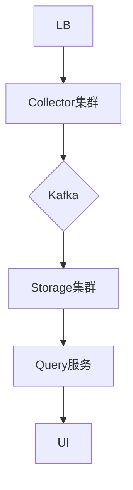

# 大规模部署架构

## 介绍

在大规模分布式系统中，Zipkin作为追踪工具需要处理高并发的追踪数据，同时保证低延迟和高可用性。本章将介绍如何设计Zipkin的部署架构，以应对以下挑战：
- 海量Span数据的收集与存储
- 跨多个数据中心的部署
- 组件的高可用性设计

## 核心组件扩展

### 1. 收集器(Collector)横向扩展

使用负载均衡器（如Nginx）将请求分发到多个Collector实例：

```bash
# 示例：Nginx配置片段
upstream zipkin_collectors {
  server collector1:9411;
  server collector2:9411;
  server collector3:9411;
}

server {
  location /api/v2/spans {
    proxy_pass http://zipkin_collectors;
  }
}
```

:::tip
建议Collector实例数 = 预期QPS / 单实例处理能力(通常2000-5000 spans/s)
:::

### 2. 存储后端选择

根据数据规模选择合适的存储：

| 存储类型       | 适用场景                  | 容量估算             |
|----------------|-------------------------|---------------------|
| Elasticsearch  | 超大规模(日均10亿+Span)  | 每1M spans约0.5GB   |
| Cassandra      | 高写入吞吐需求           | 每1M spans约0.3GB   |
| MySQL          | 小规模(POC环境)          | 每1M spans约1GB     |

## 高可用架构设计



关键设计要点：
1. **消息队列缓冲**：使用Kafka作为Collector和Storage间的缓冲层
2. **多可用区部署**：关键组件跨AZ部署
3. **读写分离**：对存储层实施读写分离策略

## 实际案例：电商平台部署

**场景**：某电商平台在双十一期间部署方案：

1. **前置条件**：
   - 预期QPS：50,000 spans/s
   - 保留周期：7天

2. **资源配置**：
   ```yaml
   collectors:
     replicas: 20
     resources:
       cpu: 4
       memory: 8Gi
   storage:
     type: elasticsearch
     nodes: 15
     shards: 30
   ```

3. **性能优化**：
   - 启用Collector的`STORAGE_TYPE=elasticsearch`环境变量
   - 调整ES的刷新间隔：`refresh_interval=30s`

## 监控与调优

关键监控指标：

```bash
# Collector监控示例
zipkin_collector_spans{status="accepted"} 123456
zipkin_collector_spans_dropped 12

# Storage查询延迟
zipkin_storage_query_latency_bucket{le="1000"} 42
```

:::caution
当出现以下情况时需要扩容：
- Collector CPU持续 >70%
- ES查询延迟 >500ms
- Kafka积压 >10,000消息
:::

## 总结与练习

**总结**：
- 通过水平扩展Collector处理高吞吐
- 根据数据规模选择合适的存储后端
- 引入消息队列提高系统弹性
- 实施全面的监控告警

**练习建议**：
1. 使用Docker Compose部署一个3节点的Zipkin集群
2. 使用Locust模拟10,000 spans/s的负载
3. 观察各组件资源使用情况并尝试调优

**扩展阅读**：
- [Zipkin官方性能调优指南](https://zipkin.io/pages/performance.html)
- [Elasticsearch for Zipkin最佳实践](https://www.elastic.co/blog/...)