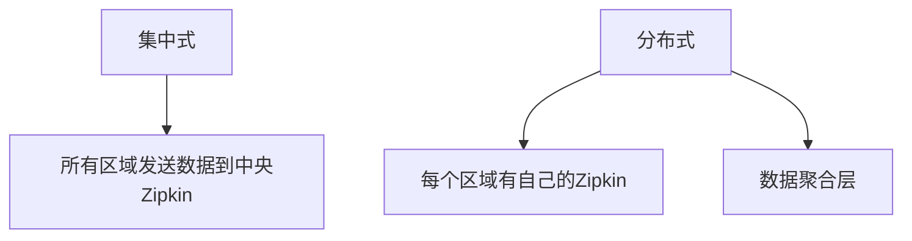
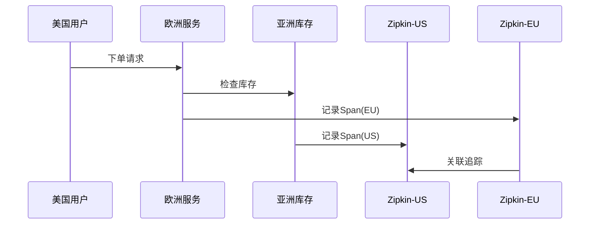

# 多区域部署策略

## 介绍

多区域部署是分布式系统设计中的关键策略，尤其对于Zipkin这样的分布式追踪系统。当你的服务跨越多个地理区域时（例如北美、欧洲和亚洲），合理的Zipkin部署方式可以显著降低追踪数据的收集延迟，提高系统可靠性。

:::tip 为什么需要多区域部署？
- 减少跨区域网络延迟
- 满足数据合规性要求
- 提高系统容灾能力
- 优化用户体验
:::

## 基础架构设计

### 1. 集中式 vs 分布式收集

在多区域部署中，你有两种主要架构选择：



#### 集中式架构
- **优点**：管理简单，数据统一
- **缺点**：跨区域延迟高，单点故障风险

#### 分布式架构
- **优点**：低延迟，高可用性
- **缺点**：需要额外聚合逻辑，运维复杂

### 2. 推荐混合架构

对于大多数场景，我们推荐以下混合方案：

1. 每个区域部署独立的Zipkin收集器
2. 中央存储集群（如Elasticsearch）跨区域复制
3. 边缘服务优先使用本区域收集器

## 实施步骤

### 步骤1：配置区域感知收集

在应用配置中指定本区域的Zipkin端点：

```yaml
# application.yml示例
zipkin:
  sender:
    type: web
  base-url: http://zipkin-collector-${REGION}.yourdomain.com
```

### 步骤2：设置存储后端

使用支持多区域复制的存储方案：

```bash
# Elasticsearch跨集群配置示例
PUT _cluster/settings
{
  "persistent": {
    "cluster.remote.region_two.seeds": "es-region-two:9300"
  }
}
```

### 步骤3：实现数据聚合

使用Zipkin的依赖链接功能跨区域关联追踪：

```java
// 在Span处理器中添加区域标签
tracer.withTag("region", System.getenv("DEPLOY_REGION"));
```

## 实际案例：电商平台全球部署

假设一个电商平台在三个区域部署：

1. **us-east** (北美)
2. **eu-central** (欧洲)
3. **ap-southeast** (亚洲)

### 追踪流程



### 关键配置项

```properties
# 欧洲区域服务配置
zipkin.base-url=http://zipkin-eu.yourdomain.com
zipkin.tags.region=eu-central

# 使用Kafka跨区域传输
zipkin.sender.type=kafka
zipkin.kafka.bootstrap-servers=kafka-global:9092
```

## 常见问题解决

:::caution 注意数据一致性
跨区域部署可能遇到时钟偏移问题，解决方案：

1. 使用NTP同步所有服务器时间
2. 在Zipkin中配置时钟偏移容忍度：
   ```properties
   zipkin.query.lookback=86400000 # 24小时
   ```
:::

## 总结与最佳实践

**关键要点**：
- 为每个主要地理区域部署独立的收集器
- 使用支持多区域复制的存储后端
- 为所有Span添加区域标签
- 实现跨区域追踪关联机制

**推荐实践**：
- 保持各区域配置一致
- 监控跨区域延迟
- 定期测试故障转移

## 扩展学习

**进一步探索**：
1. Zipkin与服务网格(如Istio)的集成
2. 使用OpenTelemetry Collector实现智能路由
3. 多区域部署下的安全考虑

**练习建议**：
1. 在本地使用Docker模拟多区域部署
2. 尝试配置跨区域的追踪关联
3. 测量不同部署策略下的追踪延迟