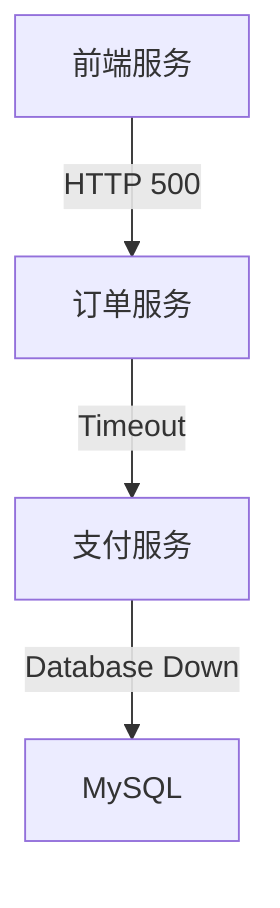

# 故障恢复流程

## 介绍

在分布式系统中，故障是不可避免的。Zipkin作为一款分布式追踪工具，不仅帮助开发者定位性能瓶颈，还能在系统故障时提供关键的恢复支持。本章将介绍如何通过Zipkin的追踪数据快速诊断问题，并设计高效的故障恢复流程。

## 为什么需要故障恢复流程？

分布式系统由多个服务组成，一个服务的故障可能引发连锁反应。Zipkin通过以下方式支持故障恢复：
1. **可视化依赖关系**：展示服务间的调用链路。
2. **错误标记**：高亮显示失败的请求。
3. **延迟分析**：定位性能下降的根源。

## 核心步骤

### 1. 监控与告警
配置Zipkin与监控工具（如Prometheus）集成，当错误率或延迟超过阈值时触发告警。

```yaml
# 示例：Prometheus告警规则
alert: HighErrorRate
expr: sum(rate(zipkin_span_errors_total[5m])) by (service) > 0.1
for: 10m
labels:
  severity: critical
annotations:
  summary: "High error rate in {{ $labels.service }}"
```

### 2. 故障诊断
通过Zipkin UI查询错误链路：
1. 过滤 `error=true` 的请求。
2. 展开调用树，查看具体错误信息（如HTTP 500或超时）。



### 3. 恢复策略
根据错误类型采取不同措施：

| 错误类型       | 恢复动作                          |
|----------------|-----------------------------------|
| 下游服务不可用 | 启用熔断（如Hystrix）或重试机制  |
| 数据库超时     | 检查连接池配置或切换只读副本      |
| 资源耗尽       | 横向扩展（Scaling Out）           |

### 4. 验证与迭代
修复后：
1. 在Zipkin中验证新请求是否成功。
2. 使用压力测试工具（如JMeter）模拟故障场景。

## 实际案例

**场景**：电商平台下单失败。<br />
**Zipkin分析**：
- 追踪ID显示支付服务超时。
- 进一步发现是Redis连接池耗尽。

**解决方案**：
1. 增加Redis连接池大小。
2. 添加降级逻辑：将非关键操作（如库存检查）改为异步。

```java
// 降级示例（Spring Cloud Sleuth + Zipkin）
@FallbackMethod(fallbackMethod = "checkInventoryFallback")
public InventoryResponse checkInventory() {
  // 正常逻辑
}

public InventoryResponse checkInventoryFallback() {
  return InventoryResponse.cached(); // 返回缓存结果
}
```

## 总结

Zipkin的故障恢复流程分为四步：
1. **监控告警**：及时发现问题。
2. **诊断根因**：利用追踪数据定位故障点。
3. **执行恢复**：根据错误类型选择策略。
4. **验证改进**：确保修复有效并优化系统。

:::tip 练习
1. 在本地部署Zipkin，模拟服务超时并练习诊断。
2. 尝试集成Zipkin与告警工具（如AlertManager）。
:::

**扩展阅读**：
- [Zipkin官方文档：故障排查指南](https://zipkin.io/pages/troubleshooting.html)
- 《分布式系统：概念与设计》中的故障恢复章节