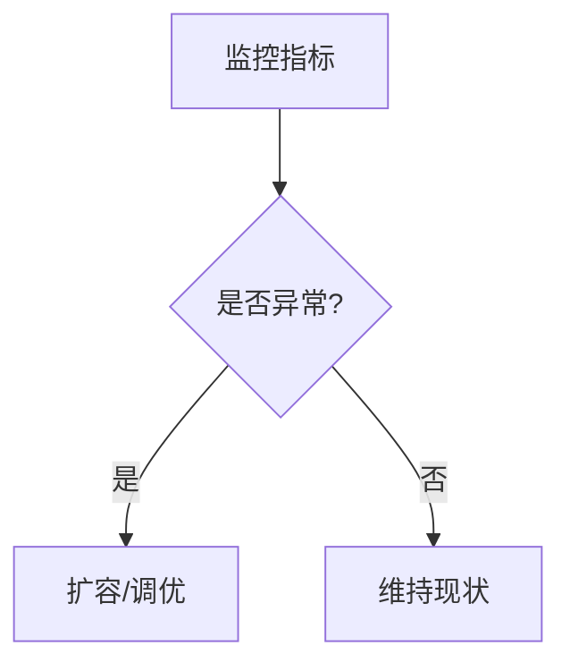

# 容量规划指南

## 介绍

容量规划是确保Zipkin在生产环境中稳定运行的关键步骤。它涉及评估系统资源需求（如存储、CPU、内存和网络带宽），并根据预期的追踪数据量配置合适的硬件或云资源。对于初学者来说，理解容量规划的基本原则可以帮助避免因资源不足导致的性能问题。

:::note
Zipkin是一个开源的分布式追踪系统，用于收集、存储和可视化微服务架构中的请求链路数据。容量规划直接影响其数据收集和查询性能。
:::

## 核心概念

### 1. 数据量估算
Zipkin的存储需求主要由以下因素决定：
- **每秒追踪量（Spans/second）**：每个微服务请求生成的Span数量。
- **Span大小**：单个Span的平均大小（通常为1-10KB）。
- **保留周期**：数据需要保留的时间（例如7天）。

计算公式：
```
总存储需求 = Spans/second × Span大小 × 保留周期（秒）
```

### 2. 资源分配
| 资源类型       | 影响因素                          | 建议配置示例         |
|----------------|-----------------------------------|---------------------|
| **CPU**        | 数据压缩/查询复杂度               | 4核（每1000 spans/s）|
| **内存**       | 查询缓存/JVM堆内存                | 8GB（基础配置）      |
| **存储**       | 数据量+索引大小                   | SSD优先             |
| **网络带宽**   | 跨节点数据传输量                  | 1Gbps+              |

## 实际案例

### 场景：电商平台
假设一个电商平台每天处理100万订单，每个订单平均生成50个Spans，Span大小为2KB，保留7天数据：

```python
# 计算示例
spans_per_second = (1_000_000 orders/day × 50 spans/order) / 86400 ≈ 579 spans/s
daily_storage = 579 × 2KB × 86400 ≈ 96GB/day
weekly_storage = 96GB × 7 ≈ 672GB
```

:::tip
实际配置需增加20%缓冲，建议分配至少800GB存储空间。
:::

## 配置示例

### 存储后端选择（以Elasticsearch为例）
```yaml
# Zipkin 的Elasticsearch配置示例
storage:
  type: elasticsearch
  hosts: http://elasticsearch:9200
  index: zipkin
  index-shards: 5       # 根据数据量分片
  index-replicas: 1     # 生产环境建议≥2
```

### JVM内存设置
```bash
# 启动Zipkin时配置堆内存
java -Xms4G -Xmx4G -jar zipkin.jar
```

## 监控与调优

使用以下指标持续优化：
1. **存储利用率**：避免超过85%磁盘占用
2. **查询延迟**：P99应`<500ms`
3. **收集成功率**：目标`≥99.9%`



## 总结

- 容量规划需要基于实际业务流量测算
- 定期监控关键指标并动态调整资源
- SSD存储和足够的内存能显著提升性能

## 扩展资源

1. [Zipkin官方文档 - 生产检查清单](https://zipkin.io/pages/production.html)
2. 练习：使用`docker stats`监控Zipkin容器的资源使用情况
3. 工具推荐：`zipkin-dependencies`分析服务间调用量