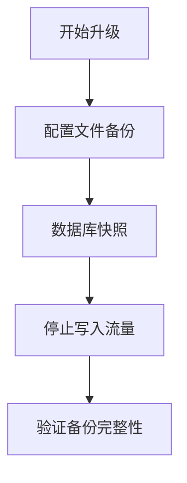

# Zipkin 升级策略

## 介绍

在分布式系统中，Zipkin作为核心的调用链追踪工具，其版本升级需要谨慎处理。本节将指导您制定可靠的升级策略，涵盖以下关键点：

- 版本差异分析
- 零停机升级方案
- 数据迁移注意事项
- 监控与验证机制

:::tip 何时需要升级？
当出现以下情况时建议考虑升级：
- 当前版本存在安全漏洞
- 需要新版本提供的功能特性
- 官方停止对旧版本的支持
:::

## 升级前准备

### 1. 版本兼容性检查

使用Zipkin的兼容性矩阵验证组件版本：

```bash
# 检查当前依赖版本
curl -sSL https://zipkin-server-host:9411/info | grep version
```

输出示例：
```
"zipkin.version":"2.23.2",
"spring.boot.version":"2.5.4"
```

### 2. 环境备份



## 分阶段升级方案

### 阶段一：金丝雀发布

通过负载均衡将少量流量路由到新版本：

```yaml
# Kubernetes示例配置
apiVersion: networking.k8s.io/v1
kind: Ingress
metadata:
  name: zipkin-canary
  annotations:
    nginx.ingress.kubernetes.io/canary: "true"
    nginx.ingress.kubernetes.io/canary-weight: "10"
```

### 阶段二：数据存储升级

对于存储层升级（如从MySQL到Elasticsearch）：

```sql
-- 示例：MySQL到ES的数据迁移
INSERT INTO zipkin_es.spans
SELECT * FROM zipkin_mysql.spans
WHERE timestamp_millis > UNIX_TIMESTAMP(DATE_SUB(NOW(), INTERVAL 30 DAY))*1000;
```

:::caution 注意
大数据量迁移建议使用批处理，每批1000-5000条记录
:::

## 版本回滚方案

建立快速回滚机制：

1. 保留旧版本二进制文件
2. 准备回滚脚本示例：

```bash
#!/bin/bash
# 快速回滚到v2.23.2
docker stop zipkin-new && \
docker run -d --name zipkin-legacy \
  -p 9411:9411 \
  -e STORAGE_TYPE=elasticsearch \
  -e ES_HOSTS=http://elastic:9200 \
  openzipkin/zipkin:2.23.2
```

## 真实案例：电商平台升级实践

**背景**：某电商平台从Zipkin 2.21升级到2.24时遇到的问题：

1. **问题现象**：Kafka采集器不兼容旧格式
2. **解决方案**：
   - 先升级数据收集端
   - 采用双写模式过渡
   - 逐步停用旧采集器

```java
// 双写配置示例（Spring Boot）
@Bean
public KafkaSender<String, byte[]> kafkaSenderV2() {
    return KafkaSender.newBuilder()
        .bootstrapServers("kafka:9092")
        .topic("zipkin-v2")
        .encoding(Encoding.JSON)
        .build();
}
```

## 升级后验证

关键检查项清单：

1. 追踪数据完整性：
   ```bash
   curl -X POST http://localhost:9411/api/v2/spans -H "Content-Type: application/json" -d @sample-span.json
   ```
2. 依赖关系图准确性
3. 系统资源占用监控

## 总结与资源

**核心要点**：
- 始终保持向后兼容
- 采用渐进式发布策略
- 建立完善的监控体系

**延伸学习**：
- [Zipkin官方升级指南](https://zipkin.io/pages/upgrading.html)
- [SemVer版本规范](https://semver.org/)
- 练习：在测试环境模拟从2.23到2.24的升级过程

:::warning 最后提醒
生产环境升级前务必在预发布环境充分验证！
:::